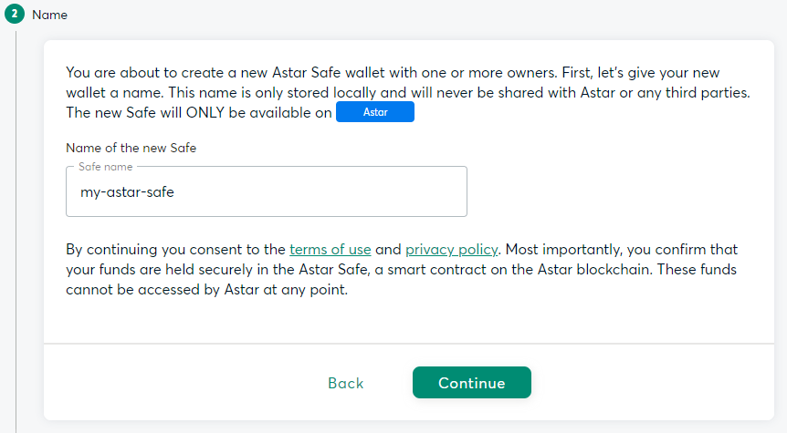
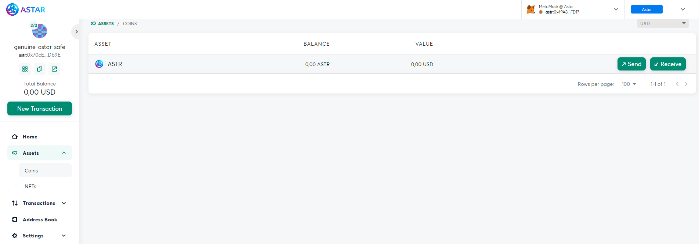
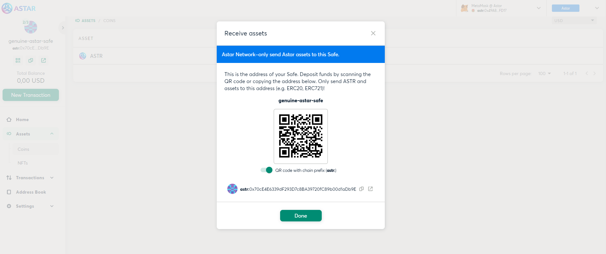
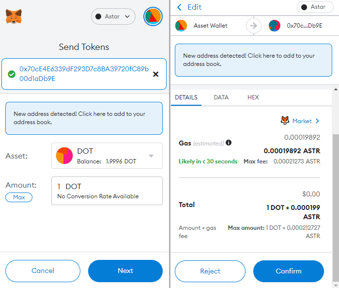

# Astar Safe (Gnosis Safe)

Build on the Gnosis Safe infrastructure: take advantage of the most modular, flexible, and secure wallet and identity solution in Ethereum. Now available on Astar!

## Create a Safe

To get started, navigate to [Astar Safe].

:::info
The current guide will focus on creating a MultiSig on Astar. Soon, we will add more networks to the list.
:::

### Connect MetaMask

To create a wallet, ypu need to connect your wallet:

1. Click **Connect Wallet**
2. Select a wallet to connect. For this example, we use MetaMask.

If you're not already signed into MetaMask, you will be prompted to sign in or download the MetaMask plugin. You will then be guided through adding and connecting your accounts, and adding and switching to the Astar Network:

1. Select an account and connect to the Safe. You'll want to select at least 2 of the 3 owner accounts and then click Next. You may need to add additional accounts to your **MetaMask Address Book** For this example, two of the accounts have all been selected.
2. Connect to the selected accounts by clicking Connect.
3. If you are not connected to Astar Network, and you don't have the network added to your MetaMask, add Astar Network as a custom network by clicking Approve.
4. Switch the network to Astar Network by clicking Switch Network.

Your wallet is now connected and connected to the correct network. Let's continue by creating a Safe on Astar. Press Continue.

## Create New Safe

To create a new Safe on Astar, click **Continue**. You will be taken to a wizard that will walk you through creating your new Safe. By going through these steps and creating your Safe, you are consenting to the terms of use and the privacy policy.

Let's begin by giving your Safe a name:

1. Enter the name of your new Safe, you can use `my-astar-safe`.
2. Click **Continue**

Next up is the owners and confirmations section of the wizard. In this section, you will add the owners of the Safe and specify the threshold. The threshold determines how many of the owners are required to confirm a transaction before the transaction gets executed.

There are many different setups that can be used when creating a Safe. There can be 1 or more owners of the Safe as well as varying threshold levels. Please note that it is not advised to create a Safe with just 1 owner as it creates the possibility of a single point of failure.

For this guide, you will create a MultiSig setup that has 2 owners and requires a threshold of 2, so at least 2 out of the 3 owners keys are required to execute transactions through the Safe.

Your account will automatically be prefilled in as the first owner, however, this can be changed if you would like to use different accounts. For this example, Owner 1 account has been prefilled. In addition to Owner 1, you can also add `Owner 2` and `Owner 3` as owners:

1. Click **Add another owner**
2. Enter **Owner 2** as the second owner, along with his address: `0x612c7623732d756FBb7a2eAb904Cd8989116C41F`
3. Enter **Owner 3** as the third owner, along with his address: `0xA96a67A5e969755B918F1ac1c20D496141a31b3F`
4. Set the confirmation threshold to **2 of 3** owners
5. Click **Review** to go to the last step in the wizard

Finally, you can review all of the build Safe and owner details and if everything looks ok:

1. Click **Create** to create your new Safe. The creation of the Safe will cost approximately less than .001 ASTR tokens on Astar Network. MetaMask will pop up and prompt you to confirm the transaction.
2. Click **Confirm** to send the transaction and create the Safe

It will take a moment to process the transaction and create the Safe, but once it has been created you should see a message saying "**Your Safe was created successfully**". From there, you can click **Get Started** to load your Safe and start interacting with it.

## Configure Safe

You can always manage your Safe and change some of the parameters set. To do you can click on the **Settings** option on the left-hand side menu.

In there you have the following options:

- **Safe Details** — allows you to change the Safe name. This is a local action that requires no on-chain interaction.
- **Owners** — allows you to initiate an on-chain proposal to add/remove owners to the Safe.
- **Policies** — allows you to initiate an on-chain proposal to change the MultiSig threshold to execute the proposal as a transaction
- **Advanced** — allows you to check other parameters from the Safe, such as the nonce, modules, and transaction guard.

## Receive and Send Native Assets

### Receive native Asset

You can now start interacting with your Safe. You can send funds to the Safe from any account with **ASTR** tokens. For this example, we use Owner 1 account. Hover over ASTR in the list of assets to reveal the **Send** and **Receive** buttons. Then click **Receive**.

Next, open up your MetaMask to initiate a transaction. Send your ASTR tokens to the MultiSig wallet. After the transaction is sent your balance for ASTR tokens will be updated on the Safe.

### Sent Native Assets

Now that you have funds in the Safe, you can send funds from the Safe to another account. For this example, you can send **1 ASTR** token to the `Owner 2` address. Hover over **ASTR** in the list of assets, and this time click on **Send**. Fill in all the information and click **Review**. Double check all the information and click on **Submit**.

:::caution
MetaMask will pop-up and you'll notice that instead of sending a transaction, you're sending a message. Click **Sign** to sign the message.
:::

If you go back to the Safe, under the **Transactions** tab, you should be able to see that there has been a transaction proposal initiated to send 1 ASTR token to Ower 2 address. However, you should also see that only 1 out of 2 confirmations have been received and that 1 more owner is required to confirm the transaction before it gets executed.

### Transaction Confirmation

The process of confirming (or rejecting) a transaction proposal is similar for all the use cases of a MultiSig Safe. One of the owners initiates the proposal to execute an action. The other owners can approve or reject the proposal. Once the signature threshold is reached, any owner can execute the transaction proposal if approved, or discard the transaction proposal if rejected.

In this example, if 2 of the 3 owners decided to reject the proposal, then the assets would remain in the Safe. However, in this case, you can confirm the transaction from either `Owner 2` or `Owner 3` account.

Switch accounts in MetaMask to `Owner 2` account (or Owner 3). Then go back to the Safe connected as Owner 2. The **Confirm** button should now be enabled. As Owner 2, click **Confirm** to meet the threshold and send the transaction.

1. Check the **Execute transaction** box to execute the transaction immediately after confirmation. You can un-check it for the transaction to be executed manually at a later time.
2. Click **Submit**. MetaMask will pop-up and ask you to confirm the transaction, if everything looks good, you can click **Confirm**

The transaction will be removed from the **QUEUE** tab and a record of the transaction can now be found under the **HISTORY** tab. In addition, `Owner 2` balance has now increased by 1 ASTR token, and the Safe's balance for ASTR tokens has decreased.

## Receive and Send Other Assets

### Receive Other Assets

Next up is to receive and send other assets to and from the Safe. In this part we will send DOT from one account to the Astar Safe. Open up MetaMask:

1. Switch to the Assets tab and select DOT from the list.
2. Click Send.
3. Paste in the Safe's address
4. Enter amount of DOTs to send. Click Next
5. Review the transaction details and then click Confirm to send the transaction.

If you navigate back to the Safe, in the list of **Assets** you should now see **DOT** and a balance of 1 DOT. It could take a few minutes for **DOT** to appear, but there is nothing for you to do to add the asset, it will appear on it's own.

### Send Other Assets

Now that you have loaded your Safe with DOTs, you can send some from the Safe to another account. You can use the same workflow as [sending and confirming native assets](https://app.gitbook.com/o/-LgGrgOEDyFYjYWIb1DT/s/-M8GVK5H7hOsGnYqg-7q-872737601/integration/wallets/astar-safe-gnosis-safe#send-tokens).

## Smart contract interaction

To directly interact with smart contracts from your Astar Safe account, please follow this guide:

[Gnosis Safe: Contract Interactions](https://help.gnosis-safe.io/en/articles/3738081-contract-interactions)

[Astar Safe]: https://safe.astar.network/
