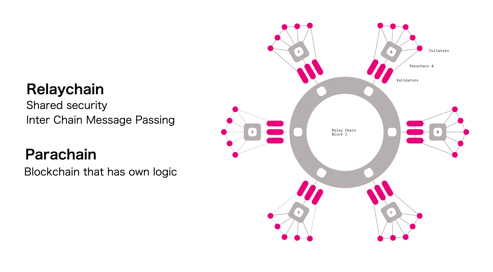

# Polkadot

[Polkadot] is an open-source project led by the [Web3 Foundation]. It is a sharded protocol that connects different blockchain networks.

## Polkadot Basics

Polkadot consists of two parts: Relaychain and Parachain.

- Relaychain: This is the core of Polkadot which is responsible for network security, consensus, and cross-chain interoperability.
- Parachain: These are sovereign blockchains with custom tokens and optimized functionality for specific use cases. Parachain connection to Relaychain is priced on a pay-as-you-go basis or a continuous connectivity lease.

Astar Network is built on Parity Substrate making it one of the first SCALABLE smart contract Polkadot Parachains.

Parachain and Relaychain in Polkadot make the following things possible:

1. Data and tokens can be transferred among parachains seamlessly.
2. Parachains can import Relaychain security.

Learn more about Polkadot:

- Polkadot Lightpaper: <https://polkadot.network/Polkadot-lightpaper.pdf>
- Polkadot web page: <https://polkadot.network/>
- Polkadot wiki: <https://wiki.polkadot.network/>

Astar Network and Polkadot

This section describes how the [Astar Network] integrates to the Polkadot ecosystem. [Astar Network] aims to be the first scalable smart contract Polkadot Parachain.

Smart Contract
The [Polkadot] relay chain does not support smart contracts. Astar will create this functionality also making it easily scalable. Developers are free to build a variety of dApps knowing that they can be scaled up with ease.

## Scalability

[Astar Network] scalability relies on layer 2 solutions such as the Optimistic Virtual Machine.

Scalability is the greatest challenge to all blockchains. To bring widespread adoption of blockchain technology, higher performance is necessary. Scalability is a critical issue that Astar Network seeks to optimize.

Two Types Of Scalability

- **Layer 1 (horizontal) scalability**: do more on the layer 1 blockchain. (e.g. sharding and Segwit)
- **Layer 2 (vertical) scalability**: do less on layer 1 and more on layer 2 or off-chain. (e.g. Plasma and State Channel)

Polkadot uses sharding technology allowing greater scalability. Astar also incorporates layer 2 vertical capabilities. Layer 1 and layer 2 offer different yet complementary solutions.

Additional benefits of the Astar Network architecture include:

- First Finality
- Flexible dApps development
- Significantly lower transaction(gas) costs

Smart contract capability combined with layer 2 architecture makes many interesting dApps possible on Astar Network. (e.g. Gaming, IoT, Payment, DEX, and Bridge)

Questions? Reach out to the [Discord Tech Channel](https://discord.gg/Z3nC9U4) where the team and community members can help you find answers.

[Polkadot]: https://polkadot.network/
[Web3 Foundation]: https://web3.foundation/
[Astar Network]: https://astar.network/
