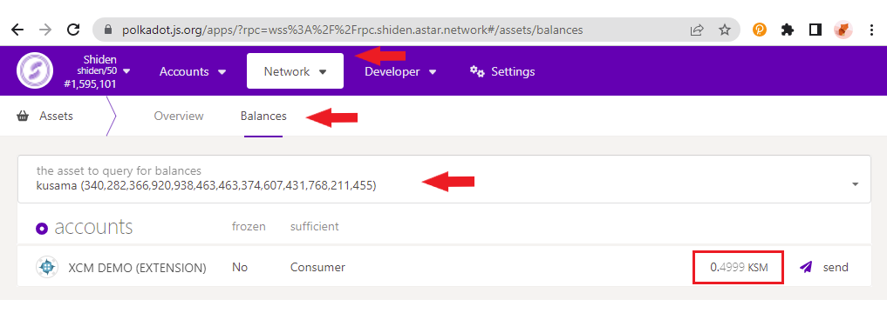

# XCM FAQ

### Q: Is there a way to see my DOT/SDN balance (on Astar/Shiden) on the Polkadot.js?

Yes. visit Polkadot.js, connect your wallet and go to Network > Balances and select the token you are interested in. The example below demonstrates how to view the SDN balance:

### Q: I used XCM to transfer 5 DOT from Polkadot to Astar, but only received 4.999

Please note that the gas amount will be deducted from the amount entered, so the amount transferred should be adjusted according to account for the gas fee estimate. For more information, visit [here] (https://docs.astar.network/docs/learn/interoperability/xcm/using-xcm/xcm-transactions).

### Q: My balance should be 1.00012 DOT but the Portal is displaying 1 DOT, where are they?

The current version of Astar Portal rounds balances to the 3rd decimal. If you have a similar issue please refer to the [previous FAQ entry] (building-with-xcm/faq-for-smart-contracts.md) and instructions on how to use Polkadot.js to find your exact balance.

### Q: Can I send my DOT token to other Parachains?

Not at the moment.

### Q: How can I send my DOT token back to Polkadot?

You can send back DOT/KSM to the Relay Chain using both EVM and native wallets. Visit the Assets Page and choose the XCM link of the relevant token.

### Q: Why is the XCM button for DOT/KSM disabled when I connect my wallet on the Astar Portal?

Ensure you have a non-zero balance of the native token as described in [this section](https://docs.astar.network/docs/learn/interoperability/xcm/using-xcm/xcm-transactions).

### Q: I transferred X tokens to another account, but the amount transferred and received by the target account is greater than X. What is going on?

XC20 assets have a defined minimum-balance. The minimum-balance is the minimum balance of an asset that any single account must have. In this specific case, if an account's balance would be reduced below that amount in an asset transfer transaction, then the amount actually transferred would include the remaining amount of specific asset on the initiating account.

Take a look at an example of a transaction in case of an asset whose minimum-balance is 10: Alice has 10.9 tokens and tries to send Bob 10 tokens. Alice's remaining balance in that case would become 0.9, which is less than minimum amount, so the amount transferred would be set to 10.9 tokens, so Alice's balance will become 0, to avoid any funds being reaped by not fulfilling the Existential Deposit.

For more information, check out this section within our documentation.

### Q: Where can I find other chains' addresses?

You can find all the different chains' addresses in Polkadot/Kusama :

1. Using [Sub ID] (https://sub.id/)

Simply input your Astar native address and you will be able to see all the related addresses of the account.

2. Display it on Polkadot.js extension by selecting the chain you would like to know the address of.

Please note that you will only be able to make an XCM withdrawal if the receiver's Relay Chain account balance is greater than the Minimum Balance (1.1 DOT for Polkadot and 0.01 KSM for Kusama).

