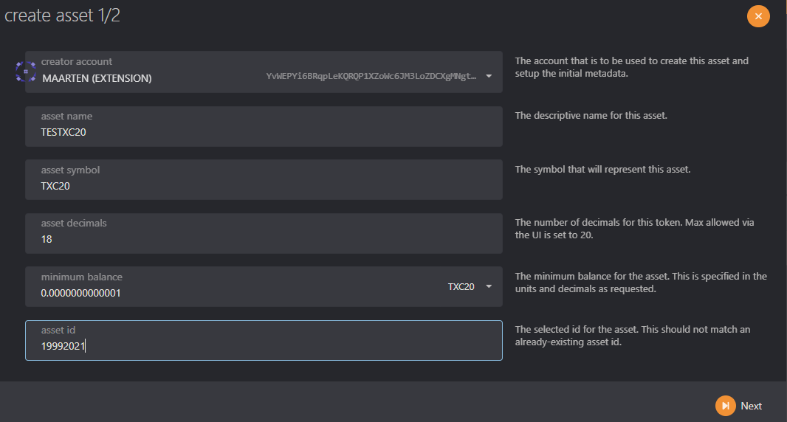
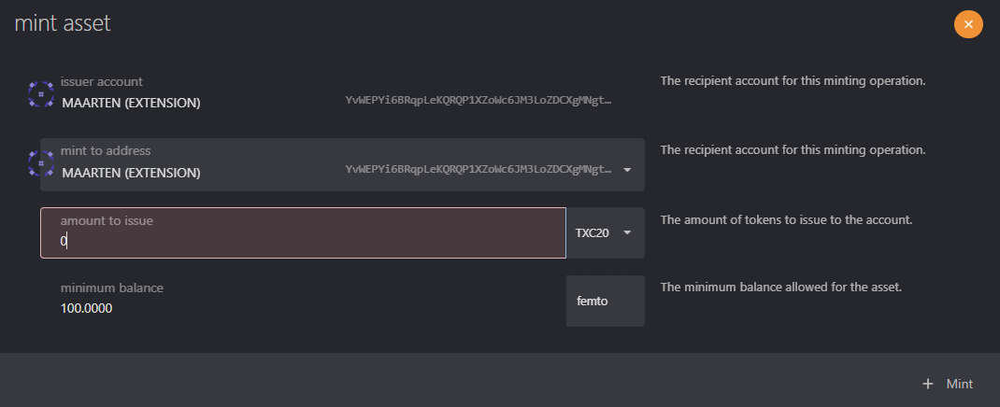

# Create XC20 Assets

## Overview

XC20 assets, created by the [Moonbeam](https://moonbeam.network/blog/introducing-xc-20s-the-new-standard-for-cross-chain-tokens-on-dotsama/) team, maintains compatibility between the EVM and Substrate framework that powers Polkadot, via precompiles — a set of built-in smart contracts made to look like ERC20s. Calling functions on an XC20 will invoke underlying Substrate functionality, which may be instructions for transferring tokens to another chain, or to send them to another local address. This compatibility layer connects the world of EVM and smart contracts to advanced Substrate-based interoperability scenarios.

## Create an XC20 Asset

XC20 asset refers to interface it uses to wrap around an asset in `assets-pallets`. So first we will need to create, mint and set metadata for an asset in `assets-pallets` and then access it from smart-contract using XC20 precompile interface.

This section of the guide will demonstrate how to register an asset using [Polkadot.js Apps](https://polkadot.js.org/apps). 

## Create the Asset

Before the asset's Metadata can be set, we will need to create an asset on the network using the following steps:

1. Navigate within [Polkadot.js Apps](https://polkadot.js.org/apps) to Network and click on **Assets**.
2. Click on **+Create** on the right to open the create asset pop-up.
3. Enter the **asset name, asset symbol**, and set the number of **decimals** for the asset. This doesn't have to be 18 decimals like the network native assets, it's completely configurable.
4. The **minimum balance** is the Existential Deposit (ED) of your asset. The ED exists so that accounts with very small balances, or that are empty, do not "bloat" the state of the blockchain and diminish its performance. **NOTE**: setting this value to pico units and minimum balance to 1, will only require 0.000000000001 units. We suggest having a minimum balance of **1**.
5. The asset id will be automatically generated for you. The valid range for permissionless creation is up to `2^32 - 1`.
6. When everything is filled in, click **Next** on the next screen.
7. Set your **roles** and create the asset by signing with the creator account.

There are a few roles that are important to take note of when registering and managing assets. These roles, with the exception of the creator, can all be designated to other accounts by the owner via the assets -> setTeam extrinsic. The roles are as follows:

- **Creator** - the account responsible for creating the asset.
- **Issuer** - the designated account capable of issuing or minting tokens. Defaults to the owner.
- **Admin** - the designated account capable of burning tokens and unfreezing accounts and assets. Defaults to the owner.
- **Freezer** - the designated account capable of freezing accounts and assets. Defaults to the owner.

## Mint Asset

The asset is now created on our network, but has no supply. To mint the tokens, click on the +Mint button next to the asset to open the mint pop-up.

1. Only the **issuer account** has permission to mint the token.
2. Enter the address that will receive the minted tokens. We recommend using a [multisig](/docs/use/manage-wallets/create-multisig.md).

## Set Asset Metadata

The metadata includes the asset name, symbol, and decimals.

To set the asset metadata, click on **Developer** at the top of the page and then select **Extrinsics** from the dropdown. From there, take the following steps:

1. Select the owner's account
2. From the **submit the following extrinsic** dropdown, choose **assets**
3. Then select the `setMetadata` extrinsic
4. Enter the asset id from the asset you created before
5. Enter the name of the asset
6. Set the symbol for the asset
7. Set the decimals for the asset
8. Click on **Submit Transaction**

You can use the **Extrinsics** page to perform other functions such as minting tokens, delegating a team, freeze and thaw assets or accounts, and more.

## Calculate XC20 Precompile Address

To access our asset as XC20 in MetaMask or another EVM wallet, we will need to use its precompile address. The XC20 precompile address is using the following rule:

`address = "0xFFFFFFFF" + DecimalToHexWith32Digits(AssetId)`

The first step is to take the asset Id and convert it to a hex value. You can use the search engine of your choice to look up a simple tool for converting decimals to hex values. In this tutorial, we will use this [decimal to hexadecimal converter](https://www.rapidtables.com/convert/number/decimal-to-hex.html).

For asset ID `19992021`, the hex value is `1310DD5`.

XC20 precompiles can only fall between  `0xFFFFFFFF00000000000000000000000000000000` and `0xFFFFFFFFFFFFFFFFFFFFFFFFFFFFFFFFFFFFFFFF`. As such, the first 8 characters of the address will always be `FFFFFFFF`. Since Ethereum addresses are 40 characters long, you will need to prepend 0s to the hex value until the address has 40 characters.

The hex value that was already generated in the example is 7 characters long, so prepending the first 8 characters, `FFFFFFFF`, to the hex value will give you the part of the 40-character address you need to interact with the XC20 precompile. Note that you still need to add zeros to get the 40-character address. You add the zeros between `FFFFFFFF` and generated hex.

For this example, the full address is `0xFFFFFFFF00000000000000000000000001310dD5`.

:::note
To use this address inside a solidity smart-contract, check sum of the address should be respected. Please use [toChecksumAddress](https://web3-tools.netlify.app/) converter that will convert your address.     
for example `0xFFFFFFFF00000000000000000000000001310dD5` will be converted to `0xfFFfffFF00000000000000000000000001310dD5`
:::

Now that you've generated the XC20 precompile address, you can use the address to interact with the XC20 as you would with any other ERC20 in Remix.

:::note
Native token (SDN/ASTR) XC20 address is by convention `0x0000000000000000000000000000000000000000`
:::
