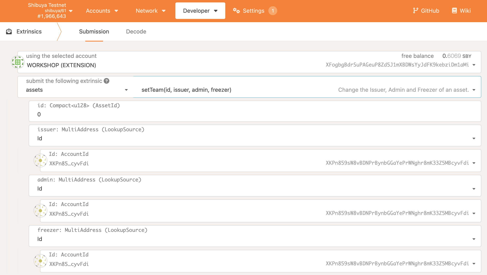
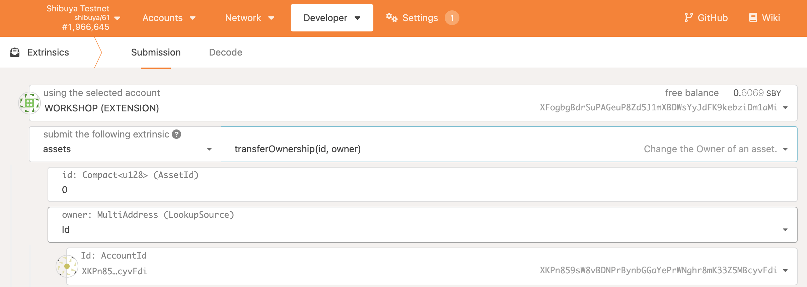

# Making Existing ERC20 Assets Cross-chain Compatible

If you would like to make an existing ERC20 asset cross-chain compatible, it's quite simple, following the instructions below

## XC20+ Extension

In short, the **XC20** standard allows smart contracts to interact with cross-chain compatible assets, as if they were typical ERC20 assets.
Unlike standard ERC20 assets deployed within the EVM environment, where balances, issuance, etc. are stored directly, **XC20** assets are mapped to a Substrate pallet, which means that developers do not have access to the same logic inherent to ERC20 format, such as `_mint` or `_burn`.

In general, this is fine for existing **XC20** assets since we shouldn't be minting or burning them in smart contracts (e.g. there is no valid reason to mint cross-chain DOT on Astar). However, there are use cases where having an extended set of functionalities is useful and required, such as for wrapped tokens.

For this reason, we provide an extended **XC20** interface called **XC20+**. It provides the following methods:
```Solidity
// Used to check what is the existential deposit of XC20 asset
function minimumBalance() external view returns (uint256);

// Used to mint new funds
function mint(address beneficiary, uint256 amount) external returns (bool);

// Used to burn funds
function burn(address who, uint256 amount) external returns (bool);
```
The aforementioned list could be extended in the future.

Please note that minting and burning requires certain priviliges - read about **XC20** assets to learn more.

:::caution

Please note that the `burn()` function in **XC20+** is inhereting the behaviour of `pallet-assets` `burn()` function. Calling `pallet-assets` `burn()` function with a amount higher than the current balance will result in a burn of the amount available, and returning success. 

In contracts, the `burn()` implementation in [`ERC20Burnable.sol`](https://github.com/OpenZeppelin/openzeppelin-contracts/blob/3214f6c2567f0e7938f481b0a6b5cd2fe3b13cdb/contracts/token/ERC20/ERC20.sol#L283) will burn the amount if it is lower or equal to the account's balance.

:::

## Wrapped Tokens
A wrapped token is a token whose value is tied to an underlying cryptocurrency. An amount of the original token is locked in a digital vault, and in return allows an equivalent amount of wrapped tokens to be minted.

This is useful for several reasons, to mention a few:
* To extend the functionalities of an existing token in conjunction with other ERC20 modules.
* To allow a native cryptocurrency to behave like an ERC20, e.g. Wrapped Ether (WETH).
* To allow the use of currencies outside their native blockchain, e.g. Wrapped bitcoin (WBTC).

In the next example we will examie how to wrap an existing ERC20 token into **XC20**.

## Wrapping ERC20 into XC20

In this example, the underlying token will be an existing ERC20, called BURRITO. We want to wrap some BURRITOs and make them cross-chain-ready. Using a standard [ERC20Wrapper](https://github.com/OpenZeppelin/openzeppelin-contracts/blob/master/contracts/token/ERC20/extensions/ERC20Wrapper.sol) token spec from OpenZeppelin will not be enough. Therefore we will need to override some of the ERC20Wrapper functions, and use **XC20+** functions.
Let's call the newly wrapped token xcBURRITO.
xcBURRITO takes the address of the underlaying token (BURITTO) and the newly created asset's address as constructor parameters. And we’ll set values for the other required parameters, but notice that we have to include the ERC20Permit constructor call, because xcBURRITO is now a parent of BURITTO.
```Solidity
constructor(IERC20 burrito)
   ERC20("Wrapped Burrito", "xcBUR")
   ERC20Permit("Wrapped Burrito")
   ERC20Wrapper(burrito)
{}
```
Since we can't use ERC20Wrapper out of box we'll override it and use the **XC20+** interface.
```Solidity
import "@openzeppelin/contracts/token/ERC20/extensions/ERC20Wrapper.sol";
import "./Burrito.sol";

contract XcBurrito is Xc20Plus, ERC20Wrapper, BURITTO{
    constructor(IERC20 burrito)
    Xc20Plus("Wrapped Burrito", "xcBUR")
    ERC20Permit("Wrapped Burrito")
    ERC20Wrapper(burrito)
    {}

    function _mint(address _to, uint256 _amount)
        internal
        override(ERC20)
    {
        // add here your pre-mint hooks if needed

        require(
            IERC20Plus(xcBurrito).mint(_to, _amount), "Minting xc token failed"
        );

        // add here your post-mint hooks if needed
    }
}
```
Check the full example on the Github repo under [examples](https://github.com/AstarNetwork/Astar).

## Procedure
### 1. Create an XC20 asset
Follow the documentation on how to [Create XC20 Assets](https://docs.astar.network/docs/use/Manage%20assets/create-xc20-assets).

### 2. Deploy the xcBurrito.sol smart contract
To deploy the XcBurrito contract you will need 2 input parameters
- Burrito ERC20 token address (H160)
- **XC20** asset address (H160)
    - Follow the instructions about how to [Generate an XC20 Address](https://docs.astar.network/docs/learn/interoperability/xcm/integration/tools). For example, if the asset_id is 17 (=0x11), the resulting EVM address will be `0xffffffff00000000000000000000000000000011`

### 3. Transfer XC Asset Ownership to the xcBurrito Smart Contract
To allow the **xcBurrito** contract to be able to mint/burn you need to call the `setTeam()` extrinsic on pallet-assets, and configure the `issuer` and `admin` to be **xcBurrito**. This will allow the contract to issue wrapped **XC20** assets, but since the EVM contract has 24 bytes (H160), we will need to transform the EVM address to ss58 format before we can call the extrinsic.


You can renounce ownership of the **XC20** by calling the `transferOwnership()` extrinsic on pallet-assets. Do note that after calling the extrinsic, you will no longer be able to
change the `issuer` or `admin` parameters, so you will want to ensure they are set correctly.



Now the xcBurrito contract is able to mint **XC20** tokens for callers who own Burrito ERC20 tokens.

## User Actions
To convert Burrito tokens into xcBurrito assets, users will need to perform the following actions.
1. Approve the xcBurrito smart contract to transfer ERC20 Burrito tokens from a user's balance, to the xcBurrito contract. As an alternative, the `permit()` call can be used to improve UX.
2. User calls xcBurrito `depositFor()` for minting new **XC20** tokens, or `withdrawTo()` for burning **XC20** tokens.
3. The newly wrapped assets are able to be transferred between chains, like any other **XC20** asset (please see the XCM documentation for more details).

## End result
The result of `depositFor(user, amount)` will be:
- XcBurrito locks an `amount` of ERC20 Burrito token.
- User's balance of ERC20 Burrito is decreased by `amount`
- XcBurrito contract mints the same `amount` of xcBurrito assets
- User's balance of xcBurrito asset is increased by `amount`


The result of `withdrawTo(user, amount)` will be:
- XcBurrito contract burns an `amount` of XcBurrito asset
- User's balance of xcBurrito asset is decreased by `amount`
- XcBurrito contract transfers `amount` of ERC20 Burrito token to user
- User's balance of ERC20 Burrito is increased by `amount`
