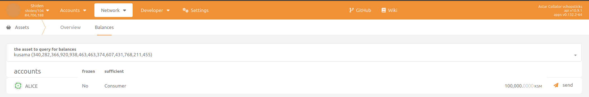
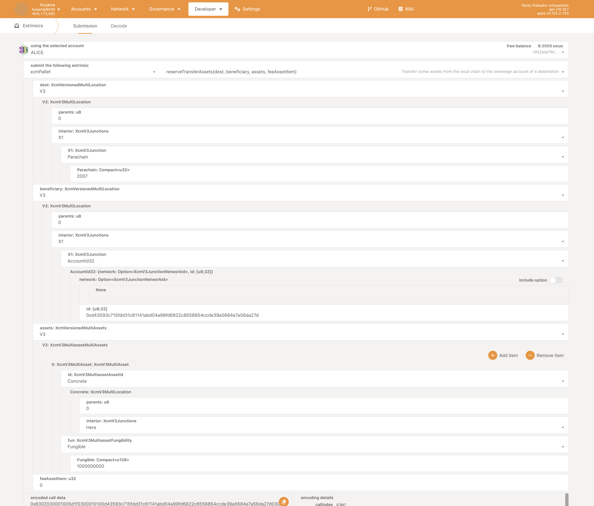

# Native XCM Transactions

Let’s examine how to transfer native Relay Chain assets (DOT or KSM) to Astar or Shiden.

For this demonstration we’ll be using the Polkadot.js portal. Regular users will be interacting through our portal where all this complexity will remain abstract. 

For this demonstration, we will transfer **KSM** tokens from Kusama to Shiden Network.

## In Practise

We will be using chopsticks for this demo (more info on the dedicated [chopsticks page](/docs/build/environment/chopsticks.md)).
This command will spawn a chopsticks network that will replicate current state of Kusama relay-chain and Shiden parachain allowing XCM:

```bash
npx @acala-network/chopsticks@latest xcm -r kusama -p shiden
```

The Relay Chain native asset is represented on Astar or Shiden by asset Id `0xFFFFFFFFFFFFFFFFFFFFFFFFFFFFFFFF` or `340282366920938463463374607431768211455` in decimal.

In the Shiden chopsticks [configs file](https://github.com/AcalaNetwork/chopsticks/blob/97b42a16d9f3fb32069eb2c19e05d7b80e250c3c/configs/shiden.yml#L25) Alice holds 100000KSM



Let's transfer some **KSM** from Kusama to Shiden using Alice.

This will be an example of VMP protocol usage or DMP to be more specific. We will make use of the `reserve_transfer_asset` functionality. This consists of moving assets from one blockchain to another blockchain via an intermediary *Sovereign* account. In the process, origin chain assets won’t be destroyed, instead, the *Sovereign* will hold them, while the target chain mints wrapped versions, and deposits them to the target address.

The *Sovereign* account ensures that the same assets cannot be used simultaneously on both chains. It also guarantees that the wrapped assets are interchangeable with the assets on the origin chain.

Alice wants to send some tokens to herself on Shiden Network, so she prepares a `reserve_transfer_asset` call on the Relay Chain. The parameters look like this:



We should specify:

- Destination
  - Using the MultiLocation notation, we describe the target chain, which is Shiden, as `/Parachain(2007)`. The notation resembles filesystem paths where the Relay Chain is considered to be root.
- Beneficiary
  - Once again using the *MultiLocation* notation, we describe the beneficiary of the asset transfer. Take note that this is the context of the destination chain. We’re transferring to Alice whose address is `ajYMsCKsEAhEvHpeA4XqsfiA9v1CdzZPrCfS6pEfeGHW9j8` on Shiden. But instead of specifying the Shiden address, we’ll specify the account ID (or public key) associated with this address: `0xd43593c715fdd31c61141abd04a99fd6822c8558854ccde39a5684e7a56da27d`
- Assets being transferred
  - Finally, we describe the assets being transferred. Since we’re transferring native Relay Chain assets, we specify these are **Concrete assets** and their location is **Here** in the context of the Relay Chain. The asset is fungible, therefore we need to specify the amount being transferred, in this case, a total of **1000000000** tokens.

After initiating the transfer, we can observe what happens on the Relay Chain:


Execution of an XCM message was attempted and funds were transferred from Alice to the Sovereign account.

On the Shiden side, we can observe the following:


XCM message has been received and instructions executed. As a result, an asset with Id `340282366920938463463374607431768211455` has been minted, a total of **996000000** tokens. These tokens have been deposited into the designation account.

Note that that received amount is less than what was originally sent. This is because **4000000** has been used to pay the transaction fee on the destination chain.

We’ve successfully transferred **KSM** assets from Kusama over to Shiden!
