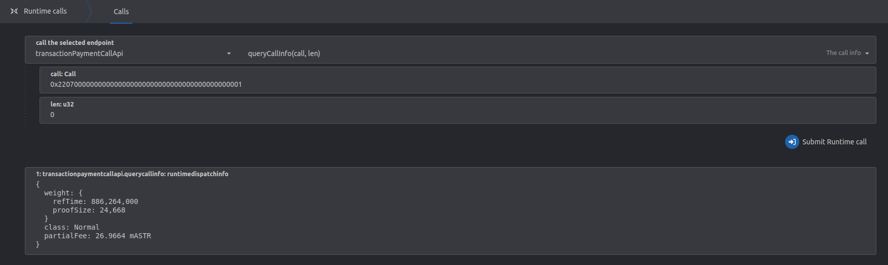

# Remote Transact via XCM

:::warning

XCM message format is not meant be used by normal user, these are low level instructions and can easily cause loss of funds if used without proper knowledge.
It's advised for normal users to use DApps and tooling build around XCM instead. The section below is targeted for developers only.

:::

## Feature Overview

The XCM `Transact` instruction allows the sender to execute arbitrary calls on the destination chain. This feature is extremely useful since it allows us to control an account on a remote chain.

For example, a user is able to send a `Transact` instruction from **Astar** to **Polkadot** that will transfer `DOT` from the user's derived account on **Polkadot** to an arbitrary receiver account on **Polkadot**. The user doesn't need to interact directly with the **Polkadot** chain in this case, but nevertheless is able to change its state. It's important to note that this is only an example - any call that can be interpreted by the remote (destination) chain is able to be sent and executed.

This is of particular use for smart contracts, since it allows them to integrate custom logic for cross-chain interoperability.

It's important to understand the difference between sending an XCM instruction sequence and receiving/interpreting it.

Sending an XCM transaction from `Astar` or `Shiden` to a remote chain may be successful on the sender side, but fail to execute on the destination, and the same is true for the opposite scenario. This can happen for multiple reasons - the XCM sequence might be incorrect, the remote chain doesn't know how to inrerpret the provided `call`, or the remote chain doesn't allow remote execution, at all.

The developer or user must ensure that the destination chain supports the encoded call and remote transactions, in general.

## Remotely Transact on Astar/Shiden/Shibuya

### XCM Sequence

At the moment, remote execution from origins other than parachain accounts are only allowed to be initiated by the `Shibuya` runtime and `Shiden` runtime.

A permissible sequence of instructions will therefore have to start like:

1. `DescendOrigin`
2. `WithdrawAsset`
3. `BuyExecution`
4. `Transact` or `SetAppendix` or _whatever user wants_

This XCM sequence, used as a prefix, may be followed by arbitrary instructions, for example: `Transact`.
Although we cannot guarantee it, other chains will most likely adopt the same or a similar prefix for XCM instruction sequences.

#### DescendOrigin

The DescendOrigin parameter ensures that the origin isn't a parachain, but a more complex junction like `{ parachain: 2006, accountId: 0x123aff....ff }`. If this is omitted, all calls will be executed as if they were sent from the _root-only_ parachain's sovereign account, which we do not allow.

#### WithdrawAsset

Withdraws assets on the destination chain from the derived sender account. The account must have the specified asset and the requested amount, otherwise the instruction will fail. These assets are used to pay for the XCM execution time.

#### BuyExecution

Buys XCM executuion time, using the withdrawn assets.

#### Transact

Execute the specified encoded call data, without consuming more weight than specified.
Call data can be virtually anything supported by the remote chain - it doesn't matter what the origin chain supports.

## Derived Remote Accounts

When executing a remote transaction, the remote chain will derive a new address based on the sender's multilocation.
The way this address is derived is determined by the chain itself so this documentation cannot guarantee how any other chain but Astar-based chains.

For Astar-based runtimes, a generalized approach, aligned with `Polkadot` and `Kusama` is used.
Multilocation is SCALE-encoded, step-by-step, until finally it is hashed using the `Blake2_256`, with the output being the derived address.

| Name                        | Value                                                                                         |
| --------------------------- | --------------------------------------------------------------------------------------------- |
| Alice's Address in Polkadot | 15oF4uVJwmo4TdGW7VfQxNLavjCXviqxT9S1MgbjMNHr6Sp5                                              |
| Alice's Public Key          | 0xd43593c715fdd31c61141abd04a99fd6822c8558854ccde39a5684e7a56da27d                            |
| Alice's Multiloc in Astar   | \{ parents: 1, interior: AccountId32 \{network: NetworkId::Polkadot, id: 0xd4359...a27d \} \} |

---

For example, let's assume `Alice` is sending an XCM sequence from `AssetHub` to `Astar`.
Sibling parachain's account is derived using a simple approach:

`blake2_256(("SiblingChain", compact_parachain_id, b"AccountId32", public_key).encode())`

| Name                      | Value                                                                                                              |
| ------------------------- | ------------------------------------------------------------------------------------------------------------------ |
| Alice's MultiLoc in Astar | \{ parents: 1, interior: X2(Parachain(1000), AccountId32 \{network: NetworkId::Polkadot, id: 0xd4359...a27d \}) \} |
| Alice's Derived Account   | 0x88275533b5d43292c86d05985c3a6e226fee2baeddb4f3b90e30a70bec4d7bff                                                 |

Similarly, in case `Alice` is sending XCM from a chain that uses **H160** address format:

`blake2_256(("SiblingChain", compact_parachain_id, b"AccountKey20", public_key).encode())`

---

In case `Alice` is sending XCM from `Polkadot`, the encoded data changes a bit and would be like:

`blake2_256((b"ParentChain", b"AccountId32", public key).encode())`

| Name                      | Value                                                                                             |
| ------------------------- | ------------------------------------------------------------------------------------------------- |
| Alice's Multiloc in Astar | \{ parents: 1, interior: X1(AccountId32 \{network: NetworkId::Polkadot, id: 0xd4359...a27d \}) \} |
| Alice's Derived Account   | 0x7dcb1027ecb97011ebe79ca233def50d1f216eb05d76367c8984f67ccc5d2dd1                                |

---

You can use the `xcm-tools` binary to generate the derived address, based on your needs.

## Remotely Transact via EVM Smart Contracts

Astar allows EVM smart contracts to send `Transact` instructions to remote chains, giving them the ability to execute arbitrary calls.

### XCM Sequence

To simplify the API via which EVM smart contracts send the `Transact` instruction, and to ensure security, we expose a function that builds a sequence like:

1. `DescendOrigin`
2. `WithdrawAsset`
3. `BuyExecution`
4. `Transact`

`DescendOrigin` will ensure that the origin is correctly set to be the smart contract's derived ss58 address.

`WithdrawAsset` at the moment requires that asset representation is present in our runtimes. However, it is expected that the remote chain's derived address will be funded so it can pay for XCM execution.

`BuyExecution` will use the previously withdrawn assets. The `weight_limit` will be set to `Unlimited`. This isn't too important for the instruction sequence being used, since the user controls the maximum allowed weight via the amount of withdrawn assets. However, the funds should be sufficient to pay for both the XCM sequence execution, and the encoded remote call.

`Transact` will execute the encoded call. The `origin_type` is set to `SovereignAccount` and cannot be changed by the end user.

There are no refunds at the end of sequence. Unused weight will be handled by the remote chain.

### Remotely Derived Contract Address

For example, let's assume you have a contract deployed on Shibuya and are calling the XCM precompile `remote_transact` with the intention of sending an XCM sequence to a sibling parachain. This sibling parachain uses the same address derivation as do our runtimes. The address derivation path will look like this:

| Name                          | Address                                                                                                        |
| ----------------------------- | -------------------------------------------------------------------------------------------------------------- |
| Contract H160 Address         | `0x48DD0a20a199f96B56eCE7e994D83614A148aA63`                                                                   |
| Contract Derived SS58 Address | `agn53DdEuRgQsvgxqj5M1AecxB6LpbXT7T1R1hjVcoEBR6M`                                                              |
| SS58 Address Public Key       | `0xd219fe1b02545c7dd7e718b1530b4e32b23288351f61e5975c7dc49b004ff119`                                           |
| Caller Multilocation          | `{ parents: 1, interior: X2 ( Parachain(2000), AccountId32 {network: NetworkId::Any, id: 0xd219f...f119 } ) }` |
| Derived Remote Address        | `5FrhDFydxUwbWyXT1XDBhRUUYpQtiJJ6skB6n2XV4NubC9fP`                                                             |

:::note
The remote address derivation scheme has changed after writing the initial example but the whole process is otherwise still valid and correct.
:::

This means that the instructions like `WithdrawAsset` and `Transact` will be executed as if origin was address `5FrhDFydxUwbWyXT1XDBhRUUYpQtiJJ6skB6n2XV4NubC9fP`.

### Precompiles API

`Transact` functionality is exposed to EVM smart contracts via precompiles. The interface can be found [here](https://github.com/AstarNetwork/Astar) under XCM precompiles.

```solidity
    function remote_transact(
    Multilocation memory destination,
    address payment_asset_id,
    uint256 payment_amount,
    bytes calldata call,
    WeightV2 memory transact_weight
) external returns (bool);
```

The `destination` is the Multilocation of destination chain and can either be a sibling parachain `Id` or the Relay Chain (in which case parachain `Id` is ignored).  
`payment asset Id & amount` - Determines which asset to withdraw on the destination chain and how much. Used to pay for execution time. Current limitation is that the asset used must have a local derivative since it's referenced via H160 address.  
`call` - The encoded call to be executed on the remote chain.  
`transact_weight` - The max weight that can be consumed by the execution of the call on the remote chain.

Continue reading below to gain a better understanding of how to calculate these parameters.

### Payment Asset

At the moment, users can only specify the paymet asset via a `H160` address. Even though the payment asset references an asset in the destination chain, the remote asset must have a local derivative. This will be updated and improved in the future so that users can specify asset multilocations directly.

In case the user wants to pay using a local currency derivative (wrapped ASTR or SDN) on the destination chain, a specialized H160 address padded with zeroes,`0x0000000000000000000000000000000000000000`, should be used.

### Transaction Weight

Specifying the correct amount of assets to withdraw and buy execution time with, as well as choosing the correct transaction weight, can be tricky. Neither are controlled by the `Astar` or `Shiden` runtimes, instead, these parameters are handled by the runtime of the destination chain. There are a few points and tips that can help user calculate the correct values.

The asset required for payment is used for two distinct executions:

1. XCM instructions - There are 4 XCM instructions in the sequence, and each one is weighed by the destination chain in order to determine how much should be paid for their execution. For quite sometime both parachains and relay used benchmarked weights for each XCM instructions, please check the destination relay/parachain weights for XCM. Astar XCM weights can be found [here](https://github.com/AstarNetwork/Astar/tree/master/runtime/astar/src/weights/xcm).
2. Call weight - The weight of the `call` on the remote chain.

The withdrawn asset amount must therefore cover `[Sum of XCM instr weight] + weight(call)` units of weight. (For example, see weight for `WithdrawAsset` intr for astar [here](https://github.com/AstarNetwork/Astar/blob/19b60fa2b831d4b5c5a935ee29233c0727150d45/runtime/astar/src/weights/xcm/fungible.rs#L138)).

The weight of the `call` is determined by the destination chain's runtime, so is not controlled by either `Astar` or `Shiden`. Users should be sure to weigh the remote call correctly on the destination chain, before sending it via XCM.

Keep in mind that these values may change - if a destination runtime gets upgraded or reconfigured, the values could change and you will need to adjust them in your smart contract.

### Calculating Values

Astar cannot guarantee that the following approach will work on all parachains, since each of them can be customized independently. But generally, all parachains should have access to these methods.

Let's assume for this example that we're on some other chain, and want to execute a transaction remotely on `Astar`.

**Step 1** Visit `Astar` network in _polkadot-js_ and locate the extrinsic we would like to execute. For the sake of simplicity, let's assume it's `dappsStaking->claimStaker`, although it could be any call. Fill all arg fields. Then copy the `encoded call data` (click on the copy icon).


**Step 2** Go to Developer > Runtime calls and select `transactionPaymentCallApi -> queryCallInfo` and paaste the encoded call data into the `call` field. Then click on `Submit Runtime call`.



**Step 3** Requires a bit of a workaround. We need to know how much the cost is to execute a **single** XCM instruction on the destination chain. The only reliable way to know this is to check with other parachain team to learn the exact value.

| Name             | Amount of weight `ref_time`             |
| ---------------- | --------------------------------------- |
| Call             | 886_264_000                             |
| XCM instructions | [Sum of cost of XCM intr in destination chain] |
| Total            | 4_886_264_000                           |

The total weight is **4_886_264_000** units of `ref_time` and **24_668** of `proof_size`. In order to maximize the chance of successful execution, we should add a sefety limit of +10% to the total weight. So `ref_time`: **5_374_890_400** and `proof_size`: **27_134**.
