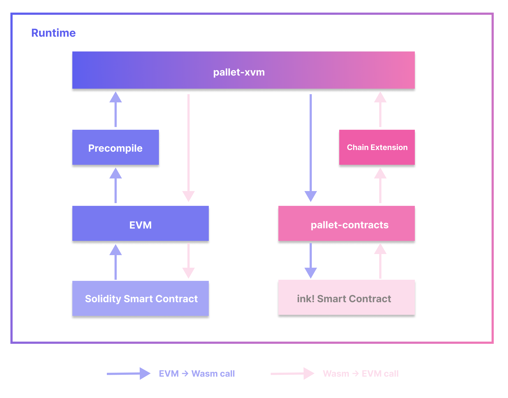

# XVM

Note that at this time XVM features are only launched in Shibuya testnet. Stay tuned for Shiden and Astar!

## Intro: Multiple VMs as one; one VM for all

As a smart contract platform, Astar Network currently supports both EVM and Wasm (WebAssembly) contracts. Based on specific needs, developers are free to build on either VM. This brings both flexibility for builders and larger groups of users to Astar Network. But the Astar team doesn’t just stop there. Even better, our multi-VM solution, XVM, is introduced to bring true interoperability between different VMs.

XVM allows smart contracts in different VMs to work together seamlessly. A smart contract in EVM can call a Wasm contract just like it’s another EVM contract and verse visa. From either EVM or Wasm perspective, contracts in different VMs can work together like they are in one: the XVM.

## Architecture



### Components

The XVM architecture contains five main components:

- `pallet-xvm`: the hub module to call EVM or Wasm.
- XVM precompile: a custom precompile that allows EVM contracts to call `pallet-xvm` .
- Chain extension: the interface that allows ink! contracts to call `pallet-xvm`
- EVM: Astar EVM implementation, which is Ethereum compatible.
- `pallet-contracts`: the VM for ink! smart contracts.

`pallet-xvm` module is the core part of XVM. It provides functions to allow other components to call EVM or Wasm, while *XVM precompile* and *chain extension* play the role of gateways for contracts to call the `pallet-xvm` module.

### Cross-VM calls

A typical XVM cross-VM call could be either:

1. Call from EVM into Wasm, or
2. Call from Wasm into EVM

For calls from EVM into Wasm, the call will be initiated by smart contracts in EVM. The call path is: EVM contract -> precompile -> `pallet-xvm` -> Wasm.

For calls from Wasm into EVM, the call will be initiated by smart contracts in Wasm. The call path is: Wasm contract -> chain extension -> `pallet-xvm` -> EVM.

Note that only calling from one VM to another is allowed. Calling the contracts within the same VM will be reverted with an error.

### Interfaces

For Solidity EVM contracts, the XVM interface is defined as follows:

```solidity
interface XVM {
    function xvm_call(
        uint8 vm_id,
        bytes calldata to,
        bytes calldata input,
        uint256 value,
        uint256 storage_deposit_limit
    ) external payable returns (bool success, bytes memory data);
}
```

For ink! Wasm contracts, XVM can be called with *chain extension*:

```rust
pub type CallResult = u32;

#[ink::chain_extension]
pub trait XvmCall {
    type ErrorCode = u32;

    #[ink(extension = 0x00010001, handle_status = false)]
    fn call(vm_id: u8, target: Vec<u8>, input: Vec<u8>, value: u128) -> CallResult;
}
```

EVM and Wasm contracts have a similar interface for XVM calls. The common arguments they share:

- `vm_id`: ID of the target VM to call. Use `0x0F` to call EVM and `0x1F` to call Wasm.
- `to`: the address of the target contract. For EVM contracts, it’s a `H160` bytes. For Wasm it’s `AccountId32` bytes.
- `input`: the encoded call arguments.
- `value`: the amount of native token to transfer, used for payable calls.

Note that in the context of callee VM, the caller address is always the address of the caller contract, instead of the user address. For instance, Alice calls an EVM smart contract `ContractA` that calls into an ink! contract, within the ink! contract’s call, the `self.env.caller` is `ContractA` address instead of Alice.

#### `input` encoding

As mentioned above, `input` of encoded arguments is needed for XVM calls. The encoding specification depends on which VM to call.

For calls to EVM (`0x0F` as VM Id), refer to [here](https://docs.soliditylang.org/en/latest/abi-spec.html#function-selector-and-argument-encoding) for Solidity ABI specifications and [here](https://docs.soliditylang.org/en/latest/abi-spec.html#examples) for examples.

For calls to Wasm (`0x1F` as VM Id), the `input` is encoded as: `selector_bytes ++ scale_encoded_args`.

#### Gaps between EVM and Wasm contracts

In the case of calling from EVM to Wasm, to call XVM in EVM, an extra parameter `storage_deposit_limit` is needed. It is required by `pallet-contracts`, to specify the maximum storage deposit to pay storage rent. As mentioned above, as the caller’s address is always a contract address instead of a user, it’s the caller contract’s address that pays for the storage rent. For Solidity contracts that call Wasm contracts via XVM, developers need to make sure the contract has enough balance for the payment, or the call fails. To pass a sufficient `storage_deposit_limit` value, developers need to know how much is required from the callee contract. For instance, they can benchmark the target call and get the limit in worst-case scenario `N`, and pass `2 x N` for margin of safety.

Another worth mentioning gap for payable calls from EVM to Wasm is the concept of *ED(existential deposit)* in `pallet-contracts`. Using the `pallet-balances` in Substrate for payable calls, `pallet-contracts` assumes all addresses, including EVM contracts address, need to meet the minimum balance requirement to keep alive (which is not true as there are no ED requirements in EVM). As mentioned above, the caller address is always the calling contract, for payable calls from EVM to Wasm, developers need to make sure their EVM contract address meets the ED requirement, otherwise, the payable call will fail in Wasm and be reverted.

### Error handling

The errors incurred in XVM calls bubble up from the callee VM to the caller VM. If an error is returned in either EVM or Wasm, the whole XVM call will be reverted.