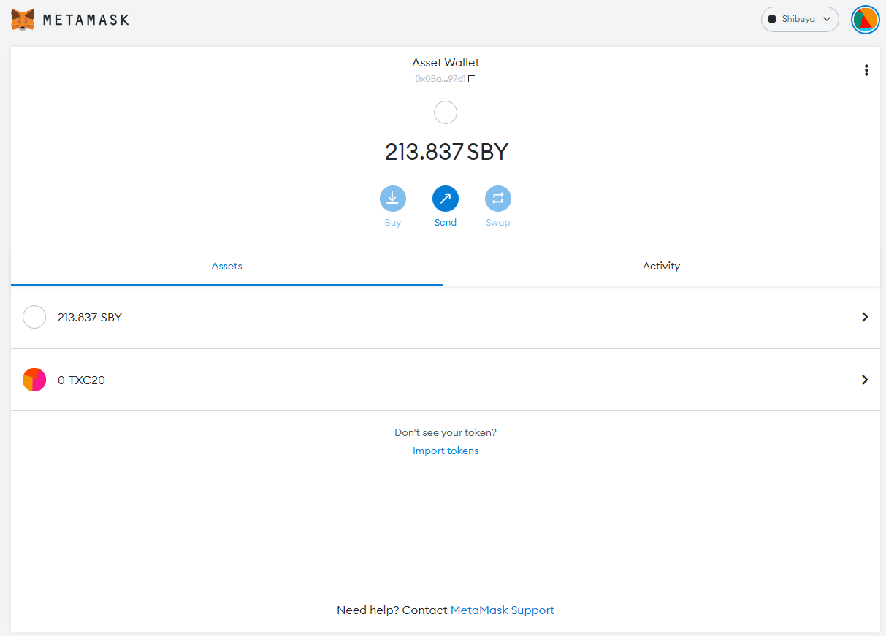
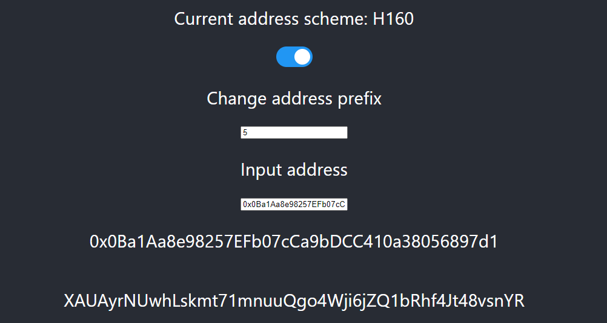
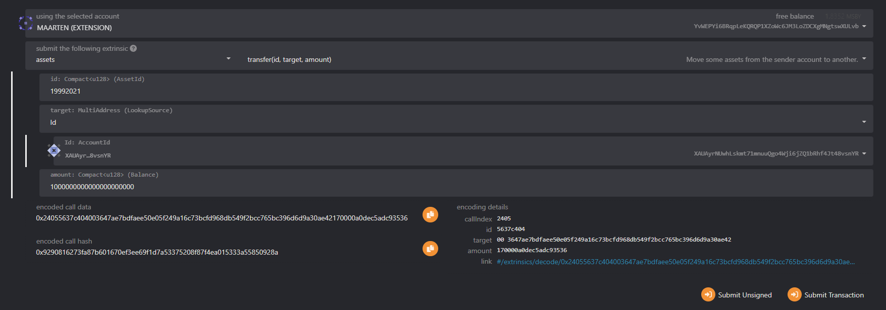
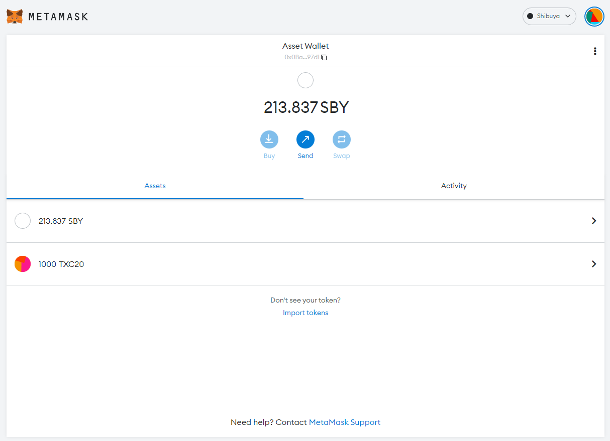

# Using XC20 Assets in EVM

## Overview

Using XCM within the EVM environment is entirely possible because Astar network uses the XC20 interface, which maps native assets listed in the Assets pallet to an ERC20-compatible interface that EVM dApps can use.

:::info

XC20s and ERC20s are similar, but there are distinct differences to be aware of since XC20s are Substrate-based assets.

One of the XC20-specific features is the existence of a **minimum-balance** threshold, specific to each asset. The minimum-balance of an asset resembles an amount which is sufficient to allow the account's existence on the system without requiring any other existential-deposit. The implication of this feature is that when transferring a certain amount of XC20 tokens, the actual amount transferred may be slightly greater in the case that the transfer would otherwise take the sender balance above zero, but below the minimum balance.

In addition, XC20 transactions executed via the Substrate API won’t be visible from EVM-based block explorers such as Blockscout. Only transactions executed via the Ethereum API will be visible through those explorers.

XC20s can interact through an ERC20 interface, so have the additional benefit of being accessible from both the Substrate and Ethereum APIs. This ultimately provides greater flexibility for developers when working with these types of assets, and allows seamless integrations with EVM-based smart contracts such as DEXs, lending platforms, and others.

:::

## Transfer XC20 to EVM address

First, let’s approach this at a high level, and move on to a more technical example for dApps.     

Let’s say we want to transfer some KSM token from Kusama to `0xd2C6929A72e466213D1c2Df8359194784650A50e`. From the Kusama side of things, the payload for sending the KSM tokens will be similar to the ones we used in the previous [section](/docs/learn/xcm/building-with-xcm/native-transactions.md). 
However, the `Beneficiary` address `AccountId` will be a mapped ss58 address of the recipient’s EVM address, as that is the only address format that XCM will accept. You can read [this article](https://medium.com/astar-network/using-astar-network-account-between-substrate-and-evm-656643df22a0) about how to create the mapped address. To keep things short, the address mappings are:

- **H160**: `0xd2C6929A72e466213D1c2Df8359194784650A50e`
- **ss58**: `YPRZVFHaRvXdnbAQsXcgqiJokpoHNkUXzR6XTBBJQKHtorT` (with prefix 5 for Shiden/Astar)
- **Public key**: `0x6c65500b73e2cec702f06dcd5299b31e4d0b6cf7728937b7d5edac79611292f2`

To obtain the asset address on the EVM, we will need to retrieve its asset `Id`. In our case, we will be using KSM, which has the asset `Id` `340282366920938463463374607431768211455`. Now we will need to convert the `Id` to hex, and append it to `0xffffffff`. In this example, the resulting address is `0xFFfFfFffFFfffFFfFFfFFFFFffFFFffffFfFFFfF`, which we can now use directly within Solidity smart contracts, or MetaMask. More info in previous [section](/docs/learn/xcm/building-with-xcm/send-xc20-evm.md#calculate-xc20-precompile-address)

## Import Assets on MetaMask

On the previous page, we created a new asset and generated the contract address. Now, let's add it to MetaMask:

:::caution

If you can't enter anything in the decimals field, then you haven't minted any assets. Ensure you have minted some assets before proceeding to the next step.

:::

1. Make sure you are connected to [the network](https://app.gitbook.com/o/-LgGrgOEDyFYjYWIb1DT/s/-M8GVK5H7hOsGnYqg-7q-872737601/~/changes/aJQFFWQNMjlao1SSjj4a/integration/network-details) where you created your token.
2. Near the bottom of the asset overview section, click Import Tokens.
3. Enter the following:
   1. Token Contract Address
   2. Token Symbol
   3. Token Decimals

As you can see in the image above, importing an asset by its contract address will allow MetaMask to read the metadata correctly, and add it to your wallet.

## Transfer XC20 assets to EVM

### Step 1: Obtain the ss58 Native Address Mapped to your EVM Address

To transfer your newly minted assets to the EVM, you will need to obtain the mapped ss58 (Substrate native) address linked to your H160 (MetaMask) address. You are able to obtain that address by following these steps:

1. Open our EVM to Substrate address [converter](https://hoonsubin.github.io/evm-substrate-address-converter/).
2. Switch to the H160 address scheme.
3. Copy your EVM address from MetaMask and paste it into the Input address field.
4. Your mapped native address will be displayed.

### Step 2: Send asset to an EVM address

For this section, we need to return to [Polkadot.js Apps](https://polkadot.js.org/apps/). Make sure you are connected to the same network on which you created your asset.

In this guide, we will send 1000 of the newly minted assets to an EVM account.

1. Navigate to `Developer -> Extrinsics`
2. Use the `assets -> transfer` extrinsic.
3. Select the account that has permission to send the asset.
4. Enter the `asset id`. See the previous page to determine what asset id you will need to enter. In this example, we are using `19992021`.
5. Enter your native address in the `Id` field, the one you received after converting your EVM address to native.
6. The last field is the amount, and we want to send `1000` tokens. In this example, we enter `1000` followed by 18 zeros, due to the asset requiring 18 decimals of precision.
7. Sign and Submit the transaction.

:::info

- We are working closely with our block explorers to map new assets, so they will be visible in our explorers.
- If you receive an error transferring your tokens to another EVM account, try increasing the gas fee.

:::