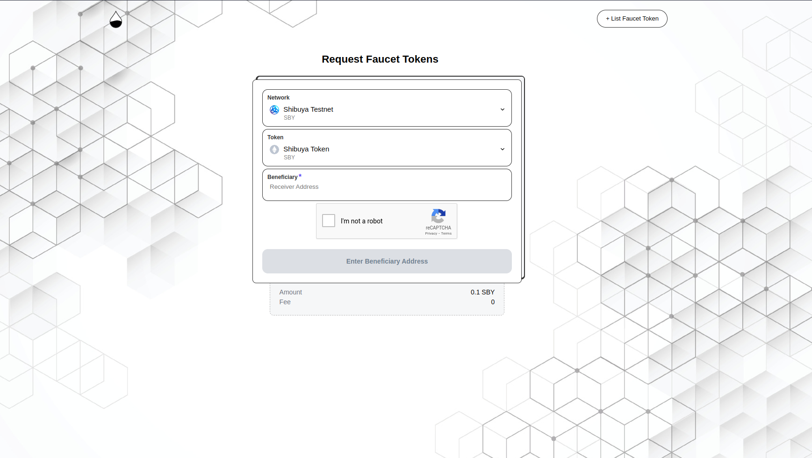
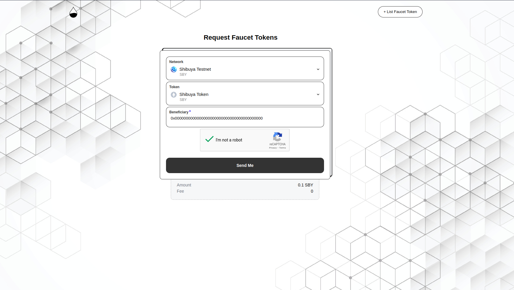

# Faucets

## Astar Portal
Faucets are available for all Shibuya accounts and empty accounts on Astar and Shiden.  
To access the faucet visit [the portal](https://portal.astar.network/#/assets), and click on the `Faucet` button.

Then, click the `I'm not a robot` checkbox, and click **Confirm**.

## [Astar Discord Server](https://discord.com/invite/kvRRnvBbQn)

Once you join the Discord server, you will be able to see the **#shibuya-faucet** channel.

In the **#shibuya-faucet** channel, please type `/drip`, and click on **network**.

Select the network.

Click on **address** and paste your address.

If your inputs are valid, you can receive tokens from the faucet.

## Chaindrop Portal

Faucet is currently only available for Shibuya.  
To access the faucet visit [our portal](https://chaindrop.org/?chainid=81&token=0xeeeeeeeeeeeeeeeeeeeeeeeeeeeeeeeeeeeeeeee), and select Shibuya from the token list.

Paste your wallet address in the `beneficiary` field.  
Click the `I'm not a robot` checkbox, to validate the Captcha.

Click `Send Me` to recieve an amount in your wallet, you can also see the amount you will receive below.  
Additionally you can also click on `success` link to view your transaction on explorer.