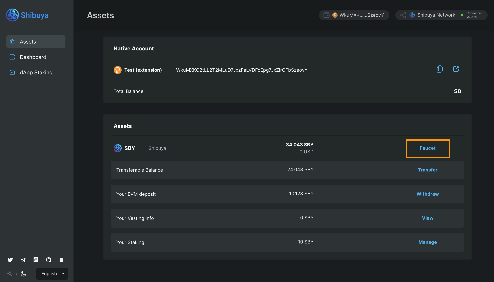

# Faucets

## Via Portal

Faucets are available for all Shibuya accounts and empty accounts on Astar/Shiden.

To access the faucet visit <https://portal.astar.network/#/assets>, and click on the 'Faucet button.

Then, click the `I'm not a robot` checkbox, and click 'Confirm'.

## Via [Astar Discord Server](https://discord.com/invite/kvRRnvBbQn)

Once you join the Discord server, you will be able to see the **#shibuya-faucet** channel.

In the **#shibuya-faucet** channel, please type `/drip`. Then, you can see the following options. Please click **network**

and select the network.

Lastly, please click **address** and paste your address.

If your inputs are valid, you can receive tokens from the faucet.

Enjoy🚀
