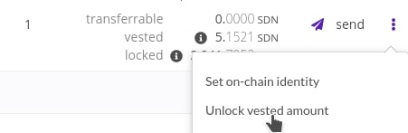

# Unbond Vested Tokens

If you joined the crowdloan, you will have vested tokens that you can unlock.

To unbond your tokens, go to your wallet and load your account.

When your account is loaded you will see your tokens and how many are locked, vested, or transferrable:

Click on the three dots next to 'send' where you can 'Unlock vested amount'. When you click on this, you need to confirm and sign the transaction.

After unlocking the tokens, it will be displayed as transferrable which means you can transfer the tokens. But if it has already been staked in the first place, it will appear as locked. Staked tokens are locked and if you want to make it transferrable, unbond your stake.
