# Using a Multisig Account on Astar Portal

This guide will assist you in utilizing a multisig account on Astar Portal via PolkaSafe.

## **Prerequisites**

- Install a substrate wallet extension (such as Polkadot.js, SubWallet, or Talisman) on your browser.
- Prepare at least two Astar wallet addresses ([See reference](/docs/user-guides/create-wallet)).

## Understanding the Benefits of Multisig Accounts

Multisig accounts offer several key benefits, particularly in terms of security, control, and flexibility:

1. **Enhanced Security:** The need for more keys reduces the risk of unauthorized access.
2. **Reduced Risk:** You won't lose access to the account even if you lose a single key.
3. **Access Control:** Multisig allows multiple users to share control over an account.
4. **Flexibility:** You can customize the number of required signatures for transactions.
5. **Dispute Resolution:** Multisig prevents unilateral decisions by requiring majority or total agreement.
6. **Auditability:** Multisig accounts provide a clear record of approved transactions.

## Creating a Multisig Account on PolkaSafe

PolkaSafe integrates with Polkadot's multisig solution, offering a seamless user experience and robust security features for managing assets in the Polkadot ecosystem. You can use the multisig accounts created on PolkaSafe with the Astar Portal.

1. Visit [PolkaSafe](https://app.polkasafe.xyz/).
2. Select the Astar network and click 'Connect Wallet.'
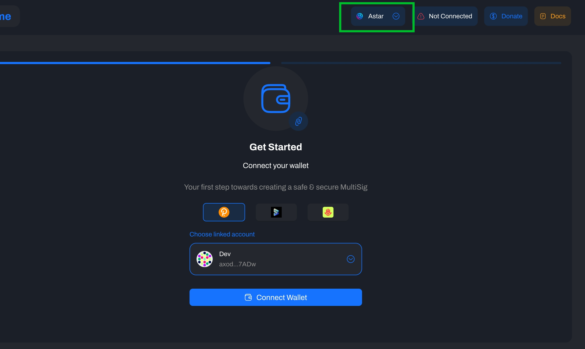
3. Choose a wallet and select an account with more than 0 ASTR.
4. Sign the message via the wallet extension.
5. Select 'Create Multisig.'
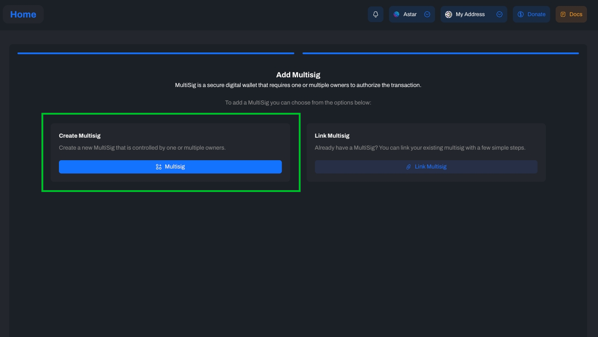
6. Choose the signatory addresses to include in the multisig account. You can select from your wallet or add an address manually.
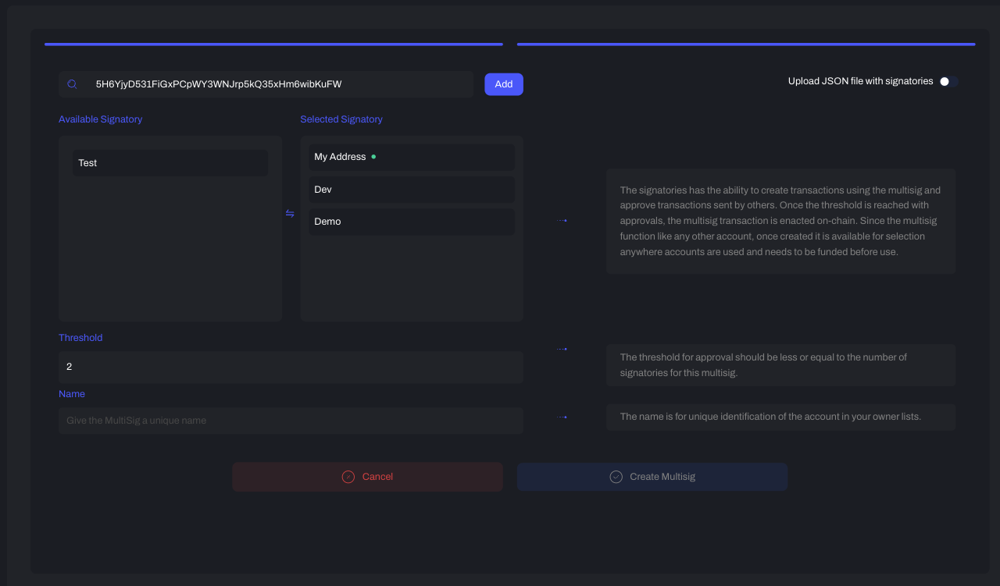
7. Input the threshold number (the minimum required signatures to authorize and execute a transaction) and name the multisig account.
8. Sign the message to add a small Existential Deposit to the multisig account.
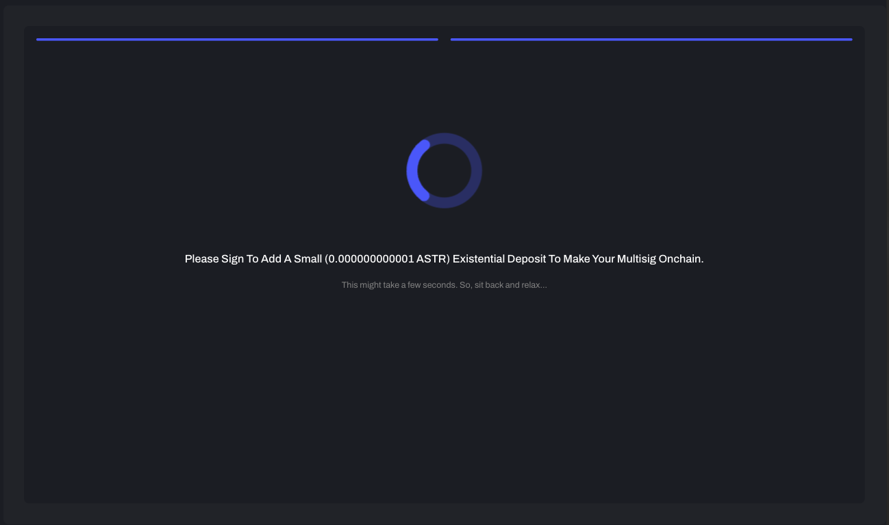
9. Now, you can manage your multisig account on PolkaSafe.
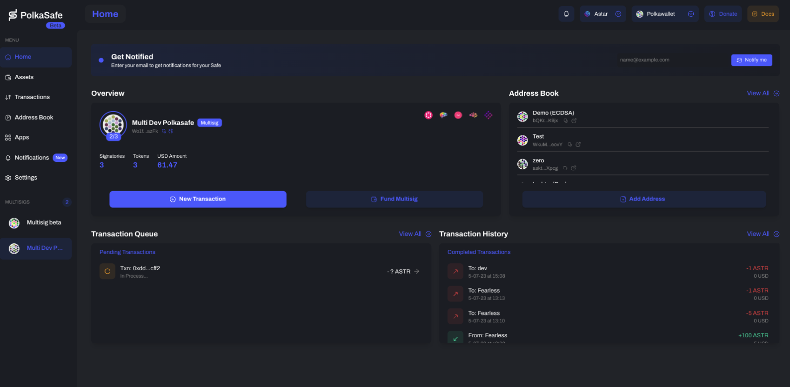

Reference: [PolkaSafe Documentation](https://docs.polkasafe.xyz/)

## Sending Transactions on Astar Portal and Approving them on PolkaSafe

1. Go to the Astar Portal and select PolkaSafe.
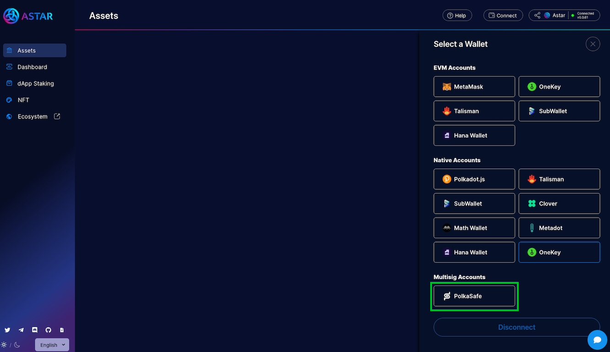
2. Choose one of the signatories (owners) to create multisig transactions.
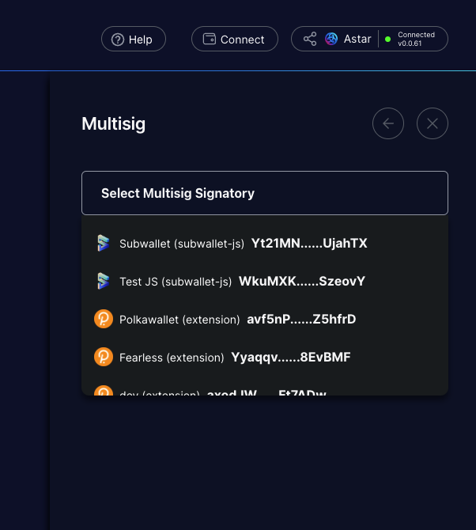
1. Sign the message on the wallet extension (the wallet popup might **take a moment** to appear). 
2. Select the multisig account and click Connect. 
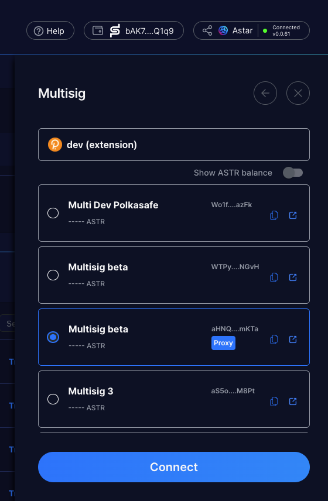
1. You can now use the Astar Portal in the same way you would with normal accounts.
2. Once the transaction is completed, click 'Approve on PolkaSafe' and approve the transaction on PolkaSafe. You should connect to signatory accounts other than the one selected on Astar Portal. 
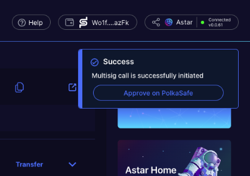
1. If you want to understand the transaction details, copy the 'Call Data' and paste it on the [Decode page](https://polkadot.js.org/apps/?rpc=wss%3A%2F%2Frpc.astar.network#/extrinsics/decode) on the Polkadot.js portal.
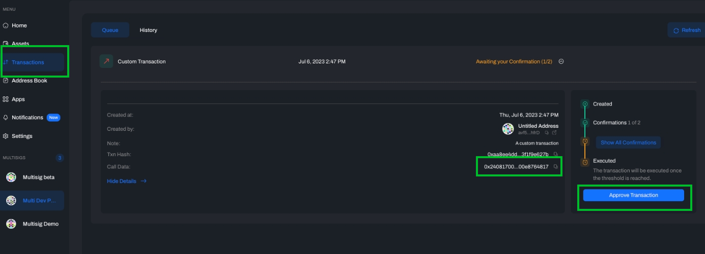
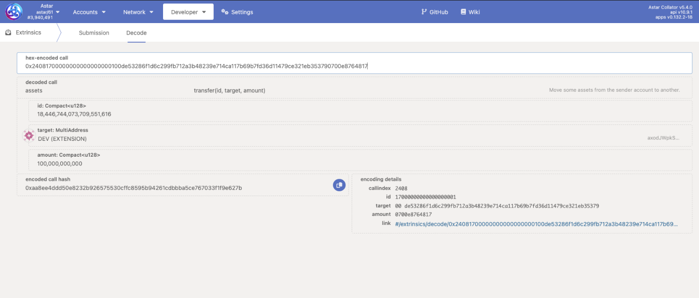