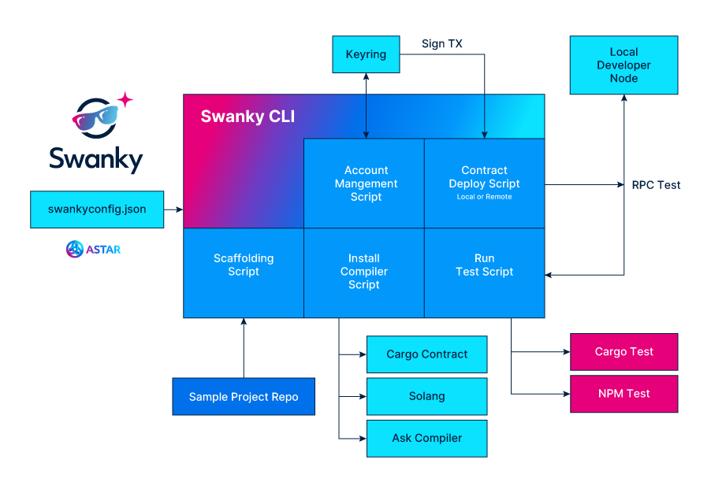

import Figure from '/src/components/figure'

# Swanky Suite

Swanky Suite aims to be a "all-in-one" tool for Wasm smart contract developers. It is based on existing tools like` cargo contract CLI` and `polkadot.js` but extending with many additional features such as generating a new smart contract environment based on example projects and providing an instant finality node (Swanky node) which will shorten the contract development lifecycle. Swanky Suite is the tool that enables all existing (and future) Web3 developers to have an equal experience compared to EVM dev tooling.

Features of Swanky Suite:

- Quick start a local contract development node with instant finality (Swanky Node)
- Scaffolding a new project with various templates for both smart contracts and front-end dApp. ie. Truffle for ink!
- Compiling projects with various languages (like Ink!, Ask-Lite, …)
- Setting up RPC tests and integration tests via npm for interacting with smart contracts on the client-side
- Handling network accounts
- Deploying smart contracts to networks within the Dotsama ecosystem that support pallet-contracts
- Making arbitrary calls to the deployed smart contracts

## Architecture overview

The Swanky Suite consists of two main parts, Swanky CLI and the Swanky Node.

Source code for both Swanky CLI nad Swanky Node is hosted on GitHub:

- [Swanky CLI](https://github.com/AstarNetwork/swanky-cli)
- [Swanky Node](https://github.com/AstarNetwork/swanky-node).

The envisioned architecture of Swanky CLI and Swanky Node (Local developer node)



## Swanky CLI

Swanky CLI is a Node.js CLI app that uses the Polkadot.js API as its backend alongside many existing tools like the cargo contract CLI. There will be many features that will support the developer such as bootstrapping WASM dApps via smart contract and UI scaffolding, running integration tests, starting local nodes, account management, connecting and deploying contracts to both local and remote networks, compiling for various languages from a single CLI app, compatibility check from contract pallet to the compiler, and much more.

### Installing

CLI can be installed in two ways:

#### Globally with npm

This approach is arguably simpler, but due to the nature of NodeJs dependency management, could lead to dependency and compatibility errors.

```sh-session
$ npm install -g @astar-network/swanky-cli
```

or

```sh-session
$ npx @astar-network/swanky-cli [command]
```

#### Downloading the precompiled binaries

This is the recommended way - it comes with all the dependencies (even NodeJs) included and will support auto-updates in the future.

1. Download the correct archive for your platform from the [releases section of swanky-cli github page](https://github.com/AstarNetwork/swanky-cli/releases).

2. Extract the archive to appropriate location, for example `software` directory.

3. Add the `swanky` executable to your path variable by creating a symbolic link to it from a common `bin` directory or similar.

> Example on MacOS:
>
> `ln -s /Users/my_name/software/swanky-cli/bin/swanky /usr/local/bin`

### Commands

#### `swanky help`

Display help and usage examples for swanky commands and subcommands.

```
USAGE
  $ swanky help [COMMAND] [-n]

ARGUMENTS
  COMMAND  Command to show help for.

FLAGS
  -n, --nested-commands  Include all nested commands in the output.

DESCRIPTION
  Display help for swanky.
```

#### `swanky init`

Scaffold a WASM project.

```
USAGE
  $ swanky init [PROJECTNAME] [--swanky-node] [--template blank|flipper|psp22] [-v]

ARGUMENTS
  PROJECTNAME  directory name of new project

FLAGS
  -v, --verbose
  --swanky-node
  --template=<option>  <options: blank|flipper|psp22>

DESCRIPTION
  Generate a new smart contract environment
```

<Figure caption="Initiate a project" src={require('./img/01-init.gif').default} />

After answering the prompts, Swanky will modify the templates, download the node and run appropriate installation scripts.
The resulting folder structure should look like this:

<Figure caption="Folder structure" src={require('./img/01a-folder_structure.png').default} />

#### `swanky check`

Verify the dependencies needed to run the swanky project.

```
USAGE
  $ swanky check

DESCRIPTION
  Check installed package versions and compatibility
```

<Figure caption="Verify dependencies" src={require('./img/02-check.gif').default} />

:::note
Currently you have to be be in a project folder to run this command.
:::

#### `swanky account`

Create and manage accounts to be used in contract interaction.

```
USAGE
  $ swanky account COMMAND

COMMANDS
  account create  Create a new dev account in config
  account list    List dev accounts stored in config
  account ls      List dev accounts stored in config
```

When creating a new account with `swanky account create`, you will be asked if you're creating a dev account.
If you answer YES, the mnemonic for that account will not be encrypted, and you will not be asked to create a password, nor to input it when interacting with a contract.
Be careful not to use that account on live networks.

To generate a new mnemonic, use `-g` or `--generate` flag.

<Figure caption="Generate account" src={require('./img/06-account_generate.gif').default} />

#### `swanky contract`

Compile, deploy, call a command on a given contract, or scaffold a new contract inside the project.

```
USAGE
  $ swanky contract COMMAND

COMMANDS
  contract call     Call a method on a smart contract
  contract compile  Compile the smart contract(s) in your contracts directory
  contract deploy   Deploy contract to a running node
  contract new      Generate a new smart contract template inside a project
```

#### `swanky contract compile`

```
Compile the smart contract(s) in your contracts directory

USAGE
  $ swanky contract compile [CONTRACTNAME] [-v]

ARGUMENTS
  CONTRACTNAME  Name of the contract to compile

FLAGS
  -v, --verbose  Display additional compilation output

DESCRIPTION
  Compile the smart contract(s) in your contracts directory
```

<Figure caption="Compile a contract" src={require('./img/03-compile.gif').default} />

#### `swanky contract deploy`

Deploy a compiled contract to a running node.

```
USAGE
  $ swanky contract deploy [CONTRACTNAME] --account <value> -g <value> [-a <value>] [-n <value>]

ARGUMENTS
  CONTRACTNAME  Name of the contract to deploy

FLAGS
  -a, --args=<value>...
  -g, --gas=<value>      (required)
  -n, --network=<value>  Network name to connect to
  --account=<value>      (required) Alias of account to be used

DESCRIPTION
  Deploy contract to a running node
```

<Figure caption="Deploy a contract" src={require('./img/08-deploy.gif').default} />

#### `swanky contract new`

Generate a new smart contract template inside a project

```
USAGE
  $ swanky contract new [CONTRACTNAME] [--template blank|flipper|psp22] [-v]

ARGUMENTS
  CONTRACTNAME  Name of new contract

FLAGS
  -v, --verbose
  --template=<option>  <options: blank|flipper|psp22>

DESCRIPTION
  Generate a new smart contract template inside a project
```

#### `swanky contract call`

Call a method on a smart contract

```
USAGE
  $ swanky contract call --address <value> -m <value> [-a <value>] [-d] [-g <value>] [-n <value>]

FLAGS
  -a, --args=<value>
  -d, --dry
  -g, --gas=<value>
  -m, --message=<value>  (required)
  -n, --network=<value>  Network name to connect to
  --address=<value>      (required)

DESCRIPTION
  Call a method on a smart contract
```

#### `swanky node`

Manage a local node.

```
USAGE
  $ swanky node COMMAND

COMMANDS
  node purge  Purge local chain state
  node start  Start a local node
```

<Figure caption="Start a local node" src={require('./img/07-node_start.gif').default} />

## Swanky Node

Swanky node is a Substrate based blockchain configured to enable `pallet-contracts` (a smart contract module) and more features to help WASM smart contract development locally.

## Features

- [pallet-contracts](https://github.com/paritytech/substrate/tree/master/frame/contracts) (polkadot-0.9.27) and its unstable-feature are enabled by default.
- `grandpa` & `aura` consensus were removed. Instead, `instant-seal` & `manual-seal` are used.
  Blocks are authored (1) as soon as a transaction get in the pool (2) when `engine_createBlock` RPC called.
  Blocks are finalized when `engine_finalizeBlock` RPC called.
- [pallet-dapps-staking](https://github.com/AstarNetwork/astar-frame/tree/polkadot-v0.9.27/frame/dapps-staking) and ChainExtension to interact with it.
- [pallet-assets](https://github.com/paritytech/substrate/tree/master/frame/assets).
- [pallet-rmrk](https://github.com/AstarNetwork/rmrk-substrate/tree/polkadot-v0.9.27) (core, equip, market) and chain extensions for pallet-rmrk-core.

It is optimized to local development purpose while removing unnecessary components such as P2P.
More features and pallets to interact with (Contract <-> Runtime) will be added.

## Compatible ink! version

ink! version `3.3.1` or lower is supported by pallet-contract polkadot-0.9.27 branch.

## Installation

### Download Binary

The easiest way is to download a binary release from [Release Page](https://github.com/AstarNetwork/swanky-node/releases)

### Build Locally

First, complete the [basic Rust setup instructions](https://github.com/AstarNetwork/swanky-node/blob/main/docs/rust-setup.md).
After that, you can build node via

```bash
cargo build --release
```

### Embedded Docs :book:

Once the project has been built, the following command can be used to explore all parameters and
subcommands:

```bash
./target/release/swanky-node -h
```

## Usage

This command will start the single-node development chain with persistent state.

```bash
./target/release/swanky-node
```

If you want to run the node with non-persist mode, use tmp option.

```
./target/release/swanky-node --tmp
# or
./target/release/swanky-node --dev
```

Purge the development chain's state.

```bash
./target/release/swanky-node purge-chain
```

> Development **alice** account will be authority and sudo account as declared in the
> [genesis state](https://github.com/AstarNetwork/swanky-node/blob/main/node/src/chain_spec.rs#L44).
> At the same time the following accounts will be pre-funded:
>
> - Alice
> - Bob
> - Charlie
> - Dave
> - Eve
> - Ferdie
> - Alice//stash
> - Bob//stash
> - Charlie//stash
> - Dave//stash
> - Eve//stash
> - Ferdie//stash

### Show only Errors and Contract Debug Output

To have only errors and contract debug output show up on the console you can supply `-lerror,runtime::contracts=debug` when starting the node.

Important: Debug output is only printed for RPC calls or off-chain tests ‒ not for transactions.

See ink! [FAQ](https://ink.substrate.io/faq/#how-do-i-print-something-to-the-console-from-the-runtime) for more details: How do I print something to the console from the runtime?.

### Connect with Polkadot-JS Apps Front-end

Once the swanky node is running locally, you can connect it with **Polkadot-JS Apps** front-end
to interact with your chain. [Click
here](https://polkadot.js.org/apps/#/explorer?rpc=ws://localhost:9944) connecting the Apps to your
local swanky node.

### Run in Docker

First, install [Docker](https://docs.docker.com/get-docker/) and
[Docker Compose](https://docs.docker.com/compose/install/).

Then run the following command to start a single node development chain.

```bash
mkdir .local # this is mounted by container
./scripts/docker_run.sh
```

This command will firstly compile your code, and then start a local development network. You can
also replace the default command
(`cargo build --release && ./target/release/swanky-node --dev --ws-external`)
by appending your own. A few useful ones are as follow.

```bash
# Run Substrate node without re-compiling
./scripts/docker_run.sh ./target/release/swanky-node --ws-external

# Purge the local dev chain
./scripts/docker_run.sh ./target/release/swanky-node purge-chain

# Check whether the code is compilable
./scripts/docker_run.sh cargo check
```

## Consensus (Manual Seal & Instant Seal)

Unlike other blockchains, Swanky node adopts block authioring and finalized gadget called Manual Seal and Instant Seal, consensus which is suitable for contracts development and testing.

Manual seal - Blocks are authored whenever RPC called.
Instant seal - Block are authored as soon as transactions get inside the pool, most often one transaction per block.

Swanky node enables both Manual seal and Instant seal.

### Manual Seal RPC calls

We can tell the node to author a block by calling the `engine_createBlock` RPC.

```bash
$ curl http://localhost:9933 -H "Content-Type:application/json;charset=utf-8" -d   '{
     "jsonrpc":"2.0",
      "id":1,
      "method":"engine_createBlock",
      "params": [true, false, null]
    }'
```

#### Params

- **Create Empty**
  `create_empty` is a Boolean value indicating whether empty blocks may be created. Setting `create-empty` to true does not mean that an empty block will necessarily be created. Rather it means that the engine should go ahead creating a block even if no transaction are present. If transactions are present in the queue, they will be included regardless of `create_empty`'s value.'

- **Finalize**
  `finalize` is a Boolean indicating whether the block (and its ancestors, recursively) should be finalized after creation.

- **Parent Hash**
  `parent_hash` is an optional hash of a block to use as a parent. To set the parent, use the format `"0x0e0626477621754200486f323e3858cd5f28fcbe52c69b2581aecb622e384764"`. To omit the parent, use `null`. When the parent is omitted the block is built on the current best block. Manually specifying the parent is useful for constructing fork scenarios and demonstrating chain reorganizations.

#### Manually Finalizing Blocks

In addition to finalizing blocks while creating them, they can be finalized later by using the second provided RPC call, `engine_finalizeBlock`.

```bash
$ curl http://localhost:9933 -H "Content-Type:application/json;charset=utf-8" -d   '{
     "jsonrpc":"2.0",
      "id":1,
      "method":"engine_finalizeBlock",
      "params": ["0x0e0626477621754200486f323e3858cd5f28fcbe52c69b2581aecb622e384764", null]
    }'
```

### More Details

For more detailed documentation please visit the [`swanky-node` GitHub repo].

## Documentation

[`swanky` CLI Github repo] with the latest documentation

[`swanky-node` Github repo] with the latest documentation.

[`pallet-contracts`]: https://github.com/paritytech/substrate/tree/master/frame/contracts
[`pallet-dapps-staking`]: https://github.com/AstarNetwork/astar-frame/tree/polkadot-v0.9.27/frame/dapps-staking
[`pallet-assets`]: https://github.com/paritytech/substrate/tree/master/frame/assets
[`swanky-node` github repo]: https://github.com/AstarNetwork/swanky-node
[`swanky` cli github repo]: https://github.com/AstarNetwork/swanky-cli
