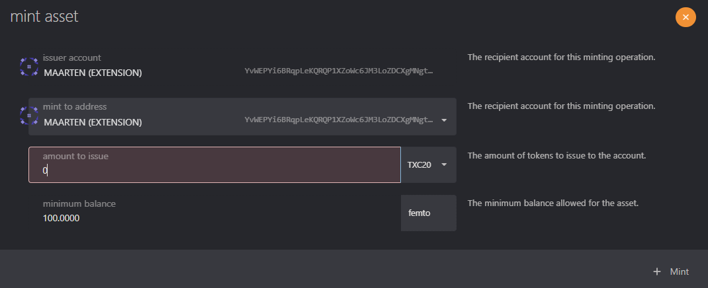

# Manage XC20 with MetaMask

## Instructions

### Check on the Portal

When you go to the [Assets](https://portal.astar.network/#/assets), log in with your MetaMask account to see all your assets.

As you can see in the screenshot above, we have DOT assets in our EVM wallet. Now let's add the asset to our MetaMask.

### Import assets on MetaMask

Open your MetaMask and connect your wallet with DOT assets. Make sure you are connected to the Astar Network. If not, you can find all [Network Details here]().

When you are connected you can import tokens into your wallet. Click on Import tokens and use the following information:

- Token Contract Address: 0xFFfFfFffFFfffFFfFFfFFFFFffFFFffffFfFFFfF
- Token Symbol: DOT
- Decimals: 10

When you are done with adding and importing the DOT asset you can see them in your wallet. You can find the full list of [supported XCM assets here]().