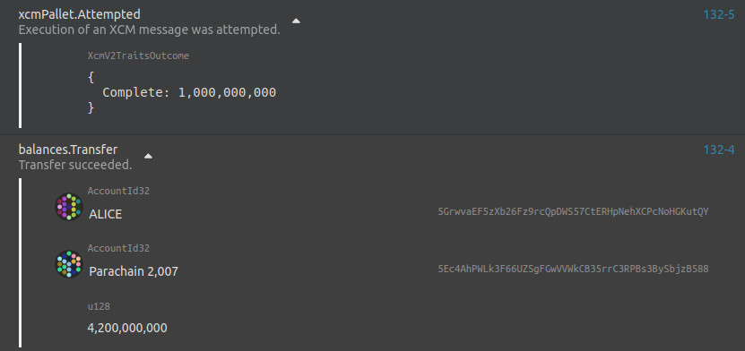

# Native Transactions

Let’s look into how we can transfer native relay-chain assets (DOT or KSM) to our Astar or Shiden.

This will be a more low-level demonstration since we’ll be using the Polkadot.js portal. Standard users will interact with this via our portal where all the complexity will be hidden, so don’t worry! 🙂

For this demonstration, we will use Shiden Network and **KSM** tokens.

## Initial State

Native relay chain asset is represented on Astar or Shiden via asset Id `0xFFFFFFFFFFFFFFFFFFFFFFFFFFFFFFFF` or `340282366920938463463374607431768211455` in decimal.

Initially, we have no KSM assets on Shiden.

Let’s now prepare and bring some assets from Kusama over to Shiden.

This will be an example of VMP protocol usage or DMP to be more specific. We will make use of the `reserve_transfer_asset` functionality. This consists of moving an asset on one blockchain to another blockchain via an intermediary *Sovereign* account. Origin chain asset won’t be destroyed, instead, the *Sovereign* will hold it. The target chain will mint a wrapped asset and deposit it to the target address.

The *Sovereign* account ensures that the same assets cannot simultaneously be used on both chains. It also guarantees that the wrapped asset is interchangeable with the asset on the origin chain.

Alice wants to send some tokens to an account on Shiden Network so she prepares `reserve_transfer_asset` call on the relay chain. Parameters look like this:

We specify:

- Destination
  - Using the MultiLocation notation, we describe the target chain, which is Shiden, as `/Parachain(2007)`. The notation resembles filesystem paths where the relay chain is considered to be root.
- Beneficiary
  - Once again using the *MultiLocation* notation, we describe the beneficiary of the asset transfer. Take note that this is the context of the destination chain. We’re transferring to an account whose address is `Zcvndjciib1X92KeyVBZMv4oUE99Ut1xRCA1e9xMdqXfP27` on Shiden. But instead of specifying the Shiden address, we’ll specify the account ID (or public key) associated with this address: `0xa2ee1f41b5bd08934f178a12e2b0169af05630a212e89d1bb644f67d2192f475`
- Assets being transferred
  - Finally, we describe the assets being transferred. Since we’re transferring native relay chain assets, we specify these are **Concrete assets** and their location is **Here** in the context of the relay chain. The asset is fungible, therefore we need to specify the amount being transferred, in this case, a total of **4200000000** tokens.

After initiating the transfer, we can observe what happens on the relay chain:

Execution of an XCM message was attempted and funds were transferred from Alice to the Sovereign account.

On the Shiden side, we can observe the following:

XCM message has been received and instructions executed. As a result, an asset with Id `340282366920938463463374607431768211455` has been minted, a total of **4196000000** tokens. These tokens have been deposited into the designation account.

Note that that received amount is less than what was originally sent. This is because **4000000** has been used to pay the transaction fee on the destination chain.

We’ve successfully transferred assets from Kusama over to Shiden!
