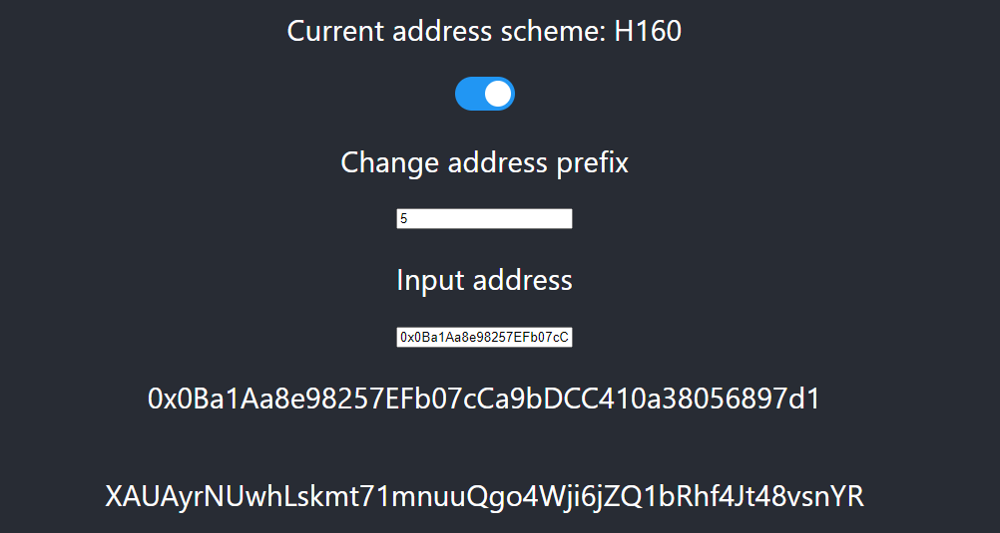

# Send XC20 Assets to EVM

## Overview

Using XCM within the EVM environment is also simple as our network uses the XC20 interface, which maps the Assets pallet to an ERC20-compatible interface that EVM dApps can use.

:::info

XC20s and ERC20s are very similar, some distinct differences are to be aware of since XC20s are Substrate-based assets.

One of the XC20 specific features is the existence of asset's minimum-balance specific for each asset. Minimum-balance of an asset resembles an amount which is sufficient to allow the account's existence on the system without requiring any other existential-deposit. This feature's implication is that when transferring a certain amount of XC20 tokens, the amount actually transferred may be slightly greater in the case that the transfer would otherwise take the sender balance above zero but below the minimum balance. Must be greater than zero.

In addition, XC20s transactions done via the Substrate API won’t be visible from EVM-based block explorers such as Blocksout. Only transactions done via the Ethereum API are visible through those explorers.

XC20s can interact through an ERC20 interface, so they have the additional benefit of being accessible from both the Substrate and Ethereum APIs. This ultimately provides greater flexibility for developers when working with these types of assets and allows seamless integrations with EVM-based smart contracts such as DEXs, and lending platforms, among others.

:::

First, let’s approach this at a high level, and then move on to a more technical example for dApps. Let’s say I want to move the KSM token from Kusama to `0xd2C6929A72e466213D1c2Df8359194784650A50e`. From the Kusama side of things, the payload for sending the KSM tokens will be similar to the ones we used in the previous section. However, the `Beneficiary` address (account ID) will be a mapped SS58 address of the recipient’s EVM address as that is the only address format that XCM can accept. You can read [this article](https://medium.com/astar-network/using-astar-network-account-between-substrate-and-evm-656643df22a0) on how to create the mapped address. To keep things short, address mappings are:

- **H160**: `0x107bAe763DC63e0686C574FdE1B58115c7d19280`
- **SS58**: `Zag6jpFEU93xsEfczHbJucBUJAHMZFVsk4b3amvV5oXbJoo` (with prefix 5 for Shiden/Astar)
- **Public key**: `0xa1363005871407f62f4b7e5752a7bc2934447699c08f4caf1b8c393287c0f502`

To obtain the asset address for EVM, we need to get the token asset ID that we wish to use. In our case, we will be using KSM, which has the asset ID of `340282366920938463463374607431768211455`. Now we need to convert the ID to hex and prefix it with `0xffffffff`. The resulting address will be `0xffffffffFFFFFFFFFFFFFFFFFFFFFFFFFFFFFFFF`. We can directly load this address with the ERC20 interface and use it within our Solidity smart contract or use it within MetaMask.

## Import Assets on MetaMask

On the previous page, we create a new asset and generated our asset contract address. Now let's add that contract address to MetaMask:

:::caution

If you can't enter the decimals you haven't minted any assets. Make sure you minted your asset before going to this step.

:::

1. Make sure you are connected to [the network](https://app.gitbook.com/o/-LgGrgOEDyFYjYWIb1DT/s/-M8GVK5H7hOsGnYqg-7q-872737601/~/changes/aJQFFWQNMjlao1SSjj4a/integration/network-details) you created your token.
2. Click in your asset overview below on Import Tokens.
3. Add the following:
   1. Token Contract Address
   2. Token Symbol
   3. Token Decimals

As you can see from the above image, importing an asset from the created address will correctly read the asset and add it to our wallet.

## Send XC20 asset to EVM

### Step 1: Convert Address

This part will be improved later to make it more builders friendly but we will explain it step by step. To send your newly created asset to EVM you first need to know your native mapped wallet to your EVM account. You can get that address by following these steps:

1. Open our EVM to Substrate address [converter](https://hoonsubin.github.io/evm-substrate-address-converter/).
2. Switch to the H160 address scheme.
3. Copy your EVM address from MetaMask and paste it into the Input address field.
4. Your mapped native address will now be displayed.

## Step 2: Send to EVM

For this part, we need to go back to [Polkadot.js Apps](https://polkadot.js.org/apps/). Make sure you are connected to the same network you created your asset.

In this guide, I want to send an amount of 1000 minted assets to my EVM account.

1. Navigate to `Developer -> Extrinsics`
2. Use the `assets -> transfer` extrinsic.
3. Select the account that has permission to send the asset.
4. Enter your `asset id`. See the previous page to know what asset id you need to enter For this guide, we are using `19992021`.
5. Enter your native address in the `Id` field, the one you got with converting your EVM address to native.
6. The last part is the amount, I want to send `1000` tokens to my address. In my case, I enter `1000` with 18 zeros because of using 18 decimals.
7. Submit and sign the transaction.

:::info

- We are still working closely with our block explorers to map the new assets and be visible in our explorers.
- If you get an error with sending your tokens to another EVM account, please increase the gas fee.

:::