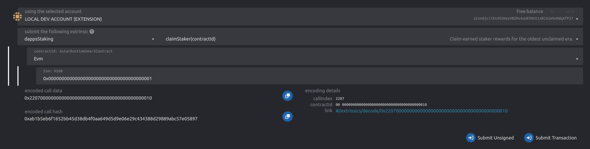
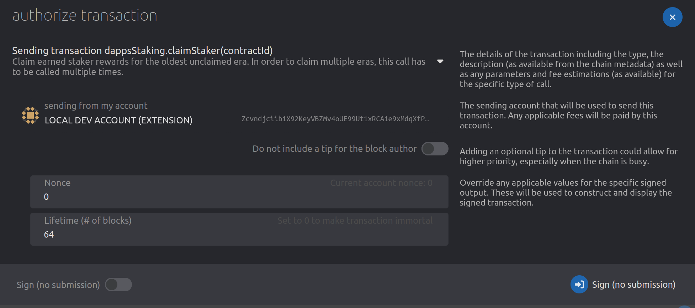
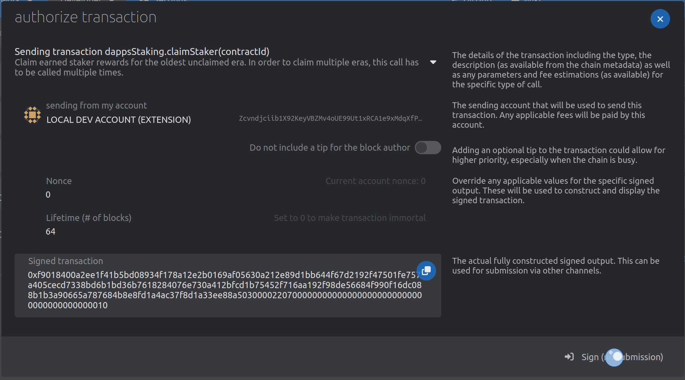
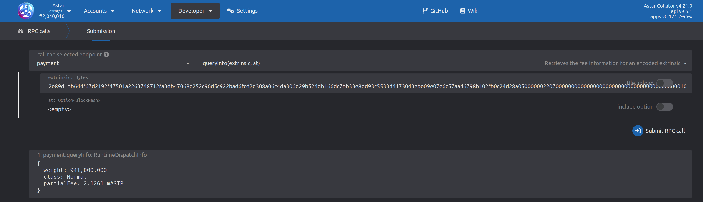
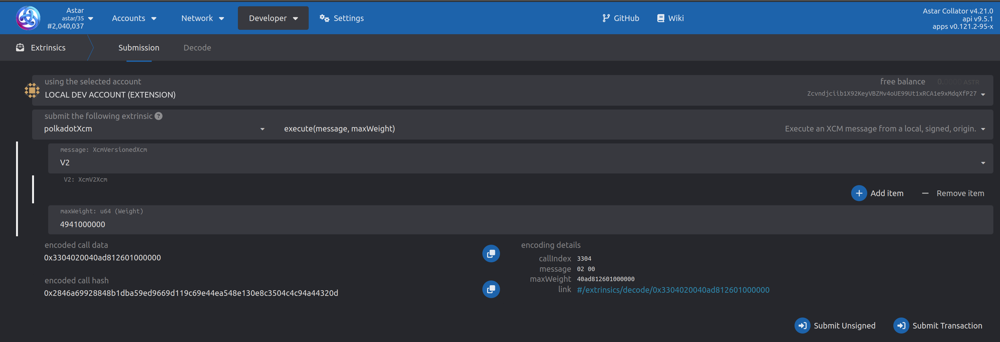
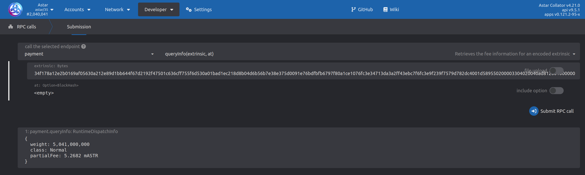

# Remote Transact via XCM

## Feature Overview

XCM's `Transact` instructions allows the sender to execute arbitrary calls in the destination chain. This feature is extremely useful since it allows us to control our account on a remote chain.

For example, a user could send `Transact` instruction from **Astar** to **Polkadot** that will transfer some `DOT` from user's derived account on **Polkadot** to an arbitrary receiver account on **Polkadot**. The end user doesn't directly interact with **Polkadot** chain, but can still change its state. It's important to note that this is just an example - any call that can be interpreted by the remote (destination) chain can potentially be sent and executed.

This is of particular use to smart contracts since it allows them to build custom cross-chain interoperable logic.

It's important to understand the difference between sending an XCM instruction sequence and receiving/interpreting it. 

Sending an XCM from `Astar` or `Shiden` to another remote chain might be successfull on the sender side, but execution on the destination chain might fail. The same is true for the vice-versa scenario. This can be for multiple reasons - the XCM sequence might be incorrect, the remote chain doesn't know how to inrerpret the provided `call` or perhaps the remote chain doesn't allow remote execution at all.

The user must ensure that the destination chain supports the encoded call and remote transaction in general.

## Remote Transact on Astar/Shiden/Shibuya

### XCM Sequence

At the moment, remote execution that doesn't come from parachain accounts isn't allowed by any of our runtimes.
This will be changed very soon.

The sequence that we will allow will have to start like:
1. `DescendOrigin`
2. `WithdrawAsset`
3. `BuyExecution`
4. `Transact` or `SetAppendix` or _whatever user wants_

This XCM sequence prefix can be followed up by arbitrary instructions, e.g. with `Transact`.
Although we cannot guarantee this, other chains will most likely allow the same (or very similar) sequence prefix.

### DescendOrigin

Ensures that the origin isn't a parachain but a more complex junction like `{ parachain: 2006, accountId: 0x123aff....ff }`. If this was omitted, any call would be executed as if it was sent from the *root-only* parachain's sovereign account, and we cannot allow that.

### WithdrawAsset

Withdraws assets on the destination chain from the derived sender account. The account must have the specified asset and the requested amount, otherwise the instruction will fail. These assets are used to pay for the XCM execution time.

### BuyExecution

Using the withdrawn assets, buys XCM executuion time.

## Transact

Execute the specified encoded call data, without consuming weight more than specified.
Call data can be virtually anything that is supported by the remote chain - doesn't matter what the origin chain supports.

## Derived Remote Accounts

When executing a remote transaction, the remote chain will derive a new address based on the sender's multilocation.
The way this address is derived is decided by the chain itself.

For our runtimes, a generalized approach, aligned with `Polkadot` and `Kusama` is used. A tuple like `("multiloc", sender_multilocation)` is SCALE encoded and hashed using `Blake2_256` hasher. The output is the derived address.

For example, let's assume `Alice` is sending an XCM sequence from `Polkadot` to `Astar`.

| Name      | Value       |
| ----------- | ----------- |
| Alice's Address in Polkadot      | 15oF4uVJwmo4TdGW7VfQxNLavjCXviqxT9S1MgbjMNHr6Sp5       |
| Alice's Public Key  | 0xd43593c715fdd31c61141abd04a99fd6822c8558854ccde39a5684e7a56da27d  |
| Alice's MultiLoc in Astar | { parents: 1, interior: AccountId32 {network: NetworkId::Polkadot, id: 0xd4359...a27d } } |
| Alice's Derived Account in Astar | 5HNGwjahXUvxBe4wNMJEb3SHhdFWaGxyuSYvsW77K9EMSy4Z |

Please use `xcm-tools` binary to generate the derived addresse based on your needs.

## Remote Transact via EVM Smart Contracts

We enable EVM smart contracts to send `Transact` instructions to remote chains, given them the possiblity to execute arbitrary calls.

### XCM Sequence

To simplify the API via which EVM smart contracts send the `Transact` instruction, and to ensure security, we expose a function that builds a sequence like:
1. `DescendOrigin`
2. `WithdrawAsset`
3. `BuyExecution`
4. `Transact`

`DescendOrigin` will ensure that the origin is correctly set to be the smart contract's derived SS58 address. **TODO** give an example?

`WithdrawAsset` at the moment requires that asset representation is present in our runtimes. However, it is expected that the remote chain's derived address will be funded so it can pay for XCM execution.

`BuyExecution` will use the previously withdrawn assets. The `weight_limit` will be set to `Unlimited`. This isn't too important for the used instruction sequence since user controls the maximum allowed weight via the amount of withdrawn assets. However, the funds should be sufficient to pay for both XCM sequence execution and the encoded remote call.

`Transact` will execute the encoded call. The `origin_type` is set to `SovereignAccount` and cannot be changed by the end user.

There are no refunds at the end of sequence. Unused weight will be handled by the remote chain.

## API

`Transact` functionality is exposed to EVM smart contracts via precompiles. Interface can be found [here](https://github.com/AstarNetwork/astar-frame) under the XCM precompiles.

```js
function remote_transact(
    uint256 parachain_id,
    bool is_relay,
    address payment_asset_id,
    uint256 payment_amount,
    bytes calldata call,
    uint64 transact_weight
) external returns (bool);
```

`destination` can either be a sibling parachain Id or relay chain (in which case parachain Id is ignored)
`payment asset Id & amount` - which asset to withdraw in the destination chain and how much. Used to pay for execution time. Current limitation is that the asset used must have a local derivative since it's referenced via H160 address
`call` - encoded call to be executed on the remote chain
`transact_weight` - max weight that can be consumed by the call execution on remote chain

Please read on to get a better understanding of how to calculate these parameters.

## Payment Asset and Transact Weight

Specifying the correct amount of assets to withdraw and buy execution time with, as well as the correct transact weight can be tricky. Neither are actually controlled by `Astar` or `Shiden` runtime, instead the destination chain's runtime handles it. There are a few points and tips that can help user calculate the correct values.

The payment asset amount is used to pay for two distinct executions:
1. XCM instructions - there are 4 XCM instructions in the sequence we're sending and each one is weighed by the destination chain in order to determine how much should be paid for the execution. At the moment most of the parachains (and relay chains) have XCM instruction weight configured to be `1_000_000_000` units of weight
2. Call weight - weight of the `call` on the remote chain

The withdrawn asset amount must therefore cover `4_000_000_000 + weight(call)` units of weight.

The weight of the `call` is determined by the destination chain's runtime, it's not controlled either by `Astar` or `Shiden`. A user should ensure to correctly weigh the remote call on the destination chain before sending it via XCM.

Keep in mind that these values can change - if destination runtime gets upgraded or reconfigured, the values might change and you will need to adjust values in your smart contract.

### Calculating Values

Astar docs page cannot guarantee that the following approach will work on all parachains since each of them can be customized differently. But in general, all parachains should have access to these methods.

Let's assume for this example that we're on some other chain and want to execute remote transaction `Astar`.

**Step 1** is to open `Astar` in *polkadot-js* and find the extrinsic we want to execute. For the sake of simplicity, let's assume it's `dappsStaking->claimStaker` although it could be any call.



**Step 2** is to sign the transaction without submitting it.


**Step 3** is to press **Sign** and store the *Signed transaction* data for further use.


**Step 4** is to open the **RPC** handle under **Developer** and select `payment->QueryInfo`. Copy the stored `Signed transaction` data into prompt and submit the RPC call. Reply will show how much this transaction weights and how much does it cost to execute it.
In this particular case, we can see it costs **941_000_000** units of weight to execute.


**Step 5** is a bit hacky. We need to know how much does it cost to execute a **single** XCM instruction in the destination chain. For `Astar` and `Shiden` it's `1_000_000_000` units of weight per instruction. This is more or less used by every parachain, but there's no guarantee so user should make sure to check this themselves or contact the other parachains team.

Since we are sending 4 XCM instructions, the total weight of *raw* XCM instructions will be 4 times the weight of a single XCM instruction: `4 x 1_000_000_000`. There's the additional weight of the transact call being executed - this is summed up with the raw XCM instructions weight.

| Name      | Amount |
| ----------- | ----------- |
| Call      | 941_000_000       |
| XCM instructions   | 4_000_000_000 |
| Total  | 4_941_000_000  |

The total weight is **4_941_000_000** units of weight.

**Step 6** is yet again hacky - open the `polkadotXcm->execute` extrinsic call and specify `maxWeight` to equal the previously calculated value of **4_941_000_000**. As in step 2, get the signed transaction data.



Repeat step 3 and query the fee details.


The calculated fee is **5.2682 mASTR**.

To summarize, in case we want to do remote execution on `Astar`, we should:
* withdraw about **0.0053 ASTR** 
* specify max transact weight to be **941_000_000** units of weight.
