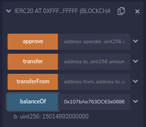

# XC20 via Smart Contracts

So far we’ve successfully transferred assets from Kusama to Shiden and we’ve shown we can access those assets the same as any other via MetaMask. Now we take it one step further and demonstrate how to use these assets from the Smart Contracts.

Here is the example staking contract we’ll be using for the demonstration (for DOT, you replace `ksm` by dot`):`

```js
// SPDX-License-Identifier: MIT
pragma solidity ^0.8.0;

// A partial ERC20 interface, just for the demo purposes
interface IERC20 {
    function balanceOf(address owner) external view returns (uint256);
    function approve(address spender, uint256 amount) external returns (bool);
    function transfer(address to, uint256 amount) external returns (bool);
    function transferFrom(address from, address to, uint256 amount) external returns (bool);
}

contract XC20_Demo {
    IERC20 public ksm = IERC20(0xFFfFfFffFFfffFFfFFfFFFFFffFFFffffFfFFFfF);
    mapping(address => uint256) public stakers;

    constructor() payable {}

    function stake(uint256 amount) public {
        require(ksm.transferFrom(msg.sender, address(this), amount));
        stakers[msg.sender] += amount;
    }

    function unstake(uint256 amount) public {
        require(stakers[msg.sender] >= amount);
        require(ksm.transfer(msg.sender, amount));
        stakers[msg.sender] -= amount;
    }
}
```

Using the partial ERC20 interface (all methods are actually supported), we can check what is the balance of the account we’ve used previously: `0x107bAe763DC63e0686C574FdE1B58115c7d19280`



The amount shown is the same one we’ve seen in MetaMask, **15 KSM** in total.

Now we try to stake 5 KSM in our simple staking dApp. The first step is to approve the staking demo contract `0x62425e07119144B5D5A16D96430c31aD0E17A877` for the transfer, using the IERC20 interface:


Now we can stake 5 KSM.


After the operation is complete, we can check the staked amount.


We’ve successfully staked 5 KSM!

To summarize what we’ve achieved so far:

1. We transferred KSM tokens from Kusama to Shiden
2. We verified we can see and interact with those tokens via MetaMask
3. We manipulated transferred tokens the same as any other ERC20 via a smart contract.
