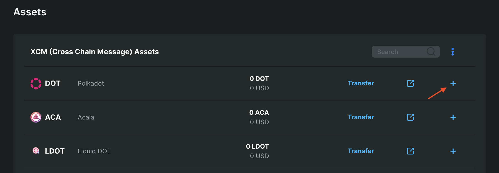

# Manage XC20 with MetaMask

## Instructions

### Visit the Portal

Visit the [Assets page](https://portal.astar.network/#/assets), and log in with your MetaMask account to view your assets.

As you can see in the screenshot above, there is DOT in our EVM wallet. Let's add the asset to MetaMask.

### Import assets to MetaMask

Open MetaMask and connect the account with DOT. Make sure you are connected to the Astar Network. If not, you will find the Network Details in the Integration section.

After the account is connected, you will be able to import tokens into the wallet. Click on Import tokens and use the following information:

- Token Contract Address: 0xFFfFfFffFFfffFFfFFfFFFFFffFFFffffFfFFFfF
- Token Symbol: DOT
- Decimals: 10

When you are finished adding and importing DOT, you will see them in your wallet. You can find the full list of supported XCM assets [here](../asset-list.md).
