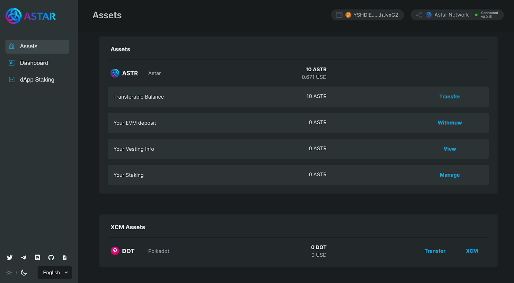

# XCM Transactions

## Overview

**XCM is a format for how message transfer should be performed in an interoperable network.  Cross-Consensus Messaging is between chains, smart contracts, pallets, bridges, and even sharded enclaves like SPREE.**

The significance of XCM is attributed to the groundbreaking capability of DOT, Polkadot's native coin, to be traded, sent, and composed across all parachains on the Polkadot network, the same as KSM will be for Kusama.
The instruction here will explain how you will be able to transfer DOT via XCM on the Astar Portal from Polkadot to Astar. The same instructions can be used for KSM on Shiden.

Also, HRMP is something that’s coming really soon. Currently, you have the ability to transfer DOT as the first asset but when HRMP becomes available in the next few weeks, it will be any token.

One of the biggest takeaways for you today is that XCM is a generic message format designed to be a language for communication between two systems. As the name suggests, it’s not necessarily only bound to Substrate-based or Dotsama chains - it can be adopted and used by any system using any consensus.

## Instructions

### XCM Transfer from Polkadot to Astar

When you go to the [Assets](https://portal.astar.network/#/assets) page, you can see the XCM Assets panel.

> It is necessary to verify that the balance of the native asset (ASTR) is not zero for the beneficiary account. Because assets from the Assets pallet cannot be transferred to an account with 0 nonce (or 0 balance)!

When you press the XCM button, the XCM popup appears as follows.

Here we would like to send DOT from Polkadot to Astar Network. There are two tabs, one to send to the Native account and the other to the EVM account. You can check the balance that can be sent from the relay chain (DOT).

Enter the amount to send and press the confirm button. A popup will appear to sign the transaction.

> Please note that the gas amount will be deducted from the amount entered. The transferred amount should be adjusted with the gas fee estimate.

Wait until the transaction is confirmed. After confirmation, you check the XCM assets again, and you can see that the DOT has been sent well to the XCM wallet.

When you click the transfer button, a popup will appear where you can transfer the asset to another wallet.

## XCM Transfer from Polkadot to Astar EVM

When you go to the [Assets](https://portal.astar.network/#/assets) page, you can see the XCM Assets panel.

> It is necessary to verify that the balance of the native asset (ASTR) is not zero for the beneficiary account. Because assets from the Assets pallet cannot be transferred to an account with 0 nonce (or 0 balance)!

When you press the XCM button, the XCM popup appears as follows. For this tutorial, we will use Deposit to EVM.

Enter the EVM Address you want to receive, enter the amount you want to send, and press the confirm button. A popup will appear to sign the transaction.

Wait until the transaction is confirmed. After confirmation, you will be able to add the DOT tokens to your EVM wallet. Read more about how to add XC20 to your MetaMask in the next section.
