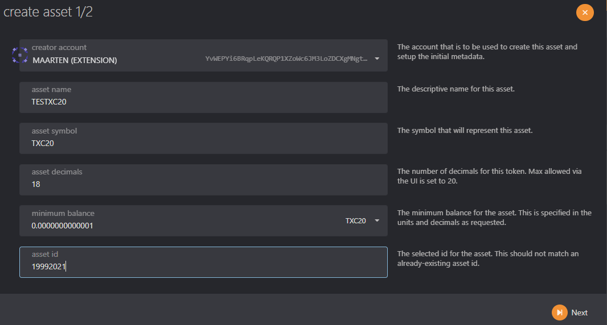
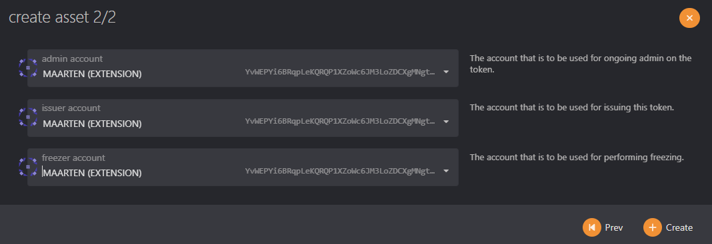
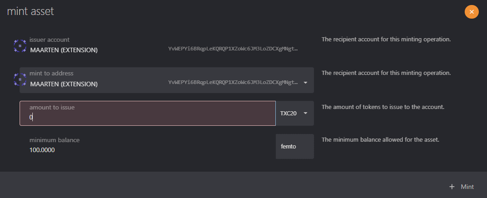
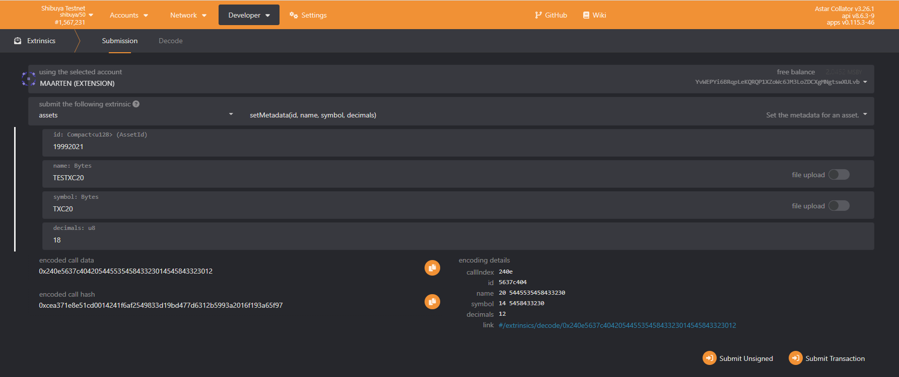

# Crear activos XC20

## Resumen

Activos XC20, creados por el equipo de [Moonbeam](https://moonbeam.network/blog/introducing-xc-20s-the-new-standard-for-cross-chain-tokens-on-dotsama/), mantienen compatibilidad entre EVM y el framework de Substrate que impulsa Polkadot, a través de precompilaciones — un conjunto de contratos inteligentes integrados diseñados para asemejarse a los ERC20. Llamar funciones en un XC20 invocará la funcionalidad subyacente de Substrate, que puede ser instrucciones para transferir tokens a otra cadena o para enviarlos a otra dirección local. Esta capa de compatibilidad conecta el mundo del EVM y los contratos inteligentes con escenarios avanzados de interoperabilidad basados en Substrate.

## Crear un activo XC20

El activo XC20 se refiere a la interfaz que utiliza para envolver un activo en `assets-pallets`. Primero necesitaremos crear, emitir y establecer metadatos para un activo en `assets-pallets` y luego acceder a él desde el contrato inteligente utilizando la interfaz de precompilación XC20.

Esta sección de la guía demostrará cómo registrar un activo utilizando [Polkadot.js Apps](https://polkadot.js.org/apps).

## Crear el activo

Antes de que se pueda establecer los metadatos del activo, necesitaremos crear un activo en la red siguiendo los siguientes pasos:

1. Navega dentro de [Polkadot.js Apps](https://polkadot.js.org/apps), a la sección de Network y haz click en **Assets**.
2. Haz click en **+Create** a la derecha para abrir el pop-up de creación de activos.
3. Ingresa el **nombre del activo, símbolo del activo**, y establece el número de **decimales** para dicho activo. No tiene que ser de 18 decimales como los activos nativos de la red; es completamente configurable.
4. El **minimum balance** es el depósito existencial (ED) de tu activo. El ED existe para evitar que las cuentas con saldos muy pequeños o vacíos "hinchen" el estado de la cadena de bloques y disminuyan su rendimiento. **NOTA**: configurar este valor en unidades pico y el saldo mínimo en 1, solo requerirá 0.000000000001 unidades. Sugerimos tener un balance mínimo de **1**.
5. El id del activo será automáticamente generado para ti. El rango válido para la creación sin permisos (permissionless) es hasta 2^32 - 1.
6. Cuando haya rellenado todos los campos, haga clic en **Siguiente** en la próxima pantalla.
7. Configura tus **roles** y crea el activo firmando con la cuenta creadora.

Hay algunos roles que son importante tener en cuenta a la hora de registrar y gestionar activos. Estos roles, a excepción del creador, pueden ser asignados a otras cuentas por el propietario a través de la extrínseca assets -> setTeam. Los roles son los siguientes:

- **Creator** - la cuenta responsable de la creación del activo.
- **Issuer** - la cuenta designada a la emisión o acuñación de tokens. Por defecto es el propietario.
- **Admin** - la cuenta designada a la quema de tokens y a descongelar cuentas y activos. Por defecto es el propietario.
- **Freezer** - la cuenta capaz de congelar cuentas y activos. Por defecto es el propietario.

## Mintear el activo

El activo está creado en nuestra red, pero no tiene suministro. Para mintear los tokens, haz click en el botón **+Mint** junto al activo para abrir el cuadro de diálogo de creación de tokens.

1. Únicamente la **cuenta issuer** tiene permiso para mintear el token.
2. Introduce la dirección que recibirá los tokens minteados. Recomendamos utilizar una [multisig](/docs/use/manage-wallets/create-multisig).

## Configurar la metadata del activo

La metadata incluye el nombre del activo, el símbolo y los decimales.

Para establecer la metadata del activo, haz click en **Developer** en la parte superior de la página y luego selecciona **Extrinsics** en el menú desplegable. Desde allí, sigue los siguientes pasos:

1. Selecciona la cuenta del propietario
2. Desde el menú desplegable de **submit the following extrinsic**, elige **assets**
3. Luego selecciona la entrínseca `setMetadata`
4. Introduce el id del activo desde el activo que creaste antes
5. Introduce el nombre del activo
6. Establece el símbolo para el activo
7. Configura los decimales para el activo
8. Haz click en **Submit Transaction**

Puedes utilizar la página de **Extrinsics** para realizar otras funciones como crear tokens, delegar un equipo, congelar y descongelar activos o cuentas, entre otras.

## Calcular la dirección de precompilación de XC20

Para acceder a nuestro activo como XC20 en MetaMask u otra billetera EVM, necesitaremos utilizar su dirección de precompilación. La dirección de precompilación de XC20 está usando la siguiente regla:

`address = "0xFFFFFFFF" + DecimalToHexWith32Digits(AssetId)`

El primer paso es tomar el Id del activo y convertirlo a un valor hexadecimal. Puedes utilizar el motor de búsqueda de tu preferencia para buscar una herramienta simple que convierta decimales a valores hexadecimales. En este tutorial, usamos este [convertidor decimal a hexadecimal](https://www.rapidtables.com/convert/number/decimal-to-hex.html).

Para activo con el ID `19992021`, el valor hexadecimal es `1310DD5`.

Los precompilados XC20 solo pueden estar comprendidos entre `0xFFFFFFFF00000000000000000000000000000000` y `0xFFFFFFFFFFFFFFFFFFFFFFFFFFFFFFFFFFFFFFFF`. Así, los 8 primeros caracteres de la dirección serán siempre "FFFFFFFF". Como las direcciones de Ethereum tienen 40 caracteres, tendrás que añadir 0s al valor hexadecimal hasta que la dirección tenga 40 caracteres.

El valor hexadecimal generado en el ejemplo ya tiene 7 caracteres de longitud, por lo que si añades los primeros 8 caracteres, FFFFFFFF, al valor hexadecimal, obtendrás la parte de la dirección de 40 caracteres que necesitas para interactuar con el precompilado XC20. Ten en cuenta que aún tienes que añadir ceros para obtener la dirección de 40 caracteres. Añade los ceros entre `FFFFFFFF` y el hexadecimal generado.

Para este ejemplo, la dirección completa es `0xFFFFFFFF00000000000000000000000001310dD5`.

:::note
Para utilizar esta dirección dentro de un smart-contract de solidity, debe respetarse la suma de comprobación de la dirección. Por favor usa el convertidor [toChecksumAddress](https://web3-tools.netlify.app/) que convertirá tu dirección.\
Por ejemplo `0xFFFFFFFF00000000000000000000000001310dD5` será convertido a `0xfFFfffFF00000000000000000000000001310dD5`
:::

Ahora que ha generado la dirección de precompilación del XC20, puede utilizar la dirección para interactuar con el XC20 como lo haría con cualquier otro ERC20 en Remix.

:::note
La dirección XC20 del token nativo (SDN/ASTR) es por convención `0x0000000000000000000000000000000000000000`
:::
