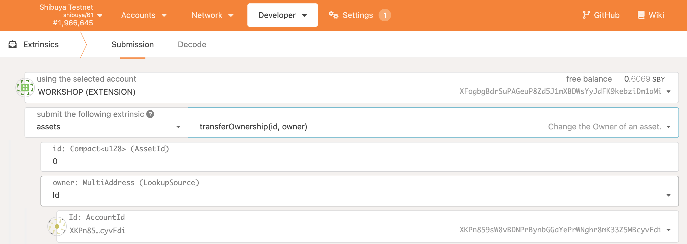

# Haciendo los activos ERC20 existentes compatibles entre cadenas

Si deseas hacer que un activo ERC20 existente sea compatible entre cadenas, es bastante simple, siguiendo las instrucciones a continuación

## Extensión XC20+

En resumen, el estándar **XC20** permite que los contratos inteligentes interactúen con activos compatibles entre cadenas, como si fueran activos ERC20 típicos.
A diferencia de los activos ERC20 estándar implementados dentro del entorno EVM, donde los saldos, emisiones, etc, se almacenan directamente, los activos **XC20** se asignan a un pallet de Substrate, lo que significa que los desarrolladores no tienen acceso a la misma lógica inherente al formato ERC20, como `_mint` o `_burn`.

En general, esto está bien para los activos **XC20** existentes, ya que no deberíamos estar creando o quemando estos activos en contratos inteligentes (por ejemplo, no hay una razón válida para crear DOT interconectados en Astar). Sin embargo, hay casos de uso en los que tener un conjunto extendido de funcionalidades es útil y necesario, como en el caso de tokens envueltos.

Por esta razón, proveemos una interfaz **XC20** ampliada llamada **XC20+**. Ofrece los siguientes métodos:

```Solidity
// Usado para comprobar cuál es el depósito existencial del activo XC20
function minimumBalance() external view returns (uint256);

// Usado para mintear nuevos fondos
function mint(address beneficiary, uint256 amount) external returns (bool);

// Usado para quemar fondos
function burn(address who, uint256 amount) external returns (bool);
```

La lista mencionada anteriormente podría ampliarse en el futuro.

Ten en cuenta que mintear y quemar requiere ciertos privilegios - lee sobre activos **XC20** para aprender más.

:::caution

Ten en cuenta que la función `burn()` en **XC20+** hereda el comportamiento de la función `burn()` de `pallet-assets`. Llamar a la función `burn()` de `pallet-assets` con un monto mayor al saldo actual resultará en la quema del monto disponible y devolverá éxito.

En los contratos, la implementación de `burn()` en [`ERC20Burnable.sol`](https://github.com/OpenZeppelin/openzeppelin-contracts/blob/3214f6c2567f0e7938f481b0a6b5cd2fe3b13cdb/contracts/token/ERC20/ERC20.sol#L283) quemará el monto si es menor o igual al balance de la cuenta.

:::

## Tokens envueltos

Un token envuelto es un token cuyo valor está vinculado a una criptomoneda subyacente. Una cantidad del token original se bloquea en una bóveda digital y, a cambio, se permite la creación de una cantidad equivalente de tokens envueltos.

Esto es útil por varias razones, por mencionar algunas:

- Para ampliar las funcionalidades de un token existente junto con otros módulos ERC20.
- Permitir que una criptomoneda nativa se comporte como una ERC20, por ejemplo, Wrapped Ether (WETH).
- Permitir el uso de monedas fuera de su blockchain nativo, por ejemplo, Wrapped bitcoin (WBTC).

En el siguiente ejemplo vamos a examinar cómo envolver a un token ERC20 existente dentro de un **XC20**.

## Envolviendo un ERC20 en un XC20

En este ejemplo, el token subyacente será un ERC20 existente, llamado BURRITO. Queremos envolver algunos BURRITOs y hacerlos aptos para la cadena cruzada. Utilizar una especificación de token estándar [ERC20Wrapper](https://github.com/OpenZeppelin/openzeppelin-contracts/blob/master/contracts/token/ERC20/extensions/ERC20Wrapper.sol) de OpenZeppelin no será suficiente. Por lo tanto, tendremos que sustituir algunas de las funciones ERC20Wrapper y utilizar funciones **XC20+**.
Vamos a llamar al recién token envuelto, xcBURRITO.
xcBURRITO toma la dirección del token subyacente (BURRITO) y la dirección del activo recién creado como parámetros del constructor. Estableceremos valores para los otros parámetros requeridos, pero observa que tenemos que incluir la llamada al constructor ERC20Permit, porque xcBURRITO es ahora un padre de BURRITO.

```Solidity
constructor(IERC20 burrito)
   ERC20("Wrapped Burrito", "xcBUR")
   ERC20Permit("Wrapped Burrito")
   ERC20Wrapper(burrito)
{}
```

Dado que no podemos utilizar ERC20Wrapper, lo sustituiremos y utilizaremos la interfaz **XC20+**.

```Solidity
import "@openzeppelin/contracts/token/ERC20/extensions/ERC20Wrapper.sol";
import "./Burrito.sol";

contract XcBurrito is Xc20Plus, ERC20Wrapper, BURITTO{
    constructor(IERC20 burrito)
    Xc20Plus("Wrapped Burrito", "xcBUR")
    ERC20Permit("Wrapped Burrito")
    ERC20Wrapper(burrito)
    {}

    function _mint(address _to, uint256 _amount)
        internal
        override(ERC20)
    {
        // agrega aquí tus hooks pre-mint si es necesario

        require(
            IERC20Plus(xcBurrito).mint(_to, _amount), "Minting xc token failed"
        );

        // agrega aquí tus hooks post-mint si es necesario
    }
}
```

## Procedimiento

### 1. Crear un activo XC20

Seguir la documentación de cómo [crear activos XC20](/docs/learn/interoperability/xcm/building-with-xcm/create-xc20-assets).

### 2. Desplegar el contrato inteligente xcBurrito.sol

Para desplegar el contrato xcBurrito necesitarás dos parámetros de entrada

- Dirección del token ERC20 Burrito (H160)
- Dirección del activo **XC20** (H160)
  - Seguir las instrucciones sobre cómo [calcular una dirección XC20](/docs/learn/interoperability/xcm/building-with-xcm/create-xc20-assets#calculate-xc20-precompile-address). Por ejemplo, si el `asset_id` es 17 (=0x11), la dirección EVM resultante será `0xffffffff00000000000000000000000000000011`

### 3. Transferir la propiedad del activo XC al contrato inteligente xcBurrito

Para permitir que el contrato **xcBurrito** pueda realizar las acciones mintear/quemar, necesitas llamar al extrínseco `setTeam()` en el pallet-assets, y configurar el `issuer` y `admin` como **xcBurrito**. Esto permitirá al contrato emitir activos envueltos **XC20**, pero como el contrato EVM tiene 24 bytes (H160), necesitaremos transformar la dirección EVM al formato ss58 antes de poder llamar al extrínseco.


Puedes renunciar a la propiedad del **XC20** llamando al extrínseco `transferOwnership()` en el pallet-assets. Ten presente que después de llamar al extrínseco, ya no podrás cambiar los parámetros `issuer` o `admin`, por lo que deberás asegurarte de que estén configurados correctamente.



Ahora el contrato xcBurrito es capaz de mintear tokens **XC20** para llamados que posean tokens ERC20 de Burrito.

## Acciones de usuario

Para convertir tokens Burrito a activos xcBurrito, los usuarios necesitarán realizar las siguientes acciones.

1. Autoriza al contrato inteligente xcBurrito para transferir tokens ERC20 Burrito desde el saldo de un usuario al contrato xcBurrito. Como alternativa, se puede utilizar la llamada `permit()` para mejorar la UX.
2. El usuario llama a `depositFor()` de xcBurrito para acuñar nuevos tokens **XC20**, o `withdrawTo()` para quemar tokens **XC20**.
3. Los activos recién envueltos pueden transferirse entre cadenas, como cualquier otro activo **XC20** (para más detalles, consulte la documentación de XCM).

## Resultado final

El resultado de `depositFor(user, amount)` será:

- XcBurrito bloquea una `cantidad` de token ERC20 Burrito.
- El saldo de ERC20 Burrito del usuario disminuye por `amount`
- El contrato XcBurrito mintea la misma `cantidad` de activos xcBurrito
- El saldo del usuario del activo xcBurrito se incrementa por `amount`

El resultado de `withdrawTo(user, amount)` será:

- El contrato de XcBurrito quema una `cantidad` del activo de XcBurrito
- El saldo del usuario del activo xcBurrito se reduce por `amount`
- El contrato XcBurrito transfiere cierto `amount` de token ERC20 Burrito al usuario
- El saldo de ERC20 Burrito del usuario se incrementa por `amount`
