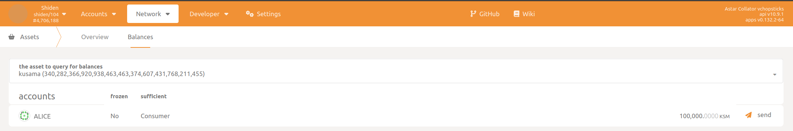
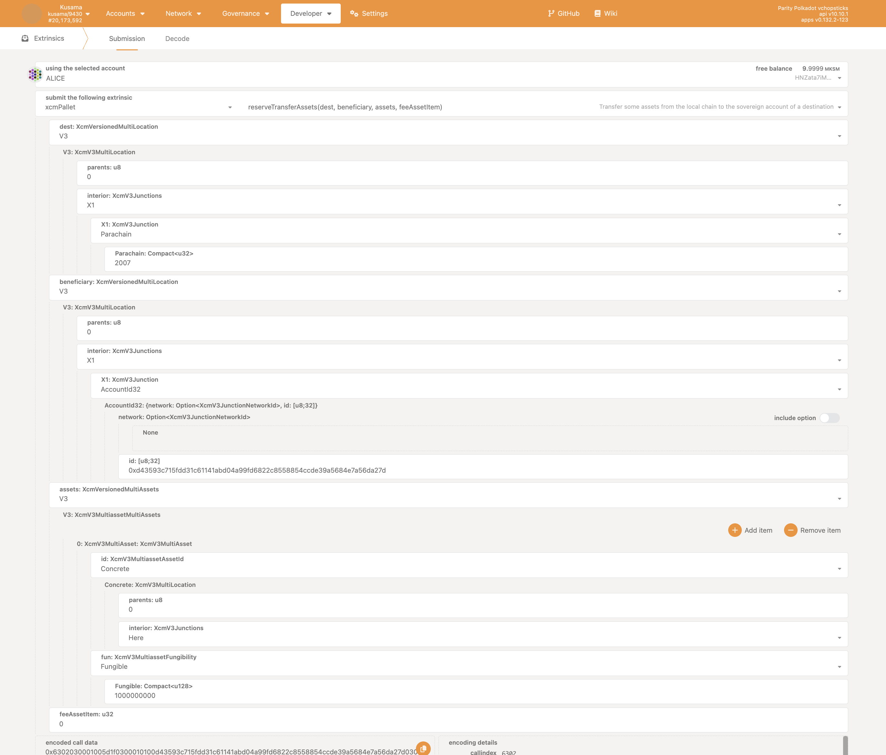
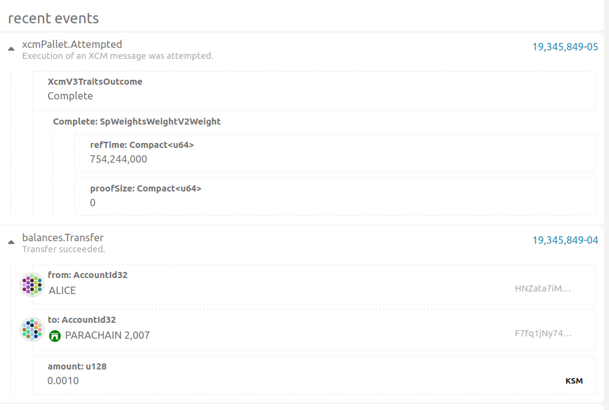
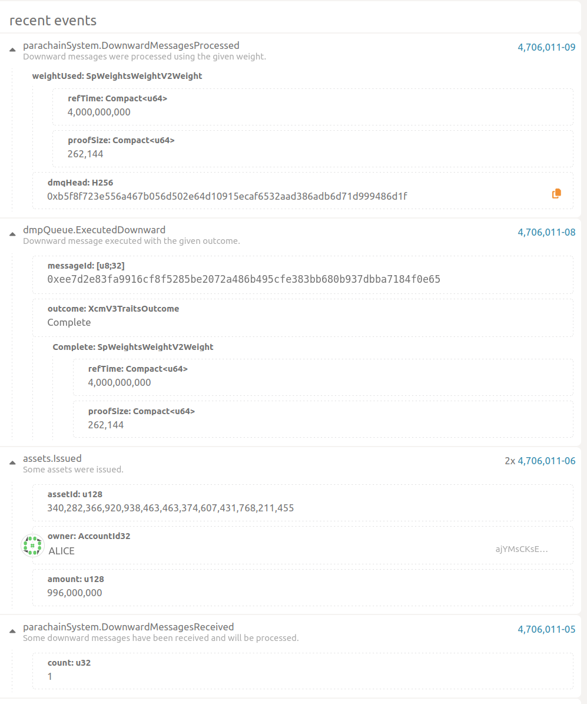

# Transacciones XCM nativas

Vamos a examinar cómo tranferir activos nativos en Relay Chain (DOT o KSM) a Astar o Shiden.

Para esta demostración estaremos usando el portal de Polkadot.js. Los usuarios habituales interactuarán a través de nuestro portal, donde toda esta complejidad permanecerá abstracta.

En esta demostración, vamos a transferir tokens **KSM** de Kusama a la red Shiden.

## En la práctica

Estaremos usando chopsticks para esta demostración (más información en la [página de chopsticks](/docs/build/environment/chopsticks.md)).
Este comando generará una red de chopsticks que replicará el estado actual de la relay-chain de Kusama y la parachain de Shiden, permitiendo XCM:

```bash
npx @acala-network/chopsticks@latest xcm -r kusama -p shiden
```

El activo nativo en Relay Chain está representado en Astar o Shiden por el id de activo `0xFFFFFFFFFFFFFFFFFFFFFFFFFFFFFFFF` o `340282366920938463463374607431768211455` en decimal.

En el [archivo de configuraciones](https://github.com/AcalaNetwork/chopsticks/blob/97b42a16d9f3fb32069eb2c19e05d7b80e250c3c/configs/shiden.yml#L25) de chopsticks de Shiden, Alice tiene 100000KSM



Vamos a transferir algo de **KSM** de Kusama a Shiden usando Alice.

Este será un ejemplo del uso del protocolo VMP o DMP para ser más específicos. Haremos uso de la funcionalidad `reserve_transfer_asset`. Esto consiste en trasladar activos de una blockchain a otra a través de una cuenta _soberana_ intermediaria. En el proceso, los activos de la cadena de origen no se destruirán, sino que el _Soberano_ los conservará, mientras que la cadena de destino acuñará versiones envueltas y las depositará en la dirección de destino.

La cuenta _Soberana_ garantiza que los mismos activos no puedan utilizarse simultáneamente en ambas cadenas. También garantiza que los activos envueltos sean intercambiables con los activos de la cadena de origen.

Alice quiere enviarse algunos tokens a sí misma en la Red Shiden, así que prepara una llamada `reserve_transfer_asset` en la Relay Chain. Los parámetros lucen así:



Debemos especificar:

- Destino
  - Utilizando la notación MultiLocation, describimos la cadena de destino, que es Shiden, como `/Parachain(2007)`. La notación se asemeja a las rutas de los sistemas de archivos en los que se considera que la Relay Chain es la raíz.
- Beneficiario
  - Una vez más, utilizando la notación _MultiLocation_, describimos al beneficiario de la transferencia de activos. Tenga en cuenta que este es el contexto de la cadena de destino. Estamos transfiriendo a Alice cuya dirección es `ajYMsCKsEAhEvHpeA4XqsfiA9v1CdzZPrCfS6pEfeGHW9j8` en Shiden. Pero en lugar de especificar la dirección Shiden, especificaremos el ID de cuenta (o clave pública) asociado a esta dirección: `0xd43593c715fdd31c61141abd04a99fd6822c8558854ccde39a5684e7a56da27d`
- Activos siendo transferidos
  - Finalmente, describimos los activos que están siendo transferidos. Dado que estamos transfiriendo activos nativos de la Relay Chain, especificamos que se trata de **activos concretos** y que su ubicación es **Here** en el contexto de la Relay Chain. El activo es fungible, por lo tanto necesitamos especificar la cantidad que se transfiere, en este caso, un total de **1000000000** tokens.

Después de iniciar la transferencia, podemos observar qué pasa en la Relay Chain:



Se intentó ejecutar un mensaje XCM y se transfirieron fondos de Alice a la cuenta Soverana.

En el lado de Shiden, podemos observar lo siguiente:



El mensaje XCM ha sido recibido y ejecutadas las instrucciones. Como resultado, se ha acuñado un activo con Id `340282366920938463463374607431768211455`, un total de **996000000** tokens. Estos tokens han sido depositados en la cuenta de destino.

Tenga en cuenta que la cantidad recibida es inferior a la enviada originalmente. Esto es porque **4000000** han sido utilizados para pagar la comisión de la transacción en la cadena destino.

¡Hemos transferido con éxito los activos **KSM** de Kusama a Shiden!
