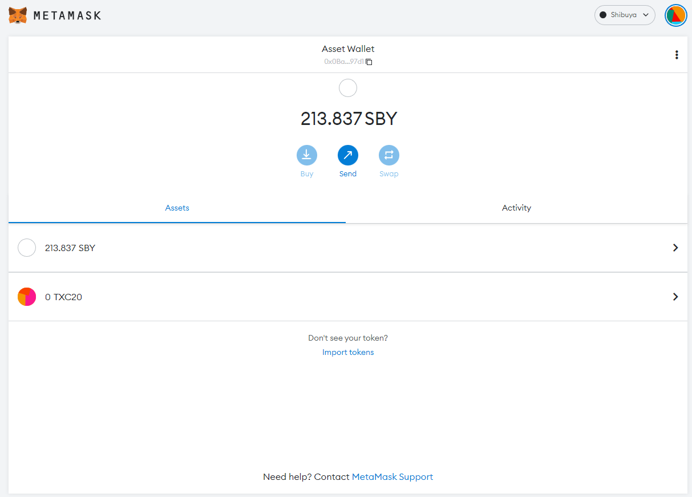
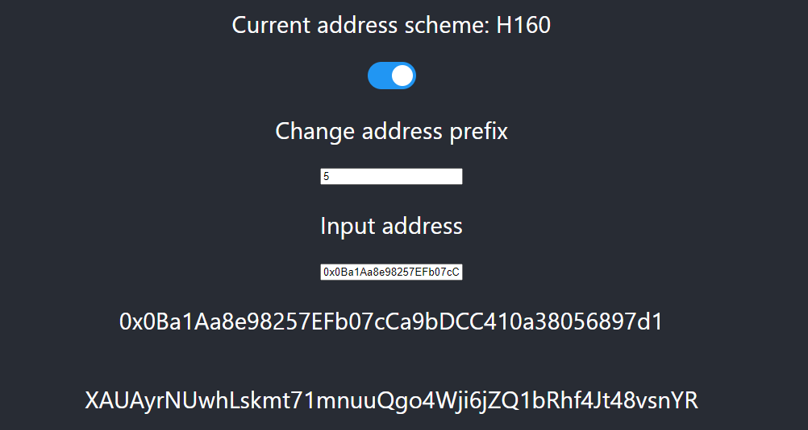
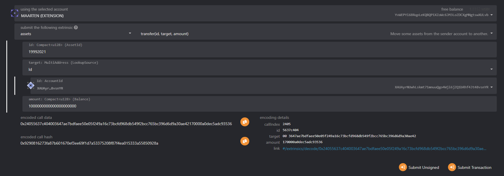
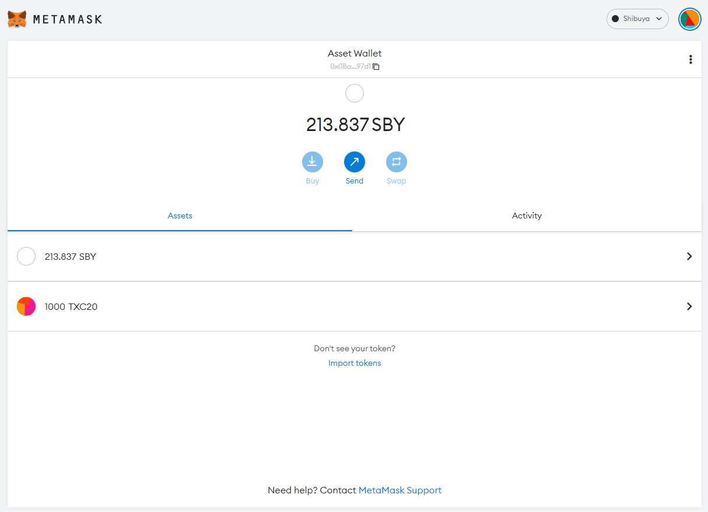

# Usando activos XC20 en EVM

## Resumen

El uso de XCM en el entorno EVM es totalmente posible porque la red Astar utiliza la interfaz XC20, que asigna los activos nativos enumerados en la paleta de activos a una interfaz compatible con ERC20 que las dApps de EVM pueden utilizar.

:::info

Los XC20 y los ERC20 son similares, pero hay que tener en cuenta algunas diferencias, ya que los XC20 son activos basados en Substrate.

Una de las características específicas de XC20 es la existencia de un **saldo mínimo**, específico para cada activo. El saldo mínimo de un activo se asemeja a una cantidad que es suficiente para permitir la existencia de la cuenta en el sistema sin requerir ningún otro depósito existencial. Esta característica implica que al transferir una determinada cantidad de fichas XC20, la cantidad real transferida puede ser ligeramente superior en el caso de que la transferencia hiciera que el saldo del remitente fuera superior a cero, pero inferior al saldo mínimo.

Además, las transacciones XC20 ejecutadas a través de la API de Substrate no serán visibles desde exploradores de bloques basados en EVM como Blockscout. Solo transacciones ejecutadas por la API de Ethereum serán visibles a través de estos exploradores.

Los XC20 pueden interactuar a través de una interfaz ERC20, por lo que tienen la ventaja adicional de ser accesibles tanto desde la API de Substrate como desde la de Ethereum. En última instancia, esto proporciona una mayor flexibilidad a los desarrolladores a la hora de trabajar con este tipo de activos, y permite integraciones fluidas con contratos inteligentes basados en EVM, como DEXs, plataformas de préstamos y otros.

:::

## Transferir XC20 a una dirección EVM

En primer lugar, vamos a enfocar esto a un alto nivel, y pasar a un ejemplo más técnico para dApps.

Vamos a decir que queremos transferir algo de tokens KSM de Kusama a `0xd2C6929A72e466213D1c2Df8359194784650A50e`. Desde el punto de vista de Kusama, la carga útil para enviar los tokens KSM será similar a la que utilizamos en la [sección anterior](/docs/learn/interoperability/xcm/building-with-xcm/native-transactions/).
Sin embargo, la dirección `AccountId` de `Beneficiary` será una dirección ss58 mapeada de la dirección EVM del destinatario, ya que es el único formato de dirección que aceptará XCM. Puedes leer [este artículo](https://medium.com/astar-network/using-astar-network-account-between-substrate-and-evm-656643df22a0) sobre cómo crear la dirección mapeada. Para abreviar, las direcciones mapeadas son:

- **H160**: `0xd2C6929A72e466213D1c2Df8359194784650A50e`
- **ss58**: `YPRZVFHaRvXdnbAQsXcgqiJokpoHNkUXzR6XTBBJQKHtorT` (con prefijo de 5 para Shiden/Astar)
- **Public key**: `0x6c65500b73e2cec702f06dcd5299b31e4d0b6cf7728937b7d5edac79611292f2`

Para obtener la dirección del activo en la EVM, necesitaremos recuperar su `Id` de activo. En nuestro caso, estaremos usando KSM, el cual tiene el `Id` de activo `340282366920938463463374607431768211455`. Ahora necesitamos convertir el `Id` a hexadecimal y añadirlo a `0xffffffff`. En este ejemplo, la dirección resultante es `0xFFfFfFffFFfffFFfFFfFFFFFffFFFffffFfFFFfF`, la cual podemos usar ahora directamente en el contrato de Solidity, o MetaMask. Más información en la [sección previa](/docs/learn/interoperability/xcm/building-with-xcm/send-xc20-evm/#calculate-xc20-precompile-address)

## Importar activos a MetaMask

En la página pasada, creamos un nuevo activo y generamos la dirección del contrato. Ahora, vamos a añadirlo a MetaMask:

:::caution

Si no puede introducir nada en el campo de decimales, es que no ha minteado ningún activo. Asegúrate de que tienes algunos activos minteados antes de proceder al siguiente paso.

:::

1. Asegúrate de que estás conectado a [la red](https://app.gitbook.com/o/-LgGrgOEDyFYjYWIb1DT/s/-M8GVK5H7hOsGnYqg-7q-872737601/~/changes/aJQFFWQNMjlao1SSjj4a/integration/network-details) donde creaste tu token.
2. Cerca de la parte inferior de la sección de resumen de activos, haga clic en Importar tokens.
3. Ingresa lo siguiente:
   1. Dirección del contrato del token
   2. Símbolo del token
   3. Decimales del token

Como puedes ver en la imagen de arriba, importar un activo por su dirección de contrato permitirá a MetaMask leer los metadatos correctamente, y añadirlo a tu billetera.

## Transferir activos XC20 a EVM

### Paso 1: Obten la dirección nativa ss58 asignada a su dirección EVM

Para transferir sus activos recién minteados a EVM, necesitará obtener la dirección ss58 mapeada (Substrate nativa) vinculada a su dirección H160 (MetaMask). Puedes obtener esa dirección siguiendo estos pasos:

1. Abre nuestro [convertidor](https://hoonsubin.github.io/evm-substrate-address-converter/) de dirección de EVM a Substrate.
2. Cambia al esquema de direcciones H160.
3. Copia tu dirección EVM desde MetaMask y pégala en el campo de introducir dirección.
4. Tu dirección nativa mapeada será mostrada.

### Paso 2: Envía tokens a una dirección EVM

Para esta sección, necesitamos regresar a [Polkadot.js](https://polkadot.js.org/apps/). Asegúrate de estar conectado a la misma red en la cual creaste tu token.

En esta guía, vamos a enviar 1000 de los recientes activos minteados a una cuenta EVM.

1. Ve a `Developer -> Extrinsics`
2. Usa la extrísenca `assets -> transfer`.
3. Selecciona la cuenta que tiene permiso de enviar el activo.
4. Ingresa el `asset id`. Consulte la página anterior para determinar qué asset id deberá introducir. En este ejemplo, estamos usando `19992021`.
5. Introduzca su dirección nativa en el campo `Id`, la que recibió tras convertir su dirección EVM a nativa.
6. El último campo es la cantidad, y queremos enviar `1000` tokens. En este ejemplo, introducimos `1000` seguido de 18 ceros, debido a que el activo requiere 18 decimales de precisión.
7. Firma y sube la transacción.

:::info

- Estamos trabajando estrechamente con nuestros exploradores de bloques para cartografiar los nuevos activos, de modo que sean visibles en nuestros exploradores.
- Si recibe un error al transferir sus fichas a otra cuenta EVM, pruebe aumentando la tarifa de gas.

:::
