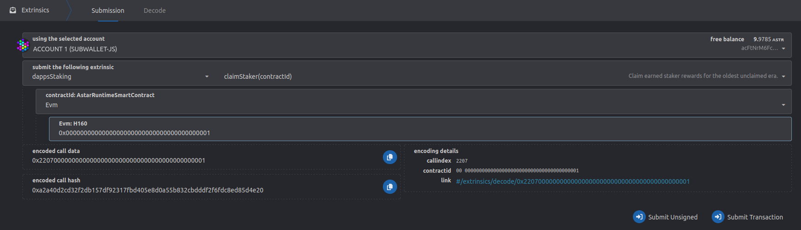
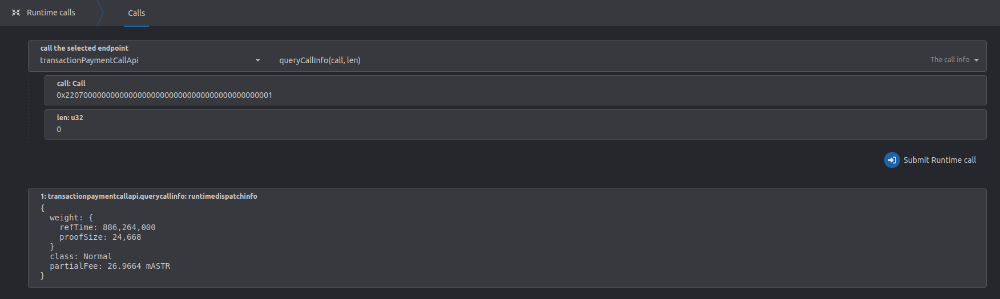

# Transacciones remotas vía XCM

## Resumen de función

La instrucción XCM `Transact` permite al emisor ejecutar llamadas arbitrarias en la cadena de destino. Esta función es extremadamente útil ya que nos permite controlar una cuenta en una cadena remota.

Por ejemplo, un usuario puede enviar una instrucción `Transact` desde **Astar** a **Polkadot** que transferirá `DOT` desde la cuenta derivada del usuario en **Polkadot** a una cuenta receptora arbitraria en **Polkadot**. El usuario no necesita interactuar directamente con la cadena **Polkadot** en este caso, pero sin embargo es capaz de cambiar su estado. Es importante señalar que esto es sólo un ejemplo - cualquier llamada que pueda ser interpretada por la cadena remota (destino) es capaz de ser enviada y ejecutada.

Esto es especialmente útil para los contratos inteligentes, ya que les permite integrar lógica personalizada para la interoperabilidad entre cadenas.

Es importante entender la diferencia entre enviar una secuencia de instrucciones XCM y recibirla/interpretarla.

El envío de una transacción XCM desde `Astar` o `Shiden` a una cadena remota puede tener éxito en el lado emisor, pero no ejecutarse en el destino, y lo mismo ocurre en el caso contrario. Esto puede ocurrir por múltiples razones - la secuencia XCM puede ser incorrecta, la cadena remota no sabe cómo interpretar la `call` proporcionada, o la cadena remota no permite la ejecución remota, en absoluto.

El desarrollador o usuario debe asegurarse de que la cadena de destino soporta la llamada codificada y las transacciones remotas, en general.

## Transacciones de forma remota en Astar/Shiden/Shibuya

### Secuencia XCM

Por el momento, la ejecución remota desde orígenes distintos de las cuentas de parachain sólo se permite que sea iniciada por el tiempo de ejecución `Shibuya` (incluyendo RocStar) y el tiempo de ejecución `Shiden`.

Por lo tanto, una secuencia permisible de instrucciones tendrá que empezar como:

1. `DescendOrigin`
2. `WithdrawAsset`
3. `BuyExecution`
4. `Transact` or `SetAppendix` o _cualquiera que quiera el usuario_

Esta secuencia XCM, utilizada como prefijo, puede ir seguida de instrucciones arbitrarias, por ejemplo: `Transact`.
Aunque no podemos garantizarlo, lo más probable es que otras cadenas adopten el mismo prefijo o uno similar para las secuencias de instrucciones XCM.

#### DescendOrigin

El parámetro DescendOrigin garantiza que el origen no sea una parachain, sino una unión más compleja como `{ parachain: 2006, accountId: 0x123aff....ff }`. Si esto se omite, todas las llamadas serán ejecutadas como si fueran enviadas desde la cuenta soberana del _root-only_ parachain, lo cual no permitimos.

#### WithdrawAsset

Retira activos en la cadena de destino de la cuenta derivada del remitente. La cuenta debe tener el activo especificado y el importe solicitado; de lo contrario, la instrucción fallará. Estos activos se utilizan para pagar el tiempo de ejecución del XCM.

#### BuyExecution

Compra tiempo de ejecución XCM, utilizando los activos retirados.

#### Transact

Ejecuta los datos de llamada codificados especificados, sin consumir más peso del especificado.
Los datos de llamada pueden ser prácticamente cualquier cosa soportada por la cadena remota - no importa lo que soporte la cadena de origen.

## Cuentas remotas derivadas

Al ejecutar una transacción remota, la cadena remota obtendrá una nueva dirección basada en la multilocalización del remitente.
La forma en que se obtiene esta dirección viene determinada por la propia cadena, por lo que esta documentación no puede garantizar cómo funciona cualquier otra cadena que no sean las cadenas basadas en Astar.

Para los tiempos de ejecución basados en Astar, se utiliza un enfoque generalizado, alineado con `Polkadot` y `Kusama`.
La multilocalización se codifica paso a paso con SCALE, hasta que finalmente se hashea utilizando el `Blake2_256`, siendo la salida la dirección derivada.

| Nombre                              | Valor                                                                                     |
| ----------------------------------- | ----------------------------------------------------------------------------------------- |
| Cuenta de Alice en Polkadot         | 15oF4uVJwmo4TdGW7VfQxNLavjCXviqxT9S1MgbjMNHr6Sp5                                          |
| Public Key de Alice                 | 0xd43593c715fdd31c61141abd04a99fd6822c8558854ccde39a5684e7a56da27d                        |
| Multilocalicación de Alice en Astar | \{ parents: 1, interior: AccountId32 \{network: NetworkId::Polkadot, id: 0xd4359...a27d \} \} |

***

Por ejemplo, supongamos que `Alice` está enviando una secuencia XCM desde `AssetHub` a `Astar`.
La cuenta de parachain hermana se deriva con un enfoque simple:

`blake2_256(("SiblingChain", compact_parachain_id, b"AccountId32", public_key).encode())`

| Nombre      | Valor                                                                                                                                |
| ----------------------------------- |------------------------------------------------------------------------------------------------------------- |
| Multilocalicación de Alice en Astar | \{ parents: 1, interior: X2(Parachain(1000), AccountId32 \{network: NetworkId::Polkadot, id: 0xd4359...a27d \}) \} |
| Cuenta derivada de Alice            | 0x88275533b5d43292c86d05985c3a6e226fee2baeddb4f3b90e30a70bec4d7bff                                           |

Del mismo modo, en caso de que `Alice` esté enviando XCM desde una cadena que utiliza el formato de dirección **H160**:

`blake2_256(("SiblingChain", compact_parachain_id, b"AccountKey20", public_key).encode())`

***

En caso de que `Alice` esté enviando XCM desde `Polkadot`, los datos codificados cambian un poco y serían así:

`blake2_256((b"ParentChain", b"AccountId32", public key).encode())`

| Nombre                              | Valor                                                                                                            |
| ----------------------------------- | ---------------------------------------------------------------------------------------------------------------- |
| Multilocalicación de Alice en Astar | \{ parents: 1, interior: X1(AccountId32 \{network: NetworkId::Polkadot, id: 0xd4359...a27d \}) \} |
| Cuenta derivada de Alice            | 0x7dcb1027ecb97011ebe79ca233def50d1f216eb05d76367c8984f67ccc5d2dd1                                               |

***

Puede utilizar el binario `xcm-tools` para generar la dirección derivada, basado en sus necesidades.

## Transacción remota a través de Contratos Inteligentes EVM

Astar permite a los contratos inteligentes de EVM enviar instrucciones de `Transact` a cadenas remotas, dándoles la capacidad de ejecutar llamadas arbitrarias.

### Secuencia XCM

Para simplificar la API a través de la cual los contratos inteligentes EVM envían la instrucción `Transact`, y para garantizar la seguridad, exponemos una función que construye una secuencia como:

1. `DescendOrigin`
2. `WithdrawAsset`
3. `BuyExecution`
4. `Transact`

`DescendOrigin` se asegurará de que el origen se establece correctamente para que sea la dirección ss58 derivada del contrato inteligente.

Por el momento, `WithdrawAsset` requiere que la representación de los activos esté presente en nuestros tiempos de ejecución. Sin embargo, se espera que la dirección derivada de la cadena remota se financie para que pueda pagar la ejecución de XCM.

`BuyExecution` utilizará los activos retirados previamente. El `weight_limit` se establecerá en `Unlimited`. Esto no es demasiado importante para la secuencia de instrucciones que se utiliza, ya que el usuario controla el peso máximo permitido a través de la cantidad de activos retirados. Sin embargo, los fondos deben ser suficientes para pagar tanto la ejecución de la secuencia XCM, como la llamada remota codificada.

`Transact` ejecutará la llamada codificada. El `origin_type` se establece en `SovereignAccount` y no puede ser cambiado por el usuario final.

No hay reembolsos al final de la secuencia. El peso no utilizado será gestionado por la cadena remota.

### Dirección del contrato derivado remotamente

Por ejemplo, supongamos que tienes un contrato desplegado en Shibuya y estás llamando al precompilador XCM `remote_transact` con la intención de enviar una secuencia XCM a un parachain hermana. Este parachain hermana utiliza la misma derivación de dirección que nuestros tiempos de ejecución. La ruta de derivación de dirección se verá así:

| Nombre                               | Dirección                                                                                                      |
| ------------------------------------ | -------------------------------------------------------------------------------------------------------------- |
| Dirección H160 del contrato          | `0x48DD0a20a199f96B56eCE7e994D83614A148aA63`                                                                   |
| Dirección SS58 derivada del contrato | `agn53DdEuRgQsvgxqj5M1AecxB6LpbXT7T1R1hjVcoEBR6M`                                                              |
| Clave pública de dirección SS58      | `0xd219fe1b02545c7dd7e718b1530b4e32b23288351f61e5975c7dc49b004ff119`                                           |
| Multiubicación de la llamada         | `{ parents: 1, interior: X2 ( Parachain(2000), AccountId32 {network: NetworkId::Any, id: 0xd219f...f119 } ) }` |
| Cuentas remotas derivadas            | `5FrhDFydxUwbWyXT1XDBhRUUYpQtiJJ6skB6n2XV4NubC9fP`                                                             |

:::note
El esquema de derivación de direcciones remotas ha cambiado después de escribir el ejemplo inicial, pero por lo demás todo el proceso sigue siendo válido y correcto.
:::

Esto significa que las instrucciones como `WithdrawAsset` y `Transact` se ejecutarán como si el origen fuera la dirección `5FrhDFydxUwbWyXT1XDBhRUUYpQtiJJ6skB6n2XV4NubC9fP`.

### API precompilados

\`Esta funcionalidad se expone a los contratos inteligentes EVM a través de precompilaciones. La interfaz se puede conseguir [aquí](https://github.com/AstarNetwork/Astar) debajo de precompilados XCM.

```solidity
    function remote_transact(
    Multilocation memory destination,
    address payment_asset_id,
    uint256 payment_amount,
    bytes calldata call,
    WeightV2 memory transact_weight
) external returns (bool);
```

El `destino` es la Multilocalización de la cadena de destino y puede ser un `Id` de parachain hermana o la Relay Chain (en cuyo caso se ignora el `Id` de parachain).\
`payment asset Id & amount` - Determina qué activo retirar en la cadena de destino y cuánto. Utilizado para pagar el tiempo de ejecución. La limitación actual es que el activo utilizado debe tener una derivada local ya que está referenciado a través de la dirección H160.\
`call` - La llamada codificada a ser ejecutada en la cadena remota.\
`transact_weight` - El peso máximo que puede consumirse por la ejecución de la llamada en la cadena remota.

Continúe leyendo a continuación para comprender mejor cómo calcular estos parámetros.

### Activo de pago

Por el momento, los usuarios sólo pueden especificar el activo paymet a través de una dirección `H160`. Aunque el activo de pago haga referencia a un activo de la cadena de destino, el activo remoto debe tener un derivado local. Esto se actualizará y mejorará en el futuro para que los usuarios puedan especificar directamente las multilocalizaciones de activos.

En caso de que el usuario desee pagar utilizando un derivado de moneda local (ASTR envuelto o SDN) en la cadena de destino, deberá utilizarse una dirección H160 especializada rellenada con ceros, `0x0000000000000000000000000000000000000000`.

### Peso de Transacción

Especificar la cantidad correcta de activos con los que retirar y comprar tiempo de ejecución, así como elegir el peso correcto de la transacción, puede ser complicado. Estos parámetros no están controlados por los tiempos de ejecución `Astar` o `Shiden`, sino por el tiempo de ejecución de la cadena de destino. Hay algunos puntos y consejos que pueden ayudar al usuario a calcular los valores correctos.

El activo requerido para el pago se utiliza para dos ejecuciones distintas:

1. Instrucciones XCM - Hay 4 instrucciones XCM en la secuencia, y cada una es ponderada por la cadena de destino para determinar cuánto debe pagarse por su ejecución. Por el momento, la mayoría de las parachains (y Relay Chains) tienen el peso de la instrucción XCM configurado con `1_000_000_000` unidades de peso.
2. Peso de llamada - El peso de la llamada en la cadena remota.

El monto del activo retirado debe, por lo tanto, cubrir unidades de peso \`4_000_000_000 + peso(llamada).

El peso de la llamada está determinado por el tiempo de ejecución de la cadena de destino, así que no está controlado por `Astar` o `Shiden`. Los usuarios deberían estar seguros de que la llamada remota es correcta en la cadena de destino, antes de enviarla a través de XCM.

Tenga en cuenta que estos valores pueden cambiar - si un tiempo de ejecución de destino se actualiza o reconfigura, los valores pueden cambiar y usted tendrá que ajustarlos en su contrato inteligente.

### Valores calculados

Astar no puede garantizar que el siguiente enfoque funcione en todas las parachains, ya que cada una de ellas puede ser personalizada independientemente. Pero en general, todos las parachains deben tener acceso a estos métodos.

Supongamos para este ejemplo que estamos en alguna otra cadena, y queremos ejecutar una transacción de forma remota en `Astar`.

**Paso 1** Visita la red `Astar` en _polkadot-js_ y localiza el extrínseco que le gustaría ejecutar. Para simplificar, vamos a suponer que es `dappsStaking->claimStaker`, aunque podría ser cualquier llamada. Completa todos los campos. Luego copia los datos de llamada codificados (haz clic en el icono de copia).



**Paso 2** Ve a Desarrollador > Llamadas Runtime y selecciona `transactionPaymentCallApi -> queryCallInfo` y pausa los datos de llamadas codificados en el campo `call`. Luego haga clic en `Enviar llamada Runtime`.



**Paso 3** Requiere un poco de trabajo. Necesitamos saber cuánto cuesta ejecutar una instrucción XCM **única** en la cadena de destino. Para `Astar` y `Shiden` son `1_000_000_000` unidades de ref_time por instrucción. Esto puede ser usado como una guía áspera, pero no hay garantía de que para otras parachains serán los mismos, los usuarios deben asegurarse de que prueban este valor ellos mismos, o póngase en contacto con el equipo de la parachain para aprender el valor exacto.

Ya que estamos enviando cuatro instrucciones XCM, el peso total de las instrucciones XCM _raw_ será cuatro veces el peso de una sola instrucción XCM: `4 x 1_000_000_000`. Además, necesitaremos añadir el peso de la llamada `transact` que se está ejecutando, así que en total, el peso de nuestro ejemplo será `5 x 1_000_000_000`.

| Nombre            | Cantidad de peso `ref_time`                                                  |
| ----------------- | ---------------------------------------------------------------------------- |
| Llamada           | 886_264_000                        |
| Instrucciones XCM | 4_000_000_000 |
| Total             | 4_886_264_000 |

El peso total es **4_886_264_000** unidades de `ref_time` y **24_668** de `proof_size`. Para maximizar las posibilidades de éxito en la ejecución, deberíamos añadir un límite de seguridad de +10% al peso total. Así que `ref_time`: **5_374_890_400** y `proof_size`: **27_134**.

El peso a pagar calculado es **4.2998 mASTR**.

Para resumir, para ejecutar funciones de forma remota en la red `Astar`, deberíamos:

- retirar alrededor de **4.2998 mASTR**
- especificar el peso máximo de transacción (+ umbral de seguridad) de **5_374_890_400** `ref_time` y **27_134** `proof_size`.
