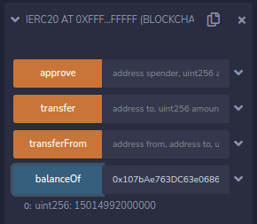
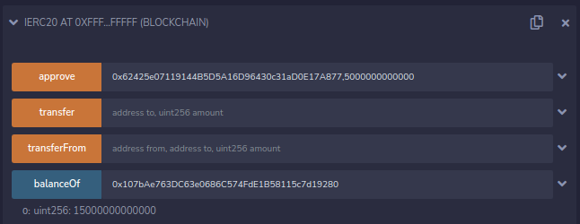
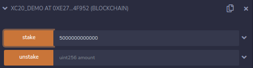
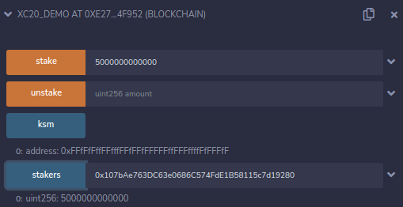

# XC20 en contratos inteligentes

Hasta ahora hemos transferido con éxito los activos de Kusama a Shiden y hemos mostrado cómo podemos acceder a esos activos igual que a cualquier otro dentro de MetaMask. Ahora daremos un paso más y demostraremos cómo utilizar estos activos con contratos inteligentes.

He aquí un ejemplo de contrato de staking que utilizaremos para la demostración (para DOT, sustituya `ksm` por `dot`):

:::note
La dirección XC20 del token relay chain (KSM y DOT) es `0xFFFFFFFFFFFFFFFFFFFFFFFFFFFFFFFFFFFFFFFF` (porque el `Id` `340,282,366,920,938,463,463,374,607,431,768,211,455` a hexadecimal es `FFFFFFFFFFFFFFFFFFFFFFFFFFFFFFFF`).\
Para utilizar esta dirección dentro de un smart-contract de solidity, debe respetarse la suma de comprobación de la dirección. Por favor usa el convertidor [toChecksumAddress](https://web3-tools.netlify.app/) que convertirá tu dirección.\
por ejemplo `0xFFFFFFFFFFFFFFFFFFFFFFFFFFFFFFFFFFFFFFFF` será convertido a `0xFFfFfFffFFfffFFfFFfFFFFFffFFFffffFfFFFfF`
:::

```js
// SPDX-License-Identifier: MIT
pragma solidity ^0.8.0;

// Una interfaz ERC20 parcial, sólo para fines de demostración
interface IERC20 {
    function balanceOf(address owner) external view returns (uint256);
    function approve(address spender, uint256 amount) external returns (bool);
    function transfer(address to, uint256 amount) external returns (bool);
    function transferFrom(address from, address to, uint256 amount) external returns (bool);
}

contract XC20_Demo {
    IERC20 public ksm = IERC20(0xFFfFfFffFFfffFFfFFfFFFFFffFFFffffFfFFFfF);
    mapping(address => uint256) public stakers;

    constructor() payable {}

    function stake(uint256 amount) public {
        require(ksm.transferFrom(msg.sender, address(this), amount));
        stakers[msg.sender] += amount;
    }

    function unstake(uint256 amount) public {
        require(stakers[msg.sender] >= amount);
        require(ksm.transfer(msg.sender, amount));
        stakers[msg.sender] -= amount;
    }
}
```

Utilizando la interfaz parcial ERC20 (todos los métodos son realmente compatibles), podemos comprobar el saldo de la cuenta que utilizamos anteriormente: `0x107bAe763DC63e0686C574FdE1B58115c7d19280`



La cantidad mostrada es la misma cantidad que vemos en MetaMask, **15 KSM** en total.

Ahora, vamos a stakear 5 KSM en nuestra simple staking dApp. El primer paso será aprobar el contrato de demostración de staking `0x62425e07119144B5D5A16D96430c31aD0E17A877` para la transferencia, utilizando la interfaz IERC20:



Ahora podemos stakear 5 KSM.



Una vez finalizada la operación, podemos comprobar el importe stakeado.



¡Hemos stakeado satisfactoriamente 5 KSM!

Para resumir lo que hemos hecho hasta ahora:

1. Transferidos tokens KSM de Kusama a Shiden.
2. Verificados los tokens que están presentes en MetaMask.
3. Confirmado que somos capaces de manipular los tokens XC20 de la misma manera que otros tokens ERC20, a través de contratos inteligentes.
