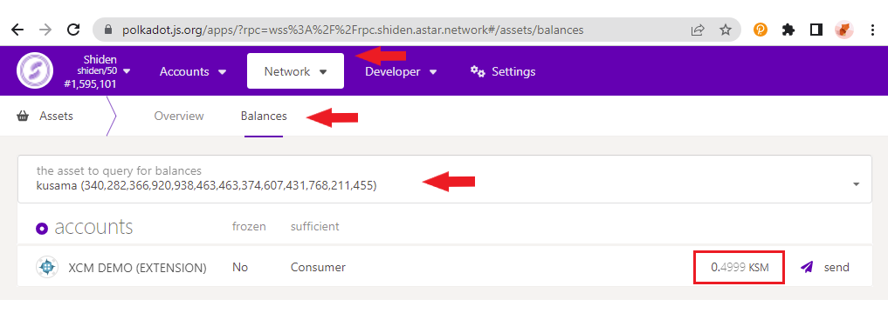

# FAQ

## P: ¿Hay alguna forma de ver mi balance DOT/SDN (en Astar/Shiden) en Polkadot.js?

Sí. visite Polkadot.js, conecte su cartera y vaya a Red > Balances y seleccione el token en el que está interesado. El siguiente ejemplo muestra cómo ver el saldo SDN:

## P: He usado XCM para transferir 5 DOT de Polkadot a Astar, pero solo he recibido 4.999

Tenga en cuenta que la cantidad de gas se deducirá de la cantidad introducida, por lo que la cantidad transferida debe ser ajustada de acuerdo a la cuenta para la estimación de la cuota de gas. Para más información, visite [aquí](/docs/learn/interoperability/xcm/using-xcm/)

## P: Mi saldo debe ser 1.00012 DOT pero el portal muestra 1 DOT, ¿dónde están?

La versión actual de Astar Portal se balancea con el tercer decimal. Si tiene un problema similar, por favor consulte la [entrada de FAQ anterior](/docs/learn/interoperability/xcm/building-with-xcm/faq-for-smart-contracts) e instrucciones sobre cómo usar Polkadot.js para encontrar su saldo exacto.

## P: ¿Puedo enviar mi token DOT a otros Parachains?

Por el momento no.

## P: ¿Cómo puedo enviar mi token DOT de vuelta a Polkadot?

Puede enviar de vuelta DOT/KSM a la cadena Relay usando tanto EVM como monederos nativos. Visite la página de Recursos y elija el enlace XCM del token relevante.

## P: ¿Por qué está desactivado el botón XCM para DOT/KSM cuando conecto mi cartera en el Portal Astar?

Asegúrese de que tiene un saldo distinto de cero en el token nativo.

## P: He transferido X tokens a otra cuenta, pero la cantidad transferida y recibida por la cuenta objetivo es mayor que X. ¿Qué está pasando?

Los activos XC20 tienen un balance mínimo definido. El saldo mínimo es el saldo mínimo de un activo que debe tener cualquier cuenta individual. En este caso específico, si el saldo de una cuenta se reduciría por debajo de esa cantidad en una transacción de transferencia de activos, entonces la cantidad realmente transferida incluiría la cantidad restante de activo específico en la cuenta inicial.

Eche un vistazo a un ejemplo de una transacción en caso de un activo cuyo balance mínimo sea 10: Alice tiene 10. e intenta enviar tokens de Bob 10. El saldo restante de Alice en ese caso se convertiría en 0,9, que es inferior a la cantidad mínima, por lo que la cantidad transferida se fijaría en 10, por lo que el saldo de Alice se convertirá en 0, para evitar que cualquier fondo sea cosechado por no cumplir con el Depósito Existencial.

Para más información, consulta esta [sección dentro de nuestra documentación](/docs/learn/interoperability/xcm/building-with-xcm/send-xc20-evm/).

## P: ¿Dónde puedo encontrar las direcciones de otras cadenas?

Puedes encontrar todas las direcciones de las diferentes cadenas en Polkadot/Kusama :

1. Usando [Sub-ID](https://sub.id/)

Simplemente introduzca su dirección nativa de Astar y podrá ver todas las direcciones relacionadas con la cuenta.

2. Muéstralo en la extensión Polkadot.js seleccionando la cadena de la que te gustaría conocer la dirección.

Tenga en cuenta que sólo podrá hacer un retiro de XCM si el saldo de la cuenta de Relay Chain del receptor es mayor que el saldo mínimo (1. DOT para Polkadot y 0.01 KSM para Kusama).

