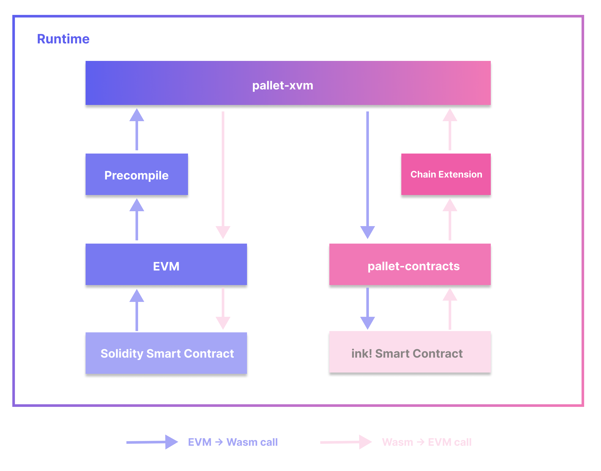

# XVM

Tenga en cuenta que en este momento las características de XVM sólo se lanzan en la red de prueba Shibuya. ¡Mantente atento a Shiden y Astar!

## Intro: Múltiples VMs como una; una VM para todos

Como plataforma de contrato inteligente, Astar Network soporta actualmente tanto los contratos EVM como Wasm (WebAssembly). Basado en necesidades específicas, los desarrolladores son libres de construir sobre cualquiera de las máquinas virtuales. Esto aporta flexibilidad tanto a los constructores como a los grupos más grandes de usuarios de Astar Network. Pero el equipo Astar no sólo se detiene allí. Aún mejor, nuestra solución multi-VM, XVM, se introduce para proporcionar una verdadera interoperabilidad entre diferentes máquinas virtuales.

XVM permite que los contratos inteligentes en diferentes máquinas virtuales trabajen juntos sin problemas. Un contrato inteligente en EVM puede llamar a un contrato de Wasm al igual que otro contrato EVM y viceversa. Desde la perspectiva EVM o Wasm, los contratos en diferentes máquinas virtuales pueden funcionar juntos como en uno: la XVM.

## Arquitectura



### Componentes

La arquitectura XVM contiene cinco componentes principales:

- `pallet-xvm`: el módulo Hub para llamar EVM o Wasm.
- Precompilados XVM: una precompilación personalizada que permite a los contratos EVM llamar `pallet-xvm` .
- Chain extension: la interfaz que permite a ink! contratos para llamar a `pallet-xvm`
- EVM: Implementación Astar EVM, que es compatible con Ethereum.
- `pallet-contracts`: la VM para ink! smart contracts.

El módulo `pallet-xvm` es la parte central de XVM. Proporciona funciones para permitir que otros componentes llamen EVM o Wasm, mientras que _XVM precompile_ y _chain extension_ juegan el papel de las pasarelas de los contratos para llamar al módulo `pallet-xvm`.

### Llamadas entre VM

Una llamada XVM típica podría ser:

1. Llama desde EVM al Wasm, o
2. Llama desde Wasm a EVM

Para las llamadas de EVM a Wasm, la llamada se iniciará mediante contratos inteligentes en EVM. La ruta de llamada es: contrato EVM -> precompilado -> `pallet-xvm` -> Wasm.

Para las llamadas de Wasm a EVM, la llamada se iniciará mediante contratos inteligentes en Wasm. La ruta de llamada es: Wasm contract -> chain extension -> `pallet-xvm` -> EVM.

Tenga en cuenta que sólo se permite llamar desde una máquina virtual a otra. Llamar a los contratos dentro de la misma VM será revertido con un error.

### Interfaces

Para los contratos EVM de solidity, la interfaz XVM se define de la siguiente manera:

```solidity
interface XVM {
    function xvm_call(
        uint8 vm_id,
        bytes calldata to,
        bytes calldata input,
        uint256 value,
        uint256 storage_deposit_limit
    ) external payable returns (bool success, bytes memory data);
}
```

Para ink! Wasm contracts, XVM se puede llamar con _chain extension_:

```rust
pub type CallResult = u32;

#[ink::chain_extension]
pub trait XvmCall {
    type ErrorCode = u32;

    #[ink(extension = 0x00010001, handle_status = false)]
    fn call(vm_id: u8, target: Vec<u8>, input: Vec<u8>, value: u128) -> CallResult;
}
```

Los contratos EVM y Wasm tienen una interfaz similar para las llamadas XVM. Los argumentos comunes que comparten:

- `vm_id`: ID de la máquina virtual de destino a llamar. Usa `0x0F` para llamar a EVM y `0x1F` para llamar a Wasm.
- `to`: la dirección del contrato objetivo. Para contratos EVM, es en bytes `H160`. Para Wasm son bytes `AccountId32`.
- `input`: los argumentos de llamada codificados.
- `value`: la cantidad de token nativo a transferir, usado para llamadas pagables.

Tenga en cuenta que en el contexto de la VM de llamada, la dirección de llamada es siempre la dirección del contrato de llamada, en lugar de la dirección de usuario. ¡Por ejemplo, Alice llama a un contrato inteligente EVM `ContractA` que llama a un ink! contrato, dentro de ink! la llamada del contrato, la `self.env.caller` es la dirección `ContractA` en lugar de Alice.

#### codificación de `entrada`

Como se ha mencionado anteriormente, `input` de los argumentos codificados es necesario para las llamadas XVM. La especificación de codificación depende de qué máquina virtual llamar.

Para llamadas a EVM (`0x0F` como VM Id), consulte [aquí](https://docs.soliditylang.org/en/latest/abi-spec.html#function-selector-and-argument-encoding) para especificaciones Solidity ABI [aquí](https://docs.soliditylang.org/en/latest/abi-spec.html#examples) para ejemplos.

Para llamadas a Wasm (`0x1F` como VM Id), el `input` está codificado como: `selector_bytes ++ scale_encoded_args`.

#### Características entre los contratos EVM y Wasm

En el caso de llamar de EVM a Wasm, para llamar a XVM en EVM, se necesita un parámetro adicional `storage_deposit_limit`. Es obligatorio por `palet-contracts`, especificar el depósito máximo de almacenamiento para pagar el alquiler de almacenamiento. Como se mencionó anteriormente, ya que la dirección de la persona que llama siempre es una dirección de contrato en lugar de un usuario, es la dirección del contrato que paga el alquiler del almacenamiento. Para contratos de solidity que llaman contratos de Wasm a través de XVM, los desarrolladores necesitan asegurarse de que el contrato tiene el saldo suficiente para el pago, o la llamada falla. Para pasar un valor suficiente de `storage_deposit_limit`, los desarrolladores necesitan saber cuánto se requiere del contrato de llamada. Por ejemplo, pueden comparar la llamada objetivo y obtener el límite en el peor escenario `N`, y pasar `2 x N` por margen de seguridad.

Otra diferencia que vale la pena mencionar para las llamadas a pagar de EVM a Wasm es el concepto de _ED(depósito existencial)_ en `pallet-contracts`. Usando el `pallet-balances` en Substrate para llamadas a pagar, `pallet-contracts` asume todas las direcciones, incluyendo la dirección de los contratos EVM necesitan cumplir con el requisito de balance mínimo para mantener vivo (lo cual no es cierto ya que no hay requisitos de ED en EVM). Como se mencionó anteriormente, la dirección de llamada es siempre el contrato de llamada, para llamadas a pagar de EVM a Wasm, los desarrolladores necesitan asegurarse de que su dirección de contrato EVM cumple con el requerimiento de ED, de lo contrario, la llamada pagadera fallará en Wasm y será revertida.

### Manejo de errores

Los errores incurridos en las llamadas XVM burbujean desde la VM llamante a la VM llamada. Si se devuelve un error en EVM o Wasm, se revertirá toda la llamada XVM.
