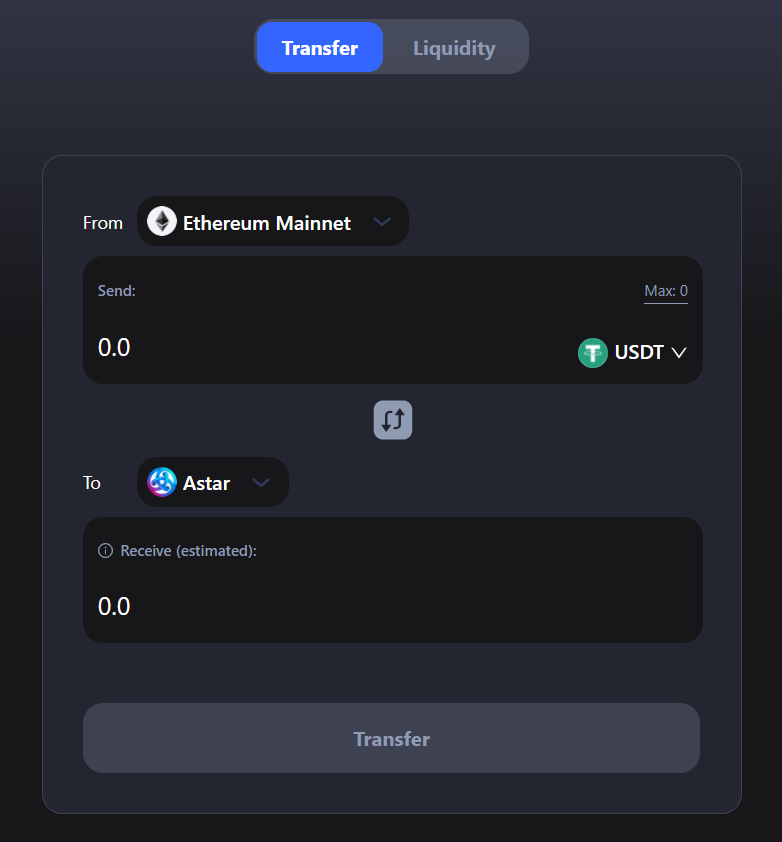

# Comprando ASTR en un DEX

Hay algunas DEX que se basan en Astar Network. Arthswap es una de ellas. Arthswap se basa en EVM, por lo que necesitamos interactuar en el entorno EVM.

## Configurar MetaMask

Ir a la extensión de Metamask -> Configuración-> Red -> Añadir red

Utilice este RPC personalizado a continuación:

**Red**: Astar  
**RPC**: [https://evm.astar.network](https://evm.astar.network)  
**Chain ID**: 592  
**Símbolo**: ASTR  
**Explorer**: [https://blockscout.com/astar](https://blockscout.com/astar)

## Puentear activos de Ethereum a la red Astar

Para comprar ASTR, necesitas tener otros activos que puedes usar para intercambiar. Una forma de hacerlo es puentear tus activos Ethereum como wETH, USDT y USDC a Astar Network.

1. Ve a [http://app.arthswap.org/#/swap](http://app.arthswap.org/#/swap)
2. Haz clic en “Bridge” y serás llevado a [https://cbridge.celer.network/#/transfer](https://cbridge.celer.network/#/transfer)
3. Ve a “Transferencia”, selecciona “Desde Ethereum” y “To Astar” y conecta Metamask.
4. Seleccione el activo que desea puentear, por ejemplo USDT.
5. Haz clic en “Transferir” y tendrás USDT en Astar Network.
6. Tendrás que pagar la tarifa del puente y también recibirás algunos tokens ASTR por las tarifas de gas que necesitas al interactuar con Astar Network.

## Intercambiar en Arthswap

1. Vuelve a [http://app.arthswap.org/#/swap](http://app.arthswap.org/#/swap) y conecta la cartera de Metamask.
2. Seleccione cambiar USDT a ASTR e introduzca la cantidad que desee.
3. Ejecuta el swap y firma la transacción.
4. Ahora tienes las fichas ASTR en tu billetera.

Después de tener ASTR en su Metamask, puede enviarlo a Polkadot.js si desea hacer stake en dApp. Por favor, consulte los tutoriales anteriores.
