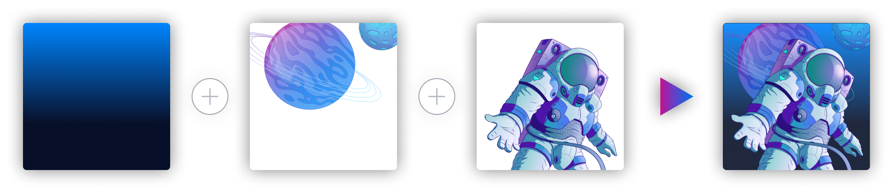

import inkredible_guide00 from "./img/inkredible_guide00.png"
import inkredible_guide01 from "./img/inkredible_guide01.png"
import inkredible_guide02 from "./img/inkredible_guide02.png"
import inkredible_guide03 from "./img/inkredible_guide03.png"
import inkredible_guide04 from "./img/inkredible_guide04.png"
import inkredible_guide05 from "./img/inkredible_guide05.png"
import inkredible_guide06 from "./img/inkredible_guide06.png"

# Usar NFT ink!redible

## ¿Qué son los NFT ink!redible?

Astar le ofrece los NFT ink!redibles - una nueva forma de que usuarios y constructores se involucren y creen NFT. Originalmente derivado del estándar RMRK, ink!redible NFTs aporta lo último en tecnología NFT a la Red Astar, y en el lenguaje dedicado, más eficiente y específico del dominio que es ink!

 

## Paso a paso

En esta sección le damos un desglose paso a paso de las funciones básicas de ink!redible NFT. Para entenderlo mejor, veamos primero una de las principales características de esta nueva norma NFT: su capacidad para permitir que las NFT se equiparen entre sí. Para ayudar en la organización de estos equipables, les damos una jerarquía y distinguimos entre ellos con las etiquetas "NFT padre", y el equipable "NFT hijo". Esto significa que las NFT hijas deben añadirse a la NFT madre, dando lugar a una composición visual de múltiples NFT. Para equipar los NFT hijos a un NFT padre, se utilizarán cuatro funciones principales: Mintear / Aprobar/ Añadir/ Equipar.

  
  

### Mintear

Necesitarás fichas nativas para acuñar estos NFT. Dentro del ink! ambiente, se requiere tener suficientes tokens para la transacción de gas y para el Depósito de Almacenamiento por NFT. Esto es para prevenir entradas de datos innecesarias y mantener la base de datos limpia. [Sobre el depósito de almacenamiento](https://docs.astar.network/docs/build/wasm/transaction-fees/#storage-rent).

  
  

### ¿Qué es el Inventario?

El inventario es el hogar de todos los NFT hijos que son propiedad de un NFT padre. Por defecto, cuando el NFT hijo se acuña por primera vez, no se añade al inventario, ni se equipa al NFT padre. Puedes preformar las siguientes acciones en la sección de inventario:

1. Cuando un NFT hijo es mintado, usted podrá agregarlos al inventario NFT padre y localizarlos aquí.
2. Puede seleccionar un NFT hijo y equiparlo a su NFT padre.
3. Puede desequipar un NFT hijo del NFT padre.

  
  

### Añadir

Cuando acuñas un NFT padre, un botón “Añadir” será la única opción disponible. Esto significa que el NFT padre no tiene hijos, y todavía no posee NFT para equiparse. Vamos a encontrarles un hijo.

  
  

### Aprobar y añadir hijo

Al acuñar un NFT hijo, podrá ver ese NFT desde un NFT padre como en la imagen de abajo. La propiedad total del niño NFT es suya al mintar. Sin embargo, cuando se añade un NFT hijo al inventario de una NFT padre, la NFT padre necesitará la plena propiedad del NFT hijo. Es en este paso que permite que el NFT padre reciba la propiedad completa del niño NFT mediante la aprobación.

Después de aprobar, podrá ver el botón "Añadir al inventario" habilitado. Ahora puede añadir el NFT hijo al inventario NFT padre.

  
  

### Equipar

Después de que haya agregado un NFT hijo al inventario de un NFT padre, verá el NFT hijo allí. Esto significa que el NFT hijo es propiedad del NFT padre. Por favor, tenga en cuenta otros NFT padres no pueden tener ese mismo hijo NFT en su inventario hasta que usted retire la propiedad de su actual NFT padre - y esta función aún no está implementada.

A continuación, puede equipar este NFT hijo al NFT padre seleccionando el NFT hijo y yendo a la página NFT. Puedes equiparlo desde aquí y ver el NFT hijo añadido al NFT padre todos juntos.

  
  

