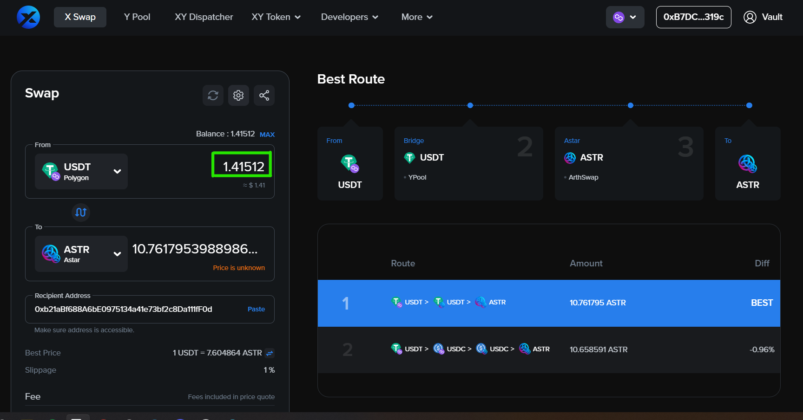
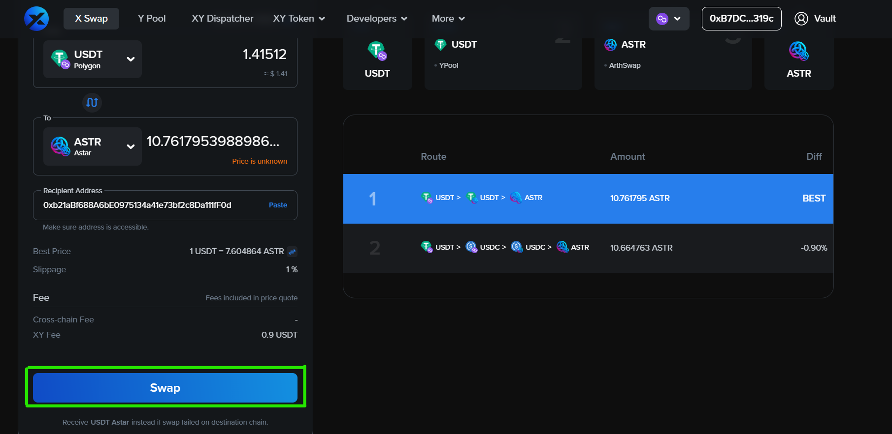

# Intercambio de activos de cadena cruzada de las principales cadenas de EVM a Astar

En este tutorial, le guiaremos a través del proceso para realizar un intercambio de al menos 12 cadenas EVM a Astar.

## Visita la página de intercambio X de XY Finance

XY Finance es un agregador de intercambio entre cadenas para DeFi y Metaverse, que permite a los usuarios comprar directamente ASTR y otros tokens en Astar desde otras cadenas en una sola transacción. Actualmente, XY Finance es compatible con 12 cadenas EVM, incluidas Ethereum, BSC, Fantom, Polygon, Arbitrum, Optimism, Avalanche C-Chain, Cronos, KCC, ThunderCore, Astar y Moonriver.

## Conectar billetera

Haga clic en el botón “Conectar Wallet”.

Antes de explorar las características sencillas que ofrece XY Finance, necesitará conectar su cartera. XY Finance soporta actualmente Metamask y WalletConnect en navegadores de escritorio, con más tipos de monederos soportados en móvil.

## Cambiar tokens

Elige la ficha que quieres intercambiar en tu cadena de origen y el token que quieres recibir en Astar. Aquí, vamos a cambiar USDT en Polygon a ASTR en Astar como ejemplo. Con el servicio ofrecido por XY Finance, los usuarios de EVM pueden adquirir directamente ASTR en una transacción.

## Ingrese la cantidad de tokens

Introduzca la cantidad de USDT que desea intercambiar.

Verifique dos veces la dirección del destinatario. XY Finance mostrará su dirección de cartera conectada por defecto y también le permite cambiar la dirección del destinatario.

Haga clic en el botón “Aprobar a intercambiar”, y su cartera le pedirá que confirme la acción.

# Intercambiar

Haga clic en el botón de "Swap", y su cartera le pedirá que confirme la acción de nuevo. Confirme su transacción desde su billetera.

Recibirá su ASTR en la Red Astar en unos minutos.
