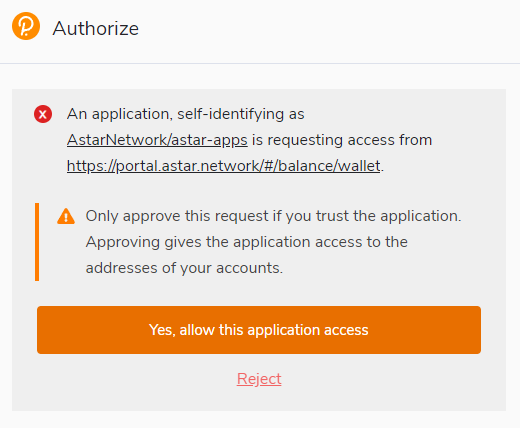

# Crear una cartera Astar

## Cuentas Astar

### Formato de Dirección

El formato de dirección utilizado en las cadenas basadas en Substrate como Astar es ss58. Ss58 es una modificación de Base-58-check de Bitcoin, con algunas modificaciones menores. En particular, el formato contiene un prefijo de tipo de dirección que identifica una dirección como perteneciente a una red específica. Astar Network es especial en el ecosistema Polkadot porque es el único parachain que soporta EVM como contrato inteligente WASM. El uso de dos máquinas virtuales diferentes conlleva dos tipos de direcciones diferentes.

- Una dirección Astar Native o dirección SS58
- Una dirección Astar EVM o dirección H160 que comienza con 0x

Interactuará con nuestra dirección nativa Astar cuando el uso de WASM dApps están listos o nuestra página dApps Staking. El uso de esta dirección requiere una extensión distinta de MetaMask. Le recomendamos que utilice la extensión Polkadot JS si es nuevo en el ecosistema.

## Astar Portal

[Astar Portal]: https://portal.astar.network/

El \[Portal Astar] es el lugar donde hay que estar para hacer cualquier cosa en nuestro ecosistema. Los desarrolladores de Astar han creado una ventanilla única para todos los que quieran interactuar en nuestro ecosistema.

A través de nuestro portal, puedes conectarte a diferentes redes del ecosistema Astar.

- **Astar Network**: parachain en Polkadot.
- **Shiden Network**: parachain en Kusama.
- **Shibuya**: parachain testnet

## Recomendación: Polkadot\{.js\} Browser Plugin

El plugin Polkadot\{.js\} proporciona un equilibrio razonable de seguridad y usabilidad. Proporciona un mecanismo local independiente para generar su dirección e interactuar con el portal Astar. Recomendamos a los usuarios que sean nuevos en nuestro ecosistema y quieran crear una dirección nativa de Astar que utilicen este monedero. Si no tienes la extensión Polkadot JS recibirás una ventana emergente en nuestro portal cuando intentes conectar tu monedero.

### Instalar el Plugin del Navegador

El complemento del navegador está disponible tanto para [Google Chrome](https://chrome.google.com/webstore/detail/polkadot%7Bjs%7D-extension/mopnmbcafieddcagagdcbnhejhlodfdd?hl=en) (y navegadores basados en Chromium como Brave) como para [Firefox](https://addons.mozilla.org/en-US/firefox/addon/polkadot-js-extension). Después de instalar el plugin, debería ver el logo naranja y blanco de Polkadot\{.js\} en la barra de menú de su navegador.

### Crear Cuenta

Abra la extensión del navegador Polkadot\{.js\} haciendo clic en el logotipo de la barra superior de su navegador. Verás una ventana emergente del navegador.

Haga clic en el botón grande más - "Crear nueva cuenta". El plugin de Polkadot\{.js\} usará la aleatoriedad del sistema para hacer una nueva semilla para ti y la mostrará en forma de doce palabras.

Debería respaldar estas palabras. Por favor, guarde la semilla en algún lugar seguro, secreto y protegido. Si por algún motivo no puede acceder a su cuenta a través de Polkadot\{.js\}, puede volver a introducir su semilla a través del "menú Añadir cuenta" seleccionando "Importar cuenta desde semilla preexistente".

Lo mejor es crear una cuenta que esté permitida en cualquier cadena del ecosistema Polkadot. Esta cuenta puede ser utilizada para Polkadot y Kusama. Su cuenta cambiará automáticamente el formato cuando se conecte a una cadena.

Un **nombre descriptivo** es arbitrario y solo para tu uso. No se almacena en la cadena de bloques y no será visible para otros usuarios que consulten su dirección a través de un explorador de bloques. Si tiene varias cuentas, puede ser útil que sea lo más descriptivo y detallado posible.

La **contraseña** se utilizará para cifrar la información de esta cuenta. Deberá volver a introducirla cuando utilice la cuenta para cualquier tipo de transacción saliente o cuando la utilice para firmar criptográficamente un mensaje.

:::danger
Ten en cuenta que esta contraseña **NO** protege tu frase de semilla. Si alguien conoce las doce palabras de tu semilla mnemotécnica, seguirá teniendo control sobre tu cuenta aunque no conozca la contraseña.
:::

Tras hacer clic en "Añadir la cuenta con la semilla generada", se creará su cuenta. Recomendamos también guardar su cuenta como archivo json en algún lugar seguro.

## Conecte su cartera al portal Astar

Vuelve a \[Portal Astar] y actualiza la página. Recibirá un popup que Polkadot JS necesita estar autorizado para ser utilizado en nuestro portal. ¡Dar permiso a la extensión para hacerlo!

Cuando haya dado el permiso de extensión, conectemos la cartera. Una ventana emergente se mostrará con todas las extensiones posibles. Acabamos de crear una nueva cuenta con Polkadot JS, así que vamos a seleccionar esta extensión.

Una vez que haya hecho clic en Polkadot JS, puede seleccionar su cuenta recién creada. Seleccione su cuenta y presione confirmar.

Ha conectado con éxito una cartera Astar a nuestro portal. Tenga en cuenta que puede utilizar esta cartera en todos las parachains del ecosistema de Dotsama.

## Soporte

En caso de que tenga algún problema. Únete a nuestra comunidad y nuestros Embajadores te apoyarán. ¡Por favor, recuerde que nunca le enviaremos DM primero! Si se le acerca alguien fingiendo formar parte del equipo, no se confíe.
