# Utilizar una cuenta Multisig en Astar Portal

Esta guía le ayudará a utilizar una cuenta multisig en Astar Portal a través de PolkaSafe.

:::danger
En el momento de esta versión, PolkaSafe sólo es compatible con Astar Network.
:::

## **Prerrequisitos**

- Instala una extensión de monedero Substrate (como Polkadot.js, SubWallet o Talisman) en tu navegador.

- Prepara al menos dos direcciones de monedero Astar [Ver referencia](/docs/use/manage-wallets/using-a-multisig-account-on-astar-portal)

## Entendiendo los beneficios de cuentas Multisig

Las cuentas multisig ofrecen varias ventajas clave, sobre todo en términos de seguridad, control y flexibilidad:

1. **Seguridad mejorada:** La necesidad de más claves reduce el riesgo de acceso no autorizado.
2. **Riesgo reducido:** No perderá el acceso a la cuenta aunque pierda una sola llave.
3. **Control de acceso:** Multisig permite que varios usuarios compartan el control de una cuenta.
4. **Flexibilidad:** Puede personalizar el número de firmas necesarias para las transacciones.
5. **Resolución de litigios:** Multisig evita las decisiones unilaterales exigiendo un acuerdo mayoritario o total.
6. **Auditoría:** Las cuentas multisig proporcionan un registro claro de las transacciones aprobadas.

## Creando una cuenta Multisig en PolkaSafe

PolkaSafe se integra con la solución multisig de Polkadot, ofreciendo una experiencia de usuario fluida y sólidas funciones de seguridad para la gestión de activos en el ecosistema de Polkadot. Puedes utilizar las cuentas multisig creadas en PolkaSafe con el Portal Astar.

1. Visita [PolkaSafe](https://app.polkasafe.xyz/).
2. Seleccione la red Astar y haga clic en 'Conectar Wallet'
   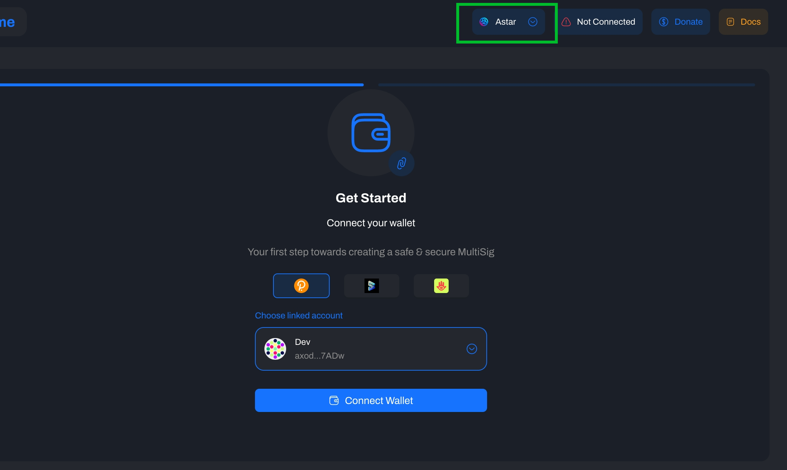
3. Elija una cartera y seleccione una cuenta con más de 0 ASTR.
4. Firma el mensaje a través de la extensión de la cartera.
5. Selecciona 'Crear Multisig.'
   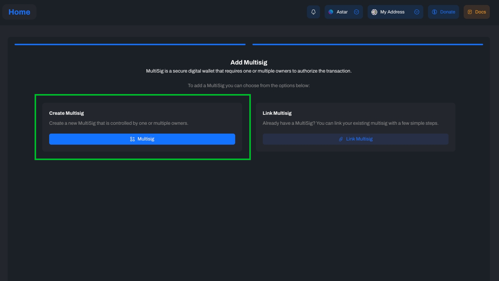
6. Elija las direcciones signatarias para incluir en la cuenta multisig. Puede seleccionar de su cartera o añadir una dirección manualmente.

:::danger
Las cuentas Ledger no pueden ser firmantes multisig
:::

   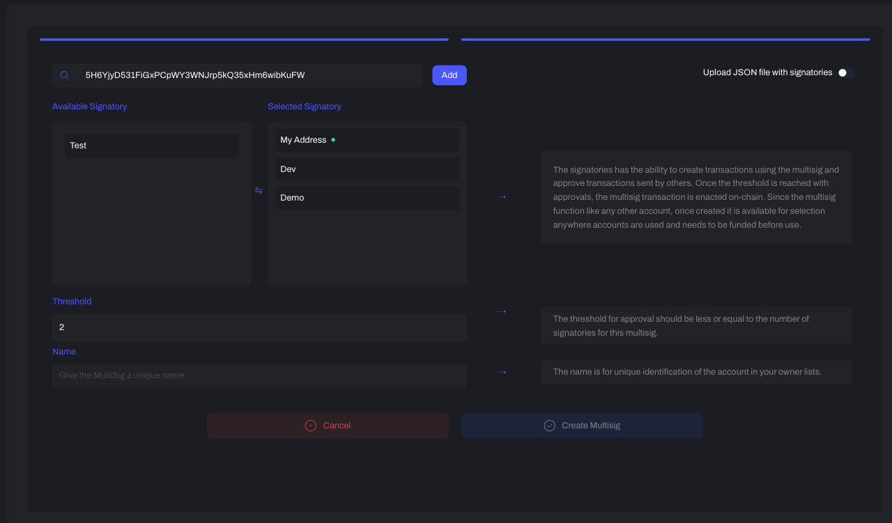
7. Introduzca el número de umbral (las firmas mínimas necesarias para autorizar y ejecutar una transacción) y el nombre de la cuenta multisig.
8. Firme el mensaje para añadir un pequeño Depósito Existencial a la cuenta multisig.
   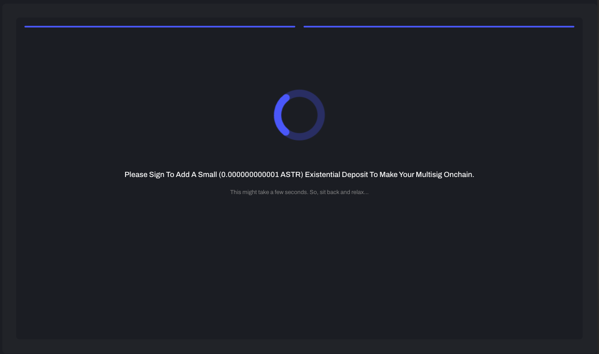
9. Opcionalmente, puede activar la gestión de firmantes proxy para permitir funcionalidades mejoradas para su cuenta multisig. [Ver referencia](/docs/use/manage-wallets/pallet-proxy)
10. Ahora puede administrar su cuenta multisig en PolkaSafe.
    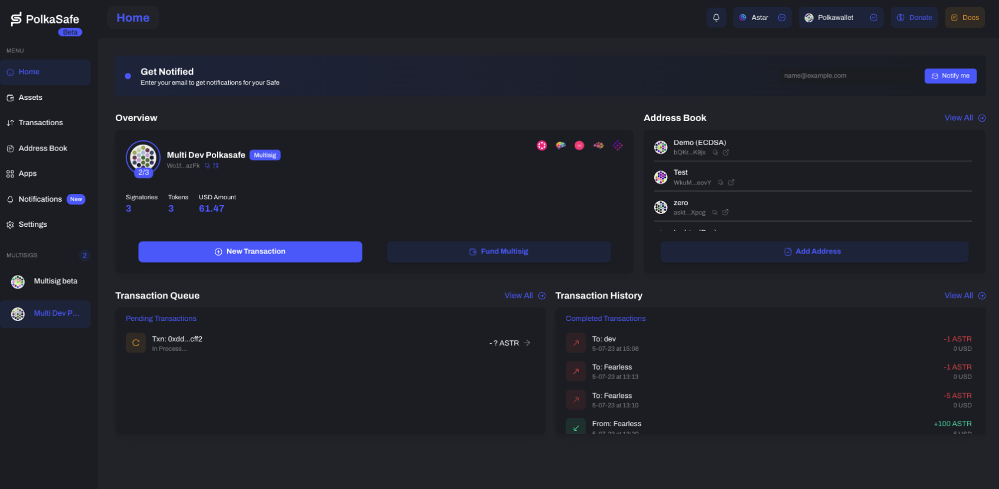

## (Opcional) Activación de la gestión de firmantes proxy para su cuenta Multisig en PolkaSafe

Añadir una cuenta proxy a su cuenta multisig mejora la funcionalidad y la flexibilidad. Un proxy permite a los firmantes modificar parámetros clave y configurar copias de seguridad de la cuenta. Además, la dirección del monedero proxy no cambia aunque se modifiquen las condiciones de consenso de la cuenta multisig. Un proxy puede:

1. Editar el Umbral: Altere el número de firmas requeridas para la autorización de transacciones.
2. Modificar signatarios: Cambie los signatarios de la cuenta multisig.
3. Crear copias de seguridad: Establecer una copia de seguridad de la cuenta multisig, facilitando transferencias de activos sin fisuras. En otras palabras, todos los activos estarán en la cuenta proxy. Esto significa que cuando agregue o elimine cualquier firmante, la dirección multisig cambiará, pero la dirección proxy no. Por lo tanto, los activos en la cuenta proxy no se perderán.

Puede añadir un proxy a su cuenta multisig durante la creación de la multisig o desde el panel de control de la cuenta.

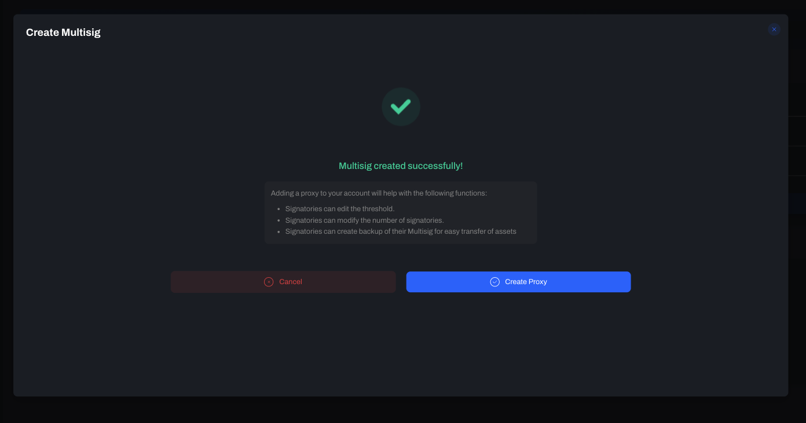

Cambie a la cuenta proxy haciendo clic en el icono de cambio.
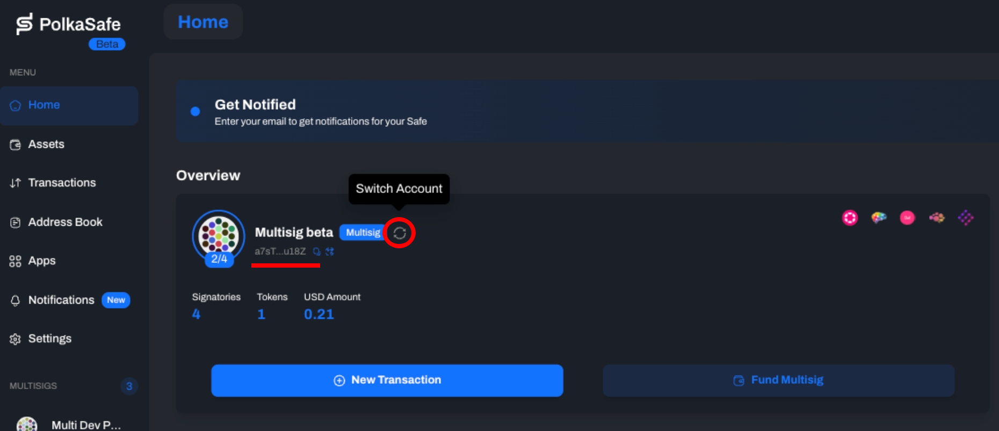

La dirección debería ahora mostrarse como la cuenta proxy.

:::tip
Al editar una cuenta multisig (por ejemplo, añadiendo firmantes) se crea una nueva dirección multisig vinculada a la dirección proxy existente. Esta nueva multisig carece de Depósito Existencial, por lo que deberá añadir saldo a la nueva dirección multisig antes de iniciar las transacciones.
:::

## Enviar transacciones en Astar Portal y aprobarlas en PolkaSafe

1. Vaya al Portal Astar y seleccione PolkaSafe.
   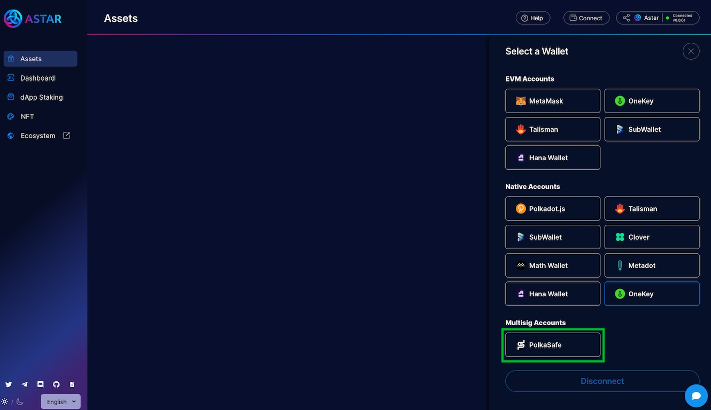
2. Elija uno de los firmantes (propietarios) para crear transacciones multisig.
   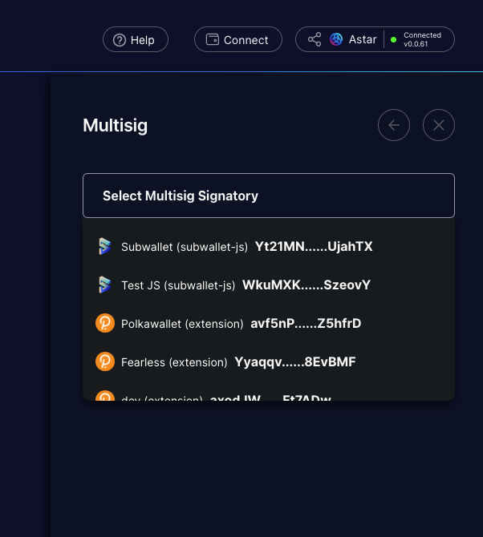
3. Firma el mensaje en la extensión del monedero (la ventana emergente del monedero puede **tardar un momento** en aparecer). 
4. Seleccione la cuenta multisig y haga clic en Conectar. 
   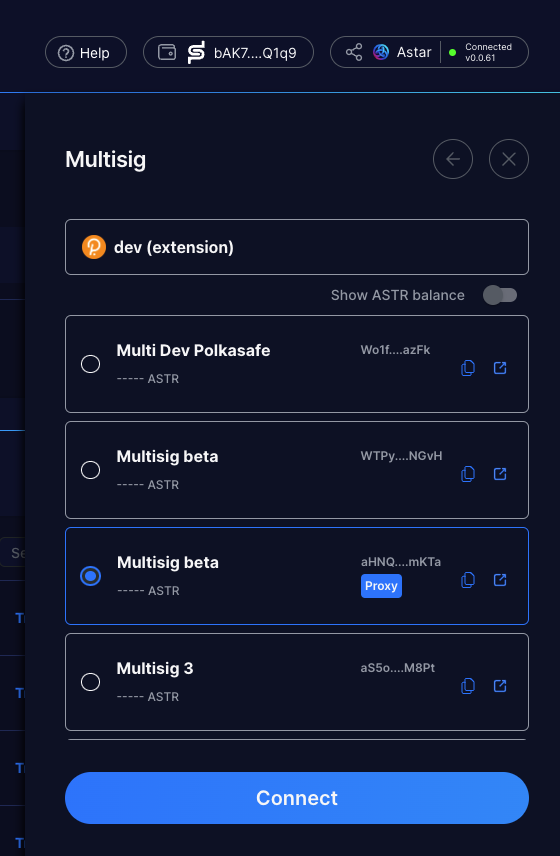
5. Ahora puedes usar el Portal Astar de la misma manera que harías con cuentas normales.
6. Una vez completada la transacción, haga clic en 'Aprobar en PolkaSafe' y apruebe la transacción en PolkaSafe. Debe conectarse a cuentas firmantes distintas de la seleccionada en Astar Portal. 
   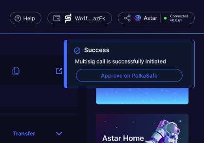
7. Si desea conocer los detalles de la transacción, copie los "Datos de la llamada" y péguelos en la [Página de descodificación](https://polkadot.js.org/apps/?rpc=wss%3A%2F%2Frpc.astar.network#/extrinsics/decode) del portal Polkadot.js.
   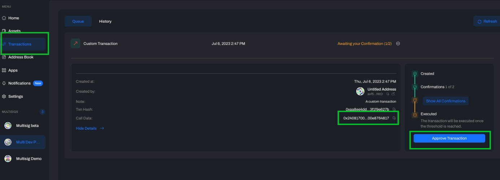
   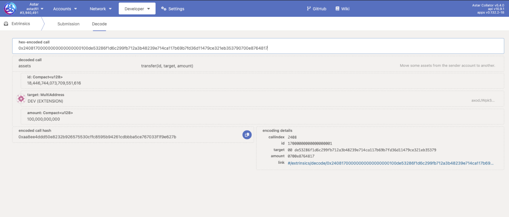

## Referencias:

### PolkaSafe

- [PolkaSafe Documentación](https://docs.polkasafe.xyz/)
- [Introducción a Cuentas Multisig](https://wiki.polkadot.network/docs/learn-account-multisig)
- [Creando un proxy puro](https://docs.polkasafe.xyz/setup-polkasafe/creating-a-pure-proxy)

### Polkadot Wiki

- [Cuentas multifirma](https://wiki.polkadot.network/docs/learn-account-multisig#introduction-to-multisig-accounts)
- [Cuentas Proxy](https://wiki.polkadot.network/docs/learn-proxies)
