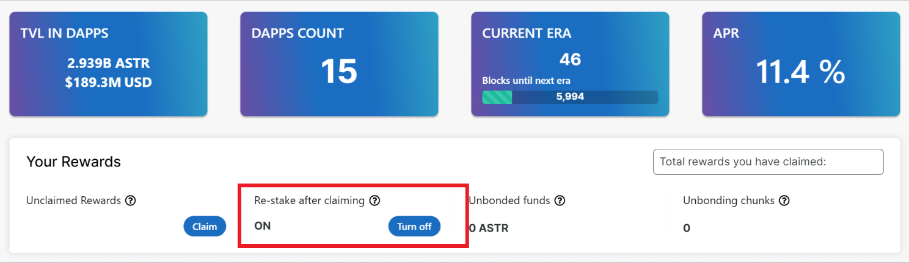

# Interêts composés

La fonction de récompenses composées permet aux stakers de réclamer des récompenses issue du staking qui seront automatiquement restakées sur la même dApp. Donc, plutôt que d'avoir à faire deux appels extrinsics et à signer deux transactions, les utilisateurs ne doivent faire qu'un appel extrinsic pour réclamer les récompenses et ces récompenses sont automatiquement réinvesties.

La fonction d'intérets composés est activée par défaut. Vous pouvez désactiver cette fonctionnalité via le portail.

