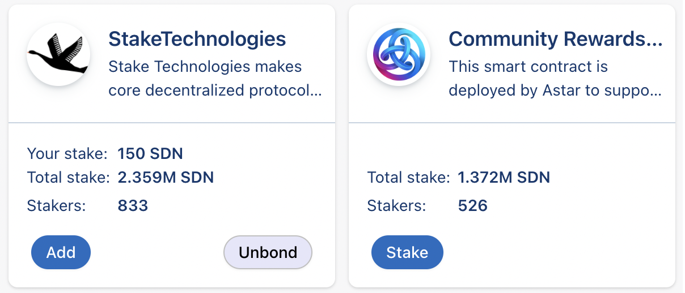

# Transfert de Nomination

Le transfert de nomination permet aux stakers de déplacer l'intégralité ou les portions de leurs nominations à d'autres projets tout en sautant la période de unbonding. De cette façon, les stakers n'ont pas à sacrifier les récompenses de staking pendant la période de déconnexion pour soutenir un projet qui les intéresse.

Le DApp staking est conçu pour soutenir les projets et les développeurs de notre écosystème. Staker par le dApp Staking est comme donner votre vote au projet que vous voulez soutenir. Votre vote (staking) aura un impact sur leurs gains avec le protocole.

## Instructions

Lorsque vous allez sur notre page de [dApp](https://portal.astar.network/#/dapp-staking/discover), vous trouverez tous les dApps listés dans notre mécanisme dApp Staking . Les instructions écrites sont les mêmes pour tous les réseaux Astar.

Cette fonction n'est disponible que pour les stakers qui sont déjà stakers dans une dApp. Si c'est la première fois que vous stakez dans notre mécanisme dApp Staking , vous pouvez trouver un guide étape par étape [ici](staking)

## Exemple d'utilisation

J'ai misé 150 SDN sur *Stake Technologies* et je veux transférer une partie sur la dApp *Community Rewards* parce que je veux les soutenir par mon vote en stakant sur leur dApp.

Vous ouvrez la fenêtre de transfert en cliquant sur le bouton **Stake** sur la dApp que vous souhaitez soutenir. Vous pouvez sélectionner les fonds que vous souhaitez utiliser, les fonds qui sont transférables et dans votre portefeuille, ou utilisez-ceux d'une dApp sur laquelle vous stakez déjà. Dans ce cas, je veux transférer des fonds de *Stake Technologies* au programme *Community Rewards*. Entrez le montant que vous souhaitez transférer (dans le cas de Shiden, le minimum est de 50 SDN) et cliquez sur **Stake**. À la fin du processus, vous finalisez en signant la transaction.

Maintenant vous voyez que vous avez transféré une partie de votre montant misé sur la nouvelle dApp sans avoir à unbond vos jetons.

