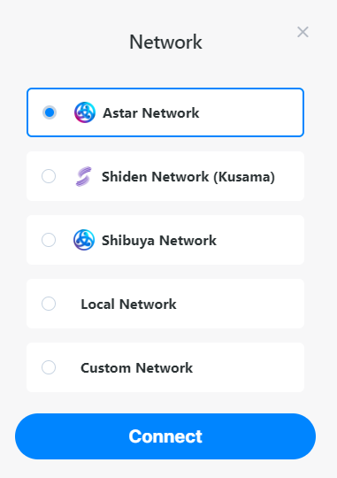
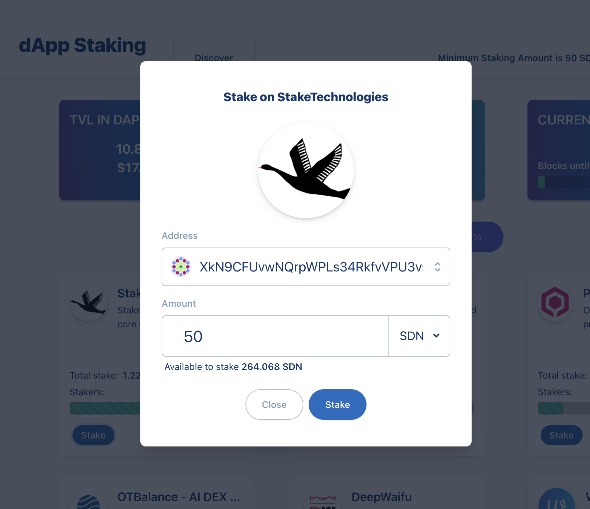

# Staking sur les dApps

## Comment staker

### Se connecter au réseau

Allez sur notre portail: et cliquez sur 'Staking'.

:::tip
Assurez-vous que vous êtes bien connecté au bon réseau.
- **Shibuya Network**: testnet
- **Shiden Network**: parachain sur Kusama
- **Astar Network**: parachain sur Polkadot
:::

### Stake

Recherchez votre projet favori. Vous pouvez cliquer sur le nom pour voir plus d'informations sur le projet. Une autre source d'information est de regarder dans notre [forum](https://forum.astar.network/), consultez [DefilLama](#defillama-en-page-id) ou [DappRadar](#dappradar-en-page-id).

Pour ajouter votre montant destaking, il vous suffit de cliquer sur 'Stake' dans la case de votre projet préféré.

### Gérer le dApp Staking

Une fois que vous avez staké, de nouvelles options pour gérer votre dApp staking apparaîtront sur la page principale :

**Add**: vous pouvez ajouter plus de jetons dans le dApp staking.

**Unbond**: ici vous pouvez sélectionner le nombre de jetons que vous voulez unbond de votre montant staké.

**Claim** (en haut de la page): réclamer vos récompenses à tous les dApps sur lesquels vous stakez. A chaque ERA vous pouvez réclamer pour vos récompenses, mais nous vous recommandons de le faire une fois par semaine.

**Re-stake after claiming** (en haut de la page) : Vous pouvez activer ou désactiver la composition automatique des récompenses réclamées issues des dApps sur lesquelles vous avez staké. Plus d'informations sont disponibles [ici](compound-rewards)
