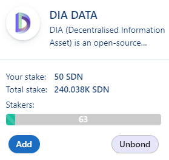
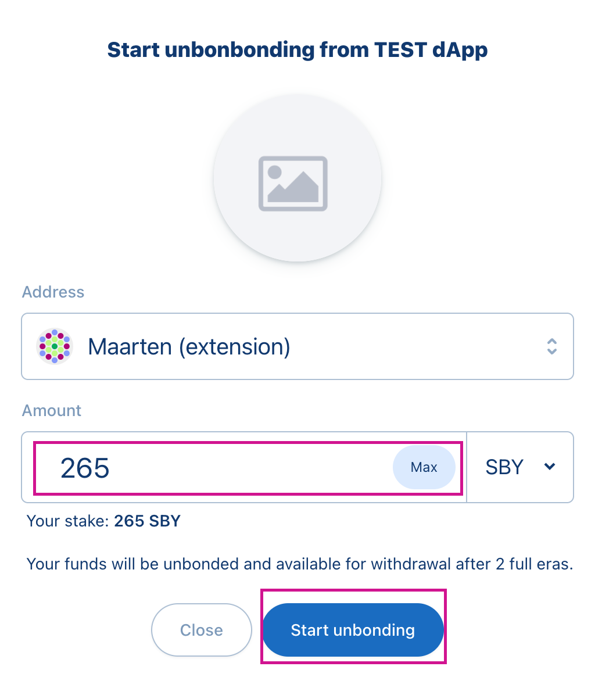
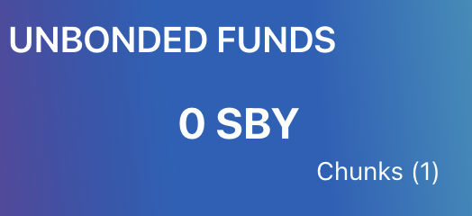

# Unbond votre staking

## Aperçu

Depuis le passage à la V2 du dApp Staking, la première nouvelle implémentation est la période de unbonding. En général, le bonding est un processus par lequel les jetons sont temporairement verrouillés. Le Staking est l'un des scénarios qui nécessitent que les jetons soient "bonded". L'unbonding est l'action de dire au réseau que vous voulez déverrouiller ces jetons. Après le temps de unbonding, qui est de 5 jours pour Shiden et de 10 jours pour Astar, vous pouvez retirer les jetons, et ils deviennent un solde transférable. Veuillez noter que ceci est basé sur une production de blocs précise de 12s. En cas de retard, votre période de unbonding peut être un peu plus longue.

| Réseau | Période de unbonding |
| ------ | -------------------- |
| Astar  | 10 jours             |
| Shiden | 5 jours              |

## Comment unbond

Si vous avez staké sur l'une des dApps, vous pouvez maintenant cliquer sur Unbond pour rendre vos jetons transférables.

Sélectionnez le montant que vous voulez **Ubond**, et cliquez sur **Max** pour unbond l'entiereté de vos jetons stakés. Pour signer votre transaction, cliquez sur **Start Unbonding**.

Vérifiez vos **Chunks**

 

Qu'est-ce qu'un chunk? Un chunk est le nombre de différentes ERA pendant lesquelles vos jetons seront en unbonding. Les chunks ne correspondent pas au montant de unbonding sur les dApps que vous avez demandé, mais au nombre de différentes ERA pour lesquelles vos jetons sont unbonded.

Retirez vos "Chunks". Lorsque votre période d'unbonding est terminée, vous devez retirer vos fonds en cliquant sur le bouton withdraw. Signez la transaction et vos jetons seront transférables dans votre portefeuille.

