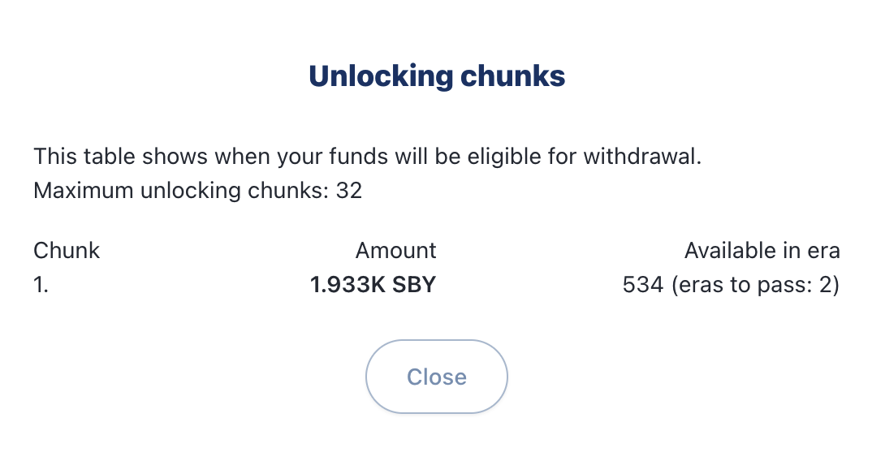
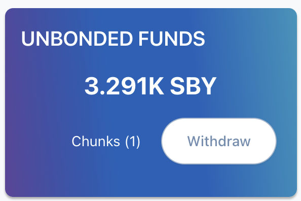

# Melepas Stake Anda

## Pandangan Umum

Pada dApp Staking v2, implementasi terbarunya adalah periode pelepasan. Umumnya, bonding (penguncian) adalah sebuah proses dimana sebuah token terkunci beberapa saat atau dalam periode tertentu. Staking adalah sebuah skenario yang membutuhkan token untuk dikunci. Pelepasan (Unbonding) adalah sebuah tindakan terhadap network bahwa anda hendak melepaskan token tersebut. Setelah periode pelepasan, sekitar 5 hari untuk Shiden dan 10 hari untuk Astar, anda dapat mengambil token anda setelah mereka dapat ditransfer. Mohon diperhatikan bahwa perhitungan pelepasan ini berdasarkan produksi per block untuk dengan durasi 12 detik setiap penciptaan block baru. Apabila ada hambatan yang sedang terjadi, periode pelepasan anda akan memakan waktu lebih lama.

| Network | Periode pelepasan |
| ------- | ----------------- |
| Astar   | 10 hari           |
| Shiden  | 5 hari            |

## Bagaimana cara untuk melepas (Unbond)

Apabila anda telah melakukan staking pada salah satu dApp, anda sekarang dapat klik pada tombol Unbond untuk membuat token anda dapat ditransfer kembali.

Pilih jumlah yang hendak kamu **Unbond**, dan klik **Max** untuk melepas semua stake. Lakukan tindakan anda dengan klik **Start Unbonding**.

Cek kembali **Chunks** anda

 

Apa itu Chunk? Chunk adalah sebuah nomor dari berbagai periode ERA pelepasan token anda. Chunk tidaklah sama dengan jumlah Unbond dari dApp yang anda minta tetapi jumlah berapa ERA lagi yang dibutuhkan hingga token anda dapat ditransfer kembali.

WIthdraw 'Chunk' anda. Ketika periode pelepasan sudah berakhir, anda bisa klik tombol Withdraw. Kemudian sign transaksi anda dan token anda dapat ditransfer ke wallet anda.

