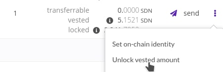
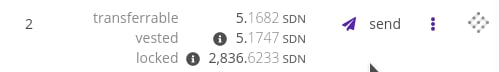

# Melepaskan Token Vesting

Apabila anda bergabung dalam crowdloan kami, anda akan mempunyai token yang berada dalam proses vesting dan bisa anda lepaskan.

Untuk melepaskannya, buka wallet anda dan hubungkan akun anda.

Saat akun ada telah dimuat anda akan dapat melihat jumlah token anda dan berapa banyak yang masih terkunci, dalam proses vesting atau dapat ditransfer:

Klik tiga titik setelah tombol 'Send' kemudian anda dapat melihat 'Unlock vested amount'. Saat anda klik, anda akan melakukan konfirmasi dan menandatangain transaksi ini. Setelahnya token yang tadinya dalam proses vesting, kini dapat ditransfer.

