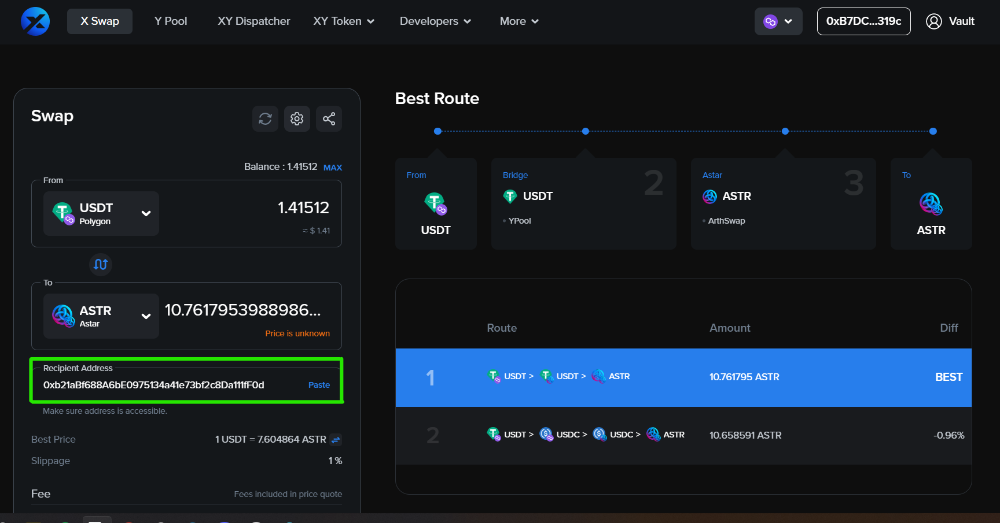

# Menukarkan Aset Lintas Chain dari Blockchain EVM Lainnya Menuju Astar

Dalam panduan ini, kami akan membimbing anda dalam proses melakukan pertukaran (swap) lintas chain (cross chain) dari 12 blockchain berbasis EVM lainnya menuju Astar.

## Buka X Swap pada XY Finance

XY Finance adalah layanan agregat pertukaran lintas blockchain untuk DeFi & Metaverse, memberi fitur kepada para pengguna untuk membeli ASTR dan token lainnya yang ada di dalam Astar dari blockchain lainnya dalam satu kali transaksi. Saat ini, XY Finance mendukung 12 blockchain berbasis EVM, termasuk Ethereum, Binance Chain, Fantom, Polygon, Arbitrum, Optimism, Avalanche C-Chain, Cronos, KCC, ThunderCore, Astar dan Moonriver.

## Hubungkan Wallet

Klik tombol “Connect Wallet”.

Sebelum anda menjelajah beragam fitur dari XY Finance, anda harus menghubungkan wallet anda dahulu. XY Finance saat ini mendukung Metamask dan WalletConnect pada browser di komputer desktop, dengan lebih banyak tipe wallet yang didukung dalam perangkat mobile.

## Pertukaran Token (Swap Token)

Pilih token yang hendak anda tukar dari blockchain asal dan token yang hendak anda terima di Astar. Kita mencontohkannya dengan menukar USDT dalam Polygon menjadi ASTR. Servis yang ditawarkan oleh XY Finance, para pengguna EVM akan dapat memiliki ASTR hanya dengan satu kali transaksi.

## Masukkan Jumlah Token

Masukkan jumlah USDT yang ingin ditukar.

Cek kembali address penerima. XY Finance akan menampilkan address wallet yang terhubung dan memungkinan anda untuk mengganti address penerima.

Klik tombol “Approve to Swap”,dan anda harus memberi konfirmasi tindakan ini pada wallet anda.

# Penukaran (Swap)

Klik tombol “ Swap”, dan wallet anda akan meminta konfirmasi anda kembali. Beri konfirmasi tentang transaksi ini dalam wallet anda.

Anda akan menerima token ASTR anda di Astar Network dalam beberapa saat.
