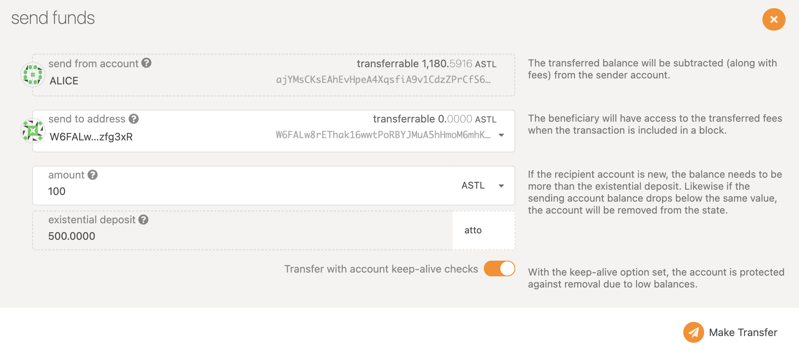
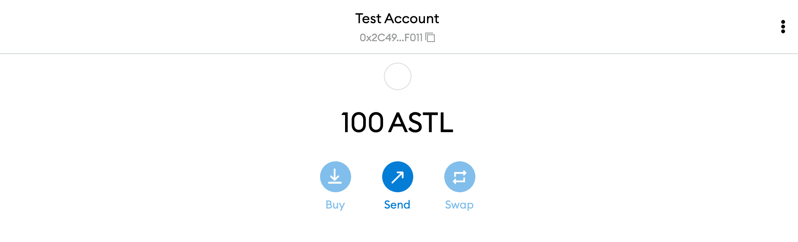

# Configure Metamask

## Add Network to your Metamask

It's easy to configure your Metamask to interact with Astar/Shiden network family. Open Metamask, click network tab, and click the Custom RPC. In the screen shown, please enter the necessary information as follows:

| Properties                    | Network Details                |
| ----------------------------- | ------------------------------ |
| Network Name                  | My Network (anything you want) |
| New RPC URL                   | http://127.0.0.1:9933          |
| Chain ID                      | 4369                           |
| Currency Symbol               | ASTL                           |
| Block Explorer URL (Optional) |                                |

## Get your local token on Metamask

Need updating...

OK, now you are ready to receive some local tokens on your Metamask! Go to account page on the explorer and click the send button of Alice. In the screen shown, you can input your SS58 address in `send to address` field and designate the amount to send. Then click the `Make Transfer` button.

Congratulations!  Now you see your local token on Metamask. And you are almost ready to deploy your first smart contract on Shiden local network now!

