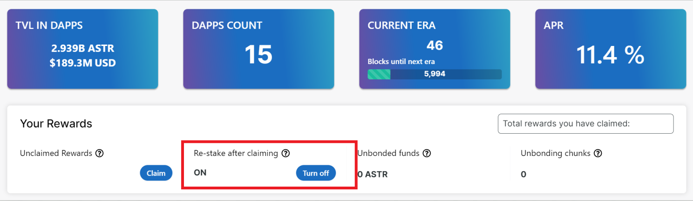

# Compound Rewards

Compound rewards feature allows stakers to claim staked rewards which will be automatically restaked on the same dApp. So rather than having to make two extrinsic calls and having to sign two transactions, users needs to only make one extrinsic call to claim the rewards and those rewards are automatically reinvested.

The compounding rewards feature is enabled by default. You can disable this feature via the portal.

