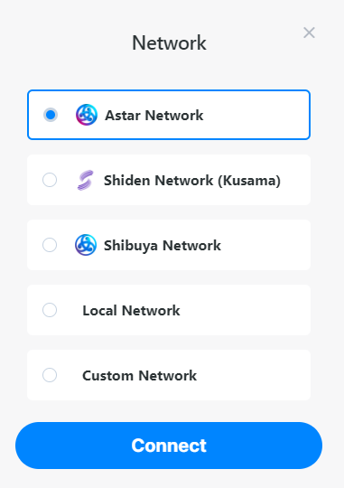
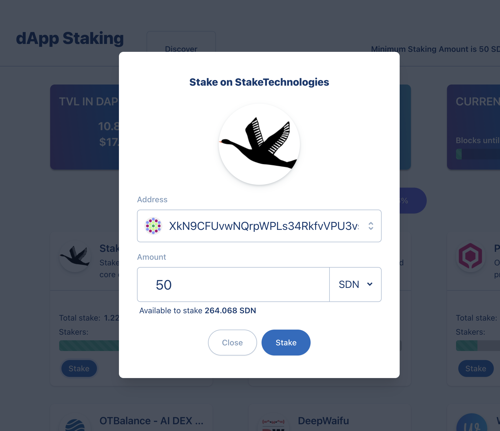

# Staking on dApps

## How to stake

### Connect to network

Go to our portal:  and click on 'Staking'.

:::tip
Make sure you are connected to the correct network.
- **Shibuya Network**: testnet
- **Shiden Network**: mainnet on Kusama
- **Astar Network**: mainnet for Polkadot
:::

### Stake

Look for your favorite project. You can click on the name to see more information about the project. Another great resource is looking in our [forum](https://forum.astar.network/), check [DefilLama](../../integrations/dapp-listing/defillama.md) or [DappRadar](../../integrations/dapp-listing/dappradar.md).

To add your staking amount, just click on 'Stake' in the box of your favorite project.

### Manage dApp Staking

Once you have staked, new options to manage your dApp staking will appear on the main page:

**Add**: you can add more tokens in dApp staking.

**Unbond**: here you can select how many tokens you want to unbond from your staked amount.

**Claim** (top of page): claim your rewards from all dApps you staked on. Every ERA you can claim for your rewards, but we recommend doing this once every week.

**Re-stake after claiming** (top of page): You can turn on or off automatic compounding of claimed rewards on staked dApps. More info is available [here](compound-rewards)
