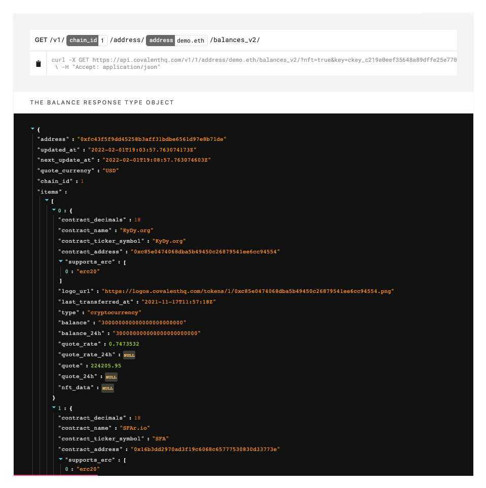
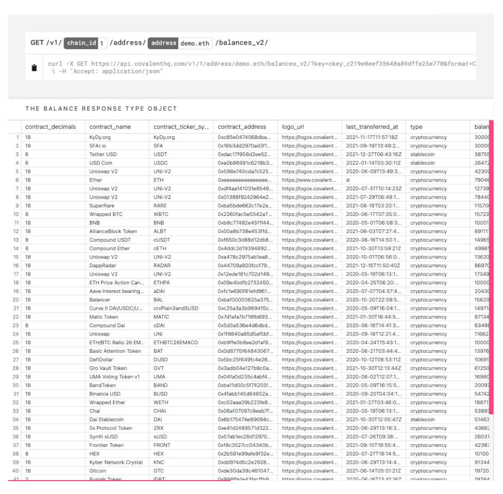
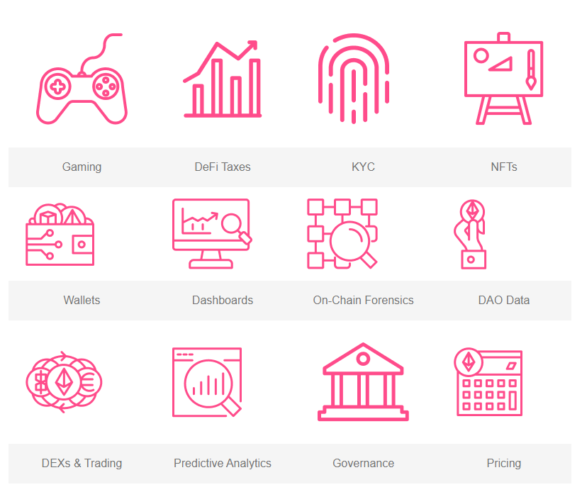

# Covalent

[Covalent]: https://www.covalenthq.com/?utm_source=astar&utm_medium=partner-docs

## Introduction

[Covalent​] provides a unified API to bring full transparency and visibility to assets across all blockchain networks including Astar.

To get started, sign up for an [API Key](https://www.covalenthq.com/platform/?utm_source=astar&utm_medium=partner-docs).

### Developer Mode (JSON)



### Analyst Mode



The Covalent API is RESTful and offers the following out-of-the-box for Astar:
​

- **Response formats**: JSON and CSV
- **Real time response**: 2 blocks
- **Batch response**: 30 minutes
- **Request volume limit**: None
- **Request rate limit**: 5 requests per second
- **Base URL**: (<https://api.covalenthq.com/v1/>)
​​- **Networks & `chain_id`**
  - Mainnet Astar - 592
  - Mainnet Shiden - 336
  - Testnet - 81
- **Supported Endpoints**
  - **Class A**
    - [Balances](https://www.covalenthq.com/docs/api/#/0/Get%20token%20balances%20for%20address/USD/592/?utm_source=astar&utm_medium=partner-docs)
    - [Transactions](https://www.covalenthq.com/docs/api/#/0/Get%20transactions%20for%20address/USD/592/?utm_source=astar&utm_medium=partner-docs)
    - [Transfers](https://www.covalenthq.com/docs/api/#/0/Get%20ERC20%20token%20transfers%20for%20address/USD/592/?utm_source=astar&utm_medium=partner-docs)
    - [Token Holders](https://www.covalenthq.com/docs/api/#/0/Get%20token%20holders%20as%20of%20any%20block%20height/USD/592/?utm_source=astar&utm_medium=partner-docs)
    - [Log Events (Contract Address)](https://www.covalenthq.com/docs/api/#/0/Get%20log%20events%20by%20contract%20address/USD/592/?utm_source=astar&utm_medium=partner-docs)
    - [Log Events (Topic Hash)](https://www.covalenthq.com/docs/api/#/0/Get%20log%20events%20by%20topic%20hash(es)/USD/592/?utm_source=astar&utm_medium=partner-docs)

Try the supported endpoints directly in your browser from our [API Reference](https://covalenthq.com/docs/api/?utm_source=astar&utm_medium=partner-docs) or use the following code examples. `The JSON response format is the same for all endpoints`:

```json
❴
    "data": ..., 
    "error": false,
    "error_message": null,
    "error_code": null
❵
```

### Curl

```sh
curl -X GET "https://api.covalenthq.com/v1/592/address/0xFEC4f9D5B322Aa834056E85946A32c35A3f5aDD8/balances_v2/?key={YOUR API KEY}" -H "Accept: application/json"
```

### JavaScript

```js
const APIKEY = 'YOUR API KEY';
const baseURL = 'https://api.covalenthq.com/v1'
const blockchainId = 592
const demoAddress = '0xFEC4f9D5B322Aa834056E85946A32c35A3f5aDD8'

async function getWalletBalance(chainId, address) {
    const url = new URL(`${baseURL}/${chainId}/address/${address}/balances_v2/?key=${APIKEY}`);
    const response = await fetch(url);
    const result = await response.json();
    const data = result.data;
    console.log(data)
    return data;
}

// Example address request
getWalletBalance(blockchainId, demoAddress);
```

### Python

```py
import requests
API_KEY = 'YOUR API KEY'
base_url = 'https://api.covalenthq.com/v1'
blockchain_id = 592
demo_address = '0xFEC4f9D5B322Aa834056E85946A32c35A3f5aDD8'

def get_wallet_balance(chain_id, address):
    endpoint = f'/{chain_id}/address/{address}/balances_v2/?key={API_KEY}'
    url = base_url + endpoint
    result = requests.get(url).json()
    data = result["data"]
    print(data)
    return(data)


# Example address request
get_wallet_balance(blockchain_id, demo_address)
```

## Use Cases

The Covalent API supports a broad range of Web3 data use cases including:



Check out their collection of ready-to-ship [Code Templates](https://github.com/covalenthq/web3-resources?utm_source=astar&utm_medium=partner-docs) that you can use to build your Web3 data-powered dApps.

## Resources

Here are some additional resources to help you get started with the Covalent API:

- [Astar Network Details](https://www.covalenthq.com/docs/networks/astar/?utm_source=astar&utm_medium=partner-docs)
- [Project Showcase](https://www.covalenthq.com/docs/project-showcase/?utm_source=astar&utm_medium=partner-docs)
- [Covalent API Reference](https://covalenthq.com/docs/api/?utm_source=astar&utm_medium=partner-docs)
- [API FAQs](https://www.covalenthq.com/docs/developer/faq/?utm_source=astar&utm_medium=partner-docs)
- [Discord Support](https://www.covalenthq.com/discord/?utm_source=astar&utm_medium=partner-docs)

## About Covalent

Covalent provides the industry-leading **Unified API** bringing visibility to billions of Web3 data points. Developers use Covalent to build exciting multi-chain applications like [crypto wallets](https://www.covalenthq.com/docs/project-showcase/wallet), [NFT galleries](https://www.covalenthq.com/docs/project-showcase/nft), and [investor dashboard tools](https://www.covalenthq.com/docs/project-showcase/tools) utilizing data from [32+ blockchains](https://www.covalenthq.com/docs/networks). Covalent is trusted by a community of 27,000+ developers and powers data for 1000+ applications including 0x, Zerion, Rainbow Wallet, Rotki, Bitski and many others.

[Website](https://www.covalenthq.com/) | [Discord](https://discord.com/invite/fgZPpq69Dd) | [Telegram](https://t.me/CovalentHQ) | [Twitter](https://twitter.com/covalent_hq) | [Youtube](https://www.youtube.com/channel/UCGn-T9qPiXAx490Wr6WPbOw) | [微信公众号](https://mp.weixin.qq.com/s?__biz=MzU0MzY5ODMzMg==&mid=2247483899&idx=1&sn=9c1d4df3acc04bc35c429b244307d3c7&chksm=fb063d08cc71b41e2da96b4747513acf2ab9182babe57c135e4a7d1fef9255eb3b310217835c&token=2144505038&lang=zh_CN#rd)
