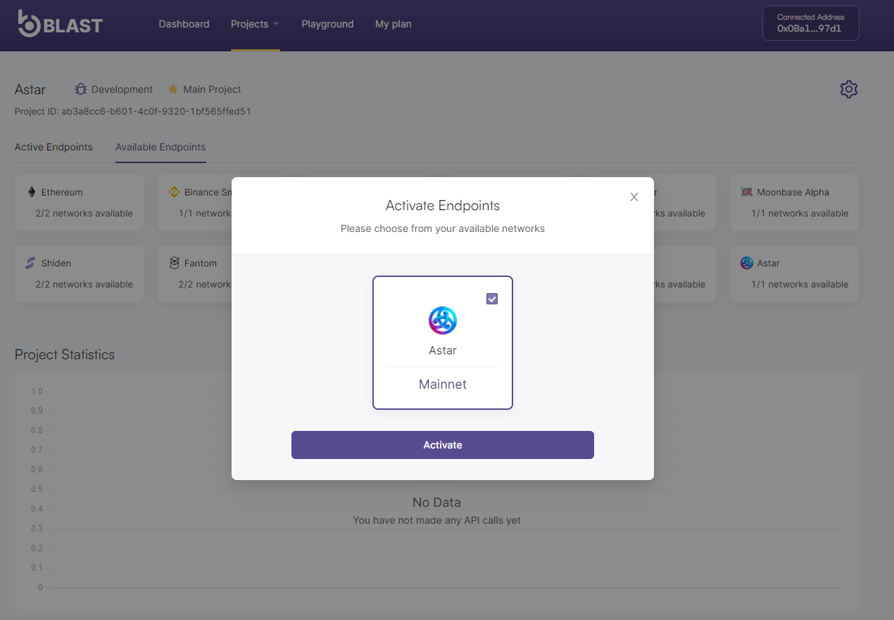

# Blast

## Overview

Blast is Bware Labs' API provider platform that aims to solve Web 3 infrastructure issues related to reliability and latency, by employing geographically distributed third-party nodes.

Blast offers a multi-region architecture that, along with a series of clustering and geo-location mechanisms, ensures optimal routing of user requests to the closest point of presence relative to where a call is generated from. Moreover, using third party-nodes scattered all over the world Blast ensures the decentralization of the underlying blockchain infrastructures thus reducing down-time and increasing reliability.

## API Usage

Blast offers a standardized Blockchain API service that covers all infrastructure aspects of Web 3 development. For each supported blockchain, users are able to generate a dedicated endpoint that will allow them access to the majority of RPC methods required for dApp development and/or blockchain interaction. In the following sections of this documentation, you can find detailed steps for how to connect and generate your endpoints, as well as RPC and WSS usage examples together with platform limitations and payment conditions

Users joining the platform will be able to use the APIs for free within certain limits with the option to upgrade to one of our standard paid subscription plans or to contact us in order to create a customized plan suitable to their needs.

## Public Endpoints

Public API solution, that includes Astar / Shiden and Shibuya (+ one-click add to Metamask):

<https://blastapi.io/public-api/astar>

<https://blastapi.io/public-api/shiden>

### Public RPC Endpoints

<https://astar.public.blastapi.io>

<https://shiden.public.blastapi.io>

<https://shibuya.public.blastapi.io>

### Public WSS Endpoints

<wss://astar.public.blastapi.io>

<wss://shiden.public.blastapi.io>

<wss://shibuya.public.blastapi.io>

## Instructions

1. Launch their app on: <https://blastapi.io/login>
2. Connect the app to your MetaMask. This is to prevent users from spamming the network. You only need to connect to create and sign to their app.

3. Now you can create your API endpoint. Click on '**Add project**' to create the environment.

4. Select your network and activate the endpoints:

After your endpoint is created, you can use the RPC Endpoint to connect to our mainnet through MetaMask or the WSS Endpoint to be used for other applications. Those endpoints are only for you to be used.

How to add your endpoint to MetaMask:

1. Open MetaMask
2. Click on Custom RPC
3. Add the information
