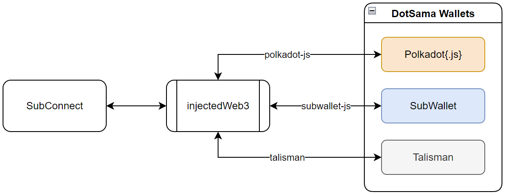
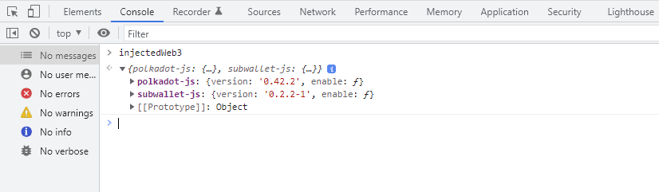

# SubWallet

## Overview

SubWallet, Polkadot{.js} and Talisman extension allow DApp to connect with them by public their interaction in object injectedW`eb3 of window browser.

- SubWallet (public with properties `subwallet-js`)
- Polkadot{.js} (public with properties `polkadot-js`)
- Talisman (public with properties `talisman`)



You can open the `injectedWeb3` object in your browser's devtools



## How to integrate with your dApp

:::info
Please refer to the example:

- Github Repository <https://github.com/Koniverse/SubConnect>
- Demo App: <https://connect.subwallet.app/>
- Video Demo: <https://bit.ly/38QhmfI>
:::

- Check the activation of the extension:
  - When a wallet extension is active in a browser it will modify `window.injectedWeb3` by adding its interaction with specifying the name.
  - For example: check the SubWallet extension by this code: `window.injectedWeb3 && window.injectedWeb3['subwallet-js']`
- Enable intergration with your dApp by the method `enable()` of extension interaction object

```js
const SubWalletExtension = window.injectedWeb3['subwallet-js']
const extension = await SubWalletExtension.enable()
```

After running this code extension, it will show a popup confirmation to confirm the integration with your dApp.

- After enabling, the `extension` variable can contain these object
  - `accounts`: Allow getting accounts data with 2 methods:  `get()` and `subscribe()`.
  - `signer`: Allow to sign data with 2 methods: `signPayload()` and `signRaw()`.
  - `metadata`: Allow getting additional metadata list with method `get()` and add/update with `provide()`.

## Use with TypeScript

If your dApp is written with TypeScript you need to add `@polkadot/extension-inject` to your `package.json` to get the extension interfaces.
