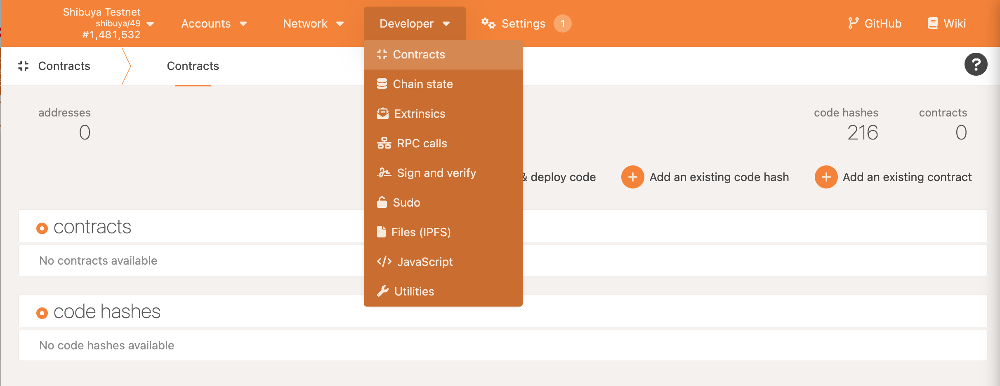
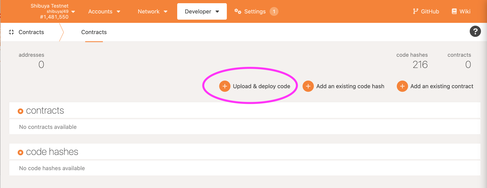
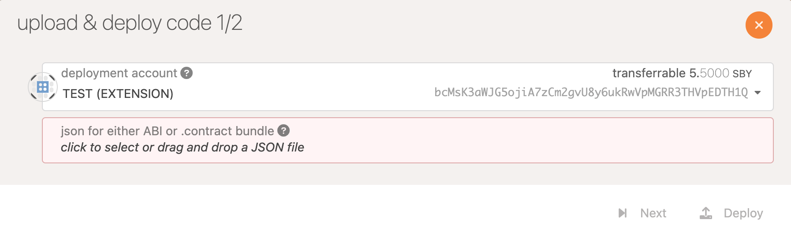
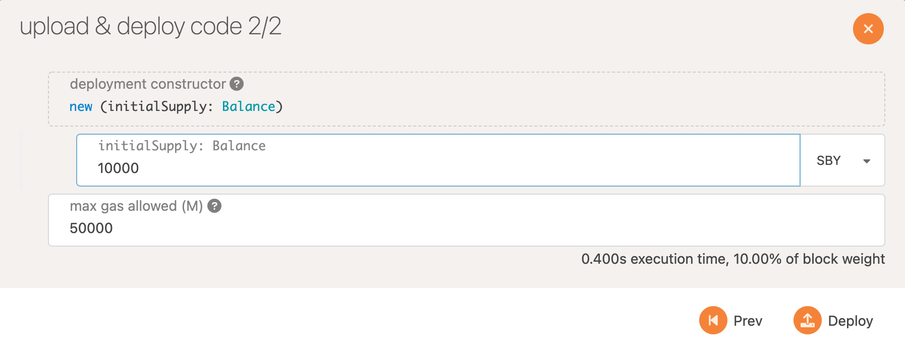
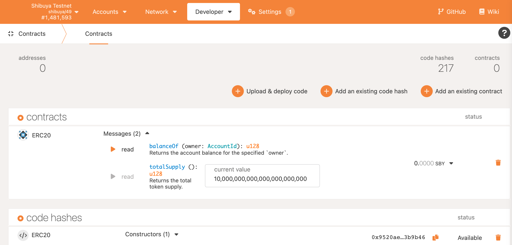
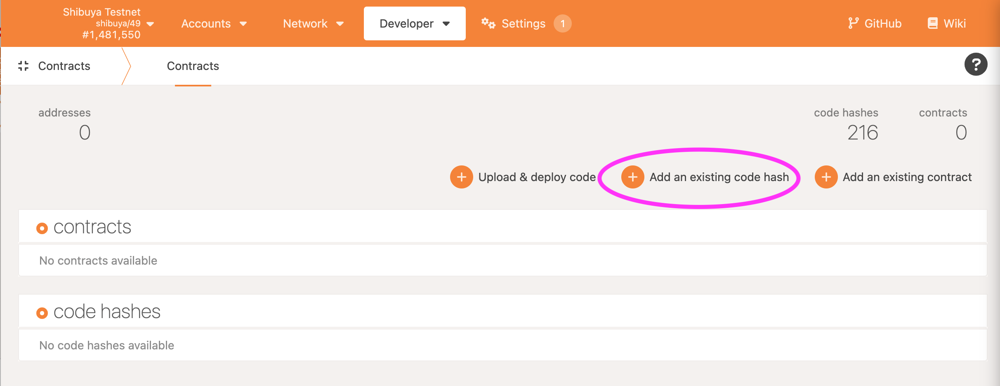
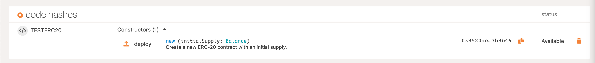

# PolkadotJS UI

## Deploy Wasm contract with Polkadot.js

This is a step by step tutorial on how to deploy a Wasm contract with Polkadot.js to the Shibuya testnet.

You can deploy Wasm blob separately from metadata but in this example we’ll use `.contract` file which combines Wasm and metadata files. If you used ink! and `cargo contract build` you will find `.contract` file under

`./target/ink/myProg.contract`

## Contract page on Polkadot.js

First, we will deploy the contract

1. Open PolkadotJS Apps in your browser and connect to Shibuya testnet. For connectivity instructions check Integration chapter in this docs.
2. Go to page `Developers —> Contracts`

3. Upload the contract

4. From the pop-up window upload the `.contract` file:

5. Set values for the constructor and deploy the contract

6. Now you can interact with the contract:

## Deploy a contract from an existing `code hash`

To deploy from an existing `code hash`, you need to have the `code hash`. Then, click `Add an existing code hash`.

