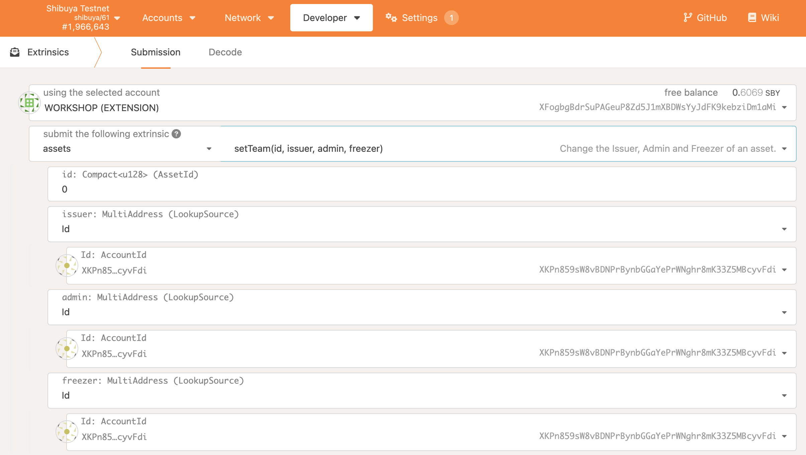

# Making Existing ERC20 Cross-chain Compatible

If you want to make an existing ERC20 asset cross-chain compatible, in an simple & easy way, please read on!

## XC20+ Extension

In short, **XC20** allows smart contracts to interact with cross-chain compatible assets same as if they were any other ERC20 asset.
Unlike for standard ERC20 assets deployed in EVM, where balances, issuance, etc. is stored directly in EVM, **XC20** assets are backed
by a Substrate pallet. This means that developer will not have access to all the internal logic of ERC20, like `_mint` or `_burn`.

In general, this is fine for existing **XC20** assets since we shouldn't be minting or burning them in smart contracts (e.g. there is no valid reason to mint cross-chain DOT on Astar). However, there are use cases where having an extended set of functionalities is useful and required, like wrapped tokens.

For this reason, we provide an extended **XC20** interface called **XC20+**. It provides the following methods:
```Solidity
// Used to check what is the existential deposit of XC20 asset
function minimumBalance() external view returns (uint256);

// Used to mint new funds
function mint(address beneficiary, uint256 amount) external returns (bool);

// Used to burn funds
function burn(address who, uint256 amount) external returns (bool);
```
The aforementioned list could be extended in the future.

Please note that minting and burning requires certain priviliges - read about **XC20** assets to learn more.

## Wrapped token in General
A wrapped token is a token whose value is tied to an underlying cryptocurrency. An amount of the original token is locked in a digital vault, and in return this allows an equivalent amount of wrapped tokens to be minted.

This is useful for several reasons, to mention a few:
* To extend the functionalities of an existing token in conjunction with other ERC20 modules.
* Allow a native cryptocurrency to behave like an ERC20, e.g. Wrapped ether (WETH).
* Allow the use of currencies outside its native blockchain, e.g. Wrapped bitcoin (WBTC).

In this example we'll do a mix of 1st and 3rd use case. We are wrapping existing ERC20 token to become **XC20**.

## Wrapping ERC20 example
Underlaying token will be existing ERC20, let's name it BURRITO. We want to wrap this BURRITO token and make it cross-chain-ready. Using standard [ERC20Wrapper](https://github.com/OpenZeppelin/openzeppelin-contracts/blob/master/contracts/token/ERC20/extensions/ERC20Wrapper.sol) token spec from OpenZeppelin will not be enough. Therefore we will override some of the  ERC20Wrapper functions to use **XC20+** functions.
Let's call this new wrapped token xcBURRITO.
This xcBURRITO takes the address of the underlaying token (BURITTO) and the newly created asset's address as a constructor parameters. And we’ll set values for all the other required parameters, notice that we have to include ERC20Permit constructor call because xcBURRITO is now a parent for BURITTO.
```Solidity
constructor(IERC20 burrito)
   ERC20("Wrapped Burrito", "xcBUR")
   ERC20Permit("Wrapped Burrito")
   ERC20Wrapper(burrito)
{}
```
Since we can't use ERC20Wrapper out of box we'll override it to use **XC20+** interface
```Solidity
import "@openzeppelin/contracts/token/ERC20/extensions/ERC20Wrapper.sol";
import "./Burrito.sol";

contract XcBurrito is Xc20Plus, ERC20Wrapper, BURITTO{
    constructor(IERC20 burrito)
    Xc20Plus("Wrapped Burrito", "xcBUR")
    ERC20Permit("Wrapped Burrito")
    ERC20Wrapper(burrito)
    {}

    function _mint(address _to, uint256 _amount)
        internal
        override(ERC20)
    {
        // add here your pre-mint hooks if needed

        require(
            IERC20Plus(xcBurrito).mint(_to, _amount), "Minting xc token failed"
        );

        // add here your post-mint hooks if needed
    }
}
```
Check the full example on the Github repo under [examples](https://github.com/AstarNetwork/astar-frame).

## Procedures
### 1. Create XC20 asset
Follow the documentation on how to [Create XC20 Assets](https://docs.astar.network/docs/xcm/building-with-xcm/create-xc20-assets).

### 2. Deploy XcBurrito.sol smart contract
To deploy XcBurrito contract you need 2 input parameters
- Burrito ERC20 token address (H160)
- **XC20** asset address (H160)
    - Follow instructions on how to [Generate XC20 Address](https://docs.astar.network/docs/xcm/integration/tools). If your asset_id is 17 (=0x11), your EVM address will be `0xffffffff00000000000000000000000000000011`

### 3. Transfer xc asset ownership to the XcBurrito smart contract
To enable **xcBurrito** contract to be able to mint/burn you need to call `setTeam()` extrinsic on pallet-assets. Configure the `issuer` and `admin` to be **xcBurrito**. This will enable the contract to issue wrapped **XC20** assets. Since the EVM contract has 24 bytes (H160), we need to transform EVM address into SS58 format to be able to call this extrinsic.


You can renounce ownership of the **XC20** by calling `transferOwnership()` extrinsic on pallet-assets. Note that after this, you won't be able to
change `issuer` or `admin` anymore so make sure those are set correctly.


Now XcBurrito contract can start minting **XC20** tokens for the callers who own Burrito ERC20 token.

## User actions
To convert Burrito token into XcBurrito assets, users will need to do two actions.
1. User Approves XcBurrito smart contract to transfer ERC20 Burrito tokens from user's balance to the XcBurrito contract. As an alternative use `permit()` call to improve UX
2. User calls XcBurrito `depositFor()` for minting new **XC20** tokens or `withdrawTo()` for burning **XC20** tokens
3. Minted wrapped asset can be transferred cross-chain same as any other **XC20** asset (please check other chapters in XCM documentation)

## End result
The result for `depositFor(user, amount)` will be:
- XcBurrito locks `amount` of ERC20 Burrito token
- User's balance for ERC20 Buritto is decreased for `amount`
- XcBurrito contract mints `amount` of XcBurrito asset
- User's balance for XcBurrito asset is increased for `amount`


The result for `withdrawTo(user, amount)` will be:
- XcBurrito contract burns `amount` of XcBurrito asset
- User's balance for XcBurrito asset is decreased for `amount`
- XcBurrito contract sends `amount` of ERC20 Burrito token to user
- User's balance for ERC20 Burrito is increased for `amount`
