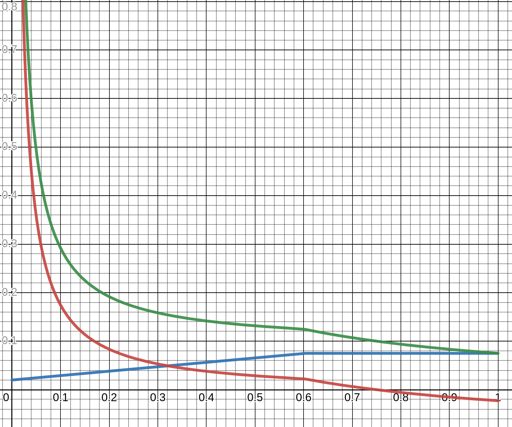

# トークノミクス & インフレーションモデル

:::note
高度なコンテンツが含まれます。
:::

:::tip
Astar & とShidenのモデルは同じですが、設定の違いがあります。 以下の章では、AstarとASTRトークンのみについて触れますが、ShidenとSDNトークンについても同様です。
:::

[Astar Network][] のトークノミクスモデルは、dApps Stakingを通じて開発者を支援することを中心に構築されています。 コアとして、ASTRトークンには複数の役割があります。

1. 取引手数料の支払い
2. dAppsへのステーキング
3. dApps Staking報酬 & Collator報酬

## インフレーションモデル

### 概要

前の章で初期のASTRトークン配布を定義しました。 しかし、Astarは新しいブロックが生成されるたびにトークンが発行される、インフレーショントークノミクスモデル（非固定供給）を採用します。 これらのトークンは、dApps Stakingシステムを稼働し、ステーカーとCollatorに報酬を与えるために使用されます。

ブロック生成ごとに、Astarは一定数のトークンを発行します。 これらの数字は、新しいブロックが **12** 秒ごとに生成されると仮定して、最初の1年間、およそ10%のインフレを達成するために選ばれました。

| ネットワーク | ブロックごとに発行  |
| ------ | ---------- |
| Astar  | 266.4 ASTR |
| Shiden | 2.664 SDN  |

AstarがShidenよりもブロックごとに100倍多くのトークンを発行することに気づくかもしれません。 これは、AstarがShidenの100倍の初期供給を持っているためです。

### 受益者

各ブロック報酬は、一連の受益者に配布されます。 ​
#### > Collators

ブロックを生成する**Collator** は報酬の一部を受け取ります。 これは、Collatorにとっての主な経済的インセンティブです。 報酬はブロック報酬のパーセンテージとして設定され、故意で変更しない限りブロックごとに一定になります。

さらに、生成されたブロックに含まれたトランザクションに対してユーザーが支払った手数料を受け取ります。 Shidenの場合、料金の **20%** はデフレーションモデルにするためにバーンされます。 同じことがすぐにAstarに採用されるかもしれません。

#### > オンチェーン・トレジャリー

トレジャリーはブロック報酬の可変部分を受け取ります。 主にParachainオークションの予備として、またAstarエコシステムの様々なプロジェクトや活動をサポートするために使用されます。

#### > dApps Staking

Astarの革新的な開発者インセンティブメカニズムの`dApps staking`は、dApps Stakingにおける現在の **トータルバリューロック**（以下、 **TVL**）に応じて、ブロック報酬の可変部分を受け取ることができます。

その一部はdApp開発者の支援にあてられ、もう一部はASTRをロックしてdAppに*ステーク*・*投票*したステイカーにあてられます。

### モデルの概要

これまでの章では、ブロックごとのインフレは固定されていると説明しました。しかし、一部の受益者に対するこの報酬の分配方法は動的で、あるパラメーターに依存します。 強調したいのは、モデルの関連パラメーターはすべてオンチェーンで読み込まれることです。オフチェーンでは**何も提供されません**。このため、安全で簡単に検証することができます。 これにより、安全で容易に検証可能になります。

モデルを深く掘り下げる前に理解すべき2つの主なポイントがあります。 **TVL** と **設定可能なブロック報酬パラメータ**です。

#### TVL

ユーザーアクションに基づいてブロックごとに変動するシステムの主な変数は、dApps Stakingの**TVL**です。 :::note  
この文脈でのTVLは、Astarの上に構築された他のプロトコル（例：DeFiプロトコル）によってロックされた非ASTRトークンを考慮せず、そのため報酬分配スキームに影響を及ぼしません。
:::

特に**TVL比率**に注目しています。
- $total\_issuance$ - 発行された合計**ASTR**トークン
- $TVL$ - dApps-staking でロックされたトークンの合計
- $TVL_{\%} = {total \over TVL}$

**Total_issuance**が1000で**TVL**が242の場合、**TVL比率**は`24.2%`となります。

#### パラメータ構成

以下のパラメータは、各ブロック報酬の分配に影響します。

| 名前                     | 説明                                 | 値の例  |
| ---------------------- | ---------------------------------- | ---- |
| Collatorsの割合           | 固定されたCollatorへの割合                  | 10%  |
| 基本のトレジャリー割合            | 常にトレジャリーに配布される最小割合                 | 10 % |
| 基本のステーカー割合             | 常にdApps-staking ステーカー報酬プールに行く最小の割合 | 20 % |
| dAppsの割合               | 固定されたdApp-staking dApp報酬プールに行く割合   | 15 % |
| 調整可能割合                 | TVLに応じて、トレジャリーとステーカーの間で分割される割合     | 45 % |
| 理想的な dApps-staking TVL | 理想的と考えられるTVL割合                     | 60%  |

ステーカーとトレジャリーが受け取る量は動的であり、TVLに依存します。 しかし、どのくらいの報酬が割り当てられるかは、下限があります。 これらは*基本*パラメータです。 CollatorとdAppsは常に報酬の一定割合を受け取ります。

##### 調整可能割合

TVLに応じて、ブロック報酬の **調整可能な割合** はステーカーとトレジャリーに分割されます。 $$ \begin{aligned} a&djustable_{staker} = min(1, {TVL_{\%} \over TVL_{ideal}}) * adjustable_{\%} \newline\newline t&otal_{staker} = base_{staker} + adjustable_{staker} \newline\newline t&otal_{treasury} = base_{treasury} + (adjustable_{\%} - adjustable_{staker}) \end{aligned} $$

より多くのトークンがステークされ、TVLが増加すると、そうでなければステークが*ゼロサムゲーム*になるという事実を補うために、ステイカー報酬の割合が増加します。 この増加は、一定のしきい値 $TVL_{ideal}$まで直線的になり、その後飽和します。 これ以上にTVLが増加しても、ステーカーの報酬が増えることはありません。

Polkadotのモデルでは、理想的なTVLに達したとき、ステーカーの報酬が指数関数的に下がることに注意してください。 この場合、飽和状態になるだけなので、*ゼロサムゲーム*になります。 私たちのアプローチの動機は、シンプルであることです。

##### 利率

前章のパラメータを用いて、ステーカーの年利を表すことができます。 $$ i = {inflation_{anual} * total_{staker} \over TVL_{\%}} $$

例として $total_{staker} = 55\%$と $TVL_{\%} = 40\%$の場合、${0.1 * 0.55 \over 0.4}$となり利率は `13.75%` となります。

しかし、インフレは金利を薄めるため、 *インフレ調整後の金利*を考慮する方が正確です。

$$ i_{adjusted} = {i + 1 \over inflation_{anual} + 1} - 1 $$

上記の例をフォローアップすると、 *インフレ調整後* の値は ${0.1375 + 1 \over 0.1 + 1} - 1$ で `3.4%` です。

### モデルの視覚化

以下のグラフは、記述されたモデルを可視化したものです。

* 緑のラインは利率 $i$
* 青のラインは合計ステーカーインフレ $total_{staker}$
* 赤のラインはインフレ調整利率 $i_{adjusted}$

モデルを確認し、[こちら](https://www.desmos.com/calculator/cjjkt6smk5)で自分で設定することができます。

[Astar Network]: https://astar.network/